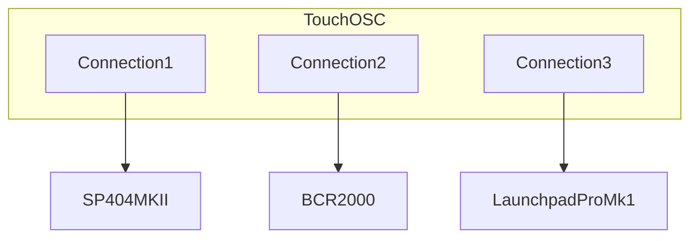

# SP-404 MKII TouchOSC Controller

TouchOSC layout for the Roland SP-404 MKII sampler, with optional **Behringer BCR2000** and **Launchpad Pro Mk1** control.

> **Launchpad note:** This layout targets the **original Launchpad Pro (Mk1)**. Later Launchpad models use different modes and SysEx behaviour, so they are not supported by this implementation.

| Feature | Detail |
|---------|--------|
| Effect buses | 5 independent buses |
| Effects | 46 types (per-bus availability depends on MIDI channel) |
| Presets | 8 slots per effect, per bus |
| Scenes | 16 global snapshots (all 5 buses) |
| Morph | Blend live faders toward a stored preset |
| Backup | Unified export/import (`/sp404/backup`) + optional Mac utility |

## Quick start

1. Open **`SP404.tosc`** in TouchOSC (from this folder).
2. Configure TouchOSC **MIDI connection 1** to your **SP-404 MKII** (this is the critical setup step).
3. On the SP-404, open **Shift + Pad 16 (FX Settings)**:
   - Set a **Favourite** for **Buses 3+4** (anything except **Bypass**), otherwise buses 3+4 will stay bypassed.
   - Optionally set **Buses 1+2** to serial or parallel routing.
4. In TouchOSC, on each bus: tap **Choose** to select an effect, then tap the bus **FX** button to switch the effect on.

Optional: add BCR2000 and Launchpad Pro Mk1 after SP-404 control is working.

---

## MIDI setup

TouchOSC uses up to three MIDI connections:

| Connection | Device | Role |
|------------|--------|------|
| **1** | SP-404 MKII | Core effect control (required) |
| **2** | BCR2000 (one or two units) | Hands-on per-bus control |
| **3** | Launchpad Pro Mk1 | Preset/scene performance control + LED feedback |



---

## BCR2000

This layout is set up to support **two BCR2000 units**:

- **BCR #1:** buses 1–4
- **BCR #2:** bus 5 (and potentially future dedicated controls)

### Per-bus control layout

Each bus follows the same control model on BCR:

```text
Bus N
- Encoder bank: perform parameters for selected effect
- FX toggle: on/off for that bus
- Sync button: sync behaviour for mapped params
- Grab button: momentary grab/preview behaviour
- Morph controls: morph enable + morph amount
```

Import the BCR preset from **[`SP404-mk2-BCR2000.syx`](SP404-mk2-BCR2000.syx)** (send the file to each BCR2000 via a SysEx tool such as MIDI-OX or SysEx Librarian). The file encodes the per-bus layout above; CC details are not duplicated in this guide.

---

## Launchpad Pro Mk1

Launchpad support is focused on live performance: presets and scenes per bus, modifier workflows, and LED feedback for stored/active states.

### Pad layout

The **main 8×8 pad grid** is split by column:

| Columns | Purpose |
|---------|---------|
| **1–5** | One column per **bus** (bus 1 = leftmost, bus 5 = rightmost). Each column has 8 preset slots for the current effect on that bus. |
| **7–8** | **Scenes** — global snapshots across all five buses (16 scenes total). |

Column 6 is unused.

### Bus buttons (top row)

**Bus buttons** are the round buttons along the **top** of the Launchpad — **Session**, **Up**, **Down**, **Left**, and **Right** (the first five map to buses 1–5). Use them for bus-level actions such as toggling FX on/off, clearing a bus, and combining with modifier buttons below.

### Modifier buttons (left side)

Along the **left** edge of the pad grid:

| Button | Role |
|--------|------|
| **Shift** | Grab / momentary preview (with preset or bus buttons) |
| **Click** | Store effect defaults (with a bus button) |
| **Undo** | Recall effect defaults (with a bus button) |
| **Delete** | Delete mode for presets and scenes |
| **Quantise** | Morph modifier (with a bus button) |

### How to enter each mode

| Mode | TouchOSC | Launchpad Pro Mk1 |
|------|----------|-------------------|
| **Delete** | Tap **Delete** in the All presets area (stays on until tapped again) | Hold **Delete** (left side), then tap pads or bus buttons |
| **Grab** | Tap **Grab mode** in the All presets area, **or** hold **Shift** while using pads | Hold **Shift** + stored preset pad (preview), **or** hold **Shift** + bus button (bus grab) |
| **Morph** | Tap **Morph** on the bus perform strip, then choose a target preset | Hold **Quantise** + tap a **bus button** to toggle morph for that bus; tap a stored preset to set the morph target |

While **morph** is on for a bus, normal preset store/recall on that bus is disabled until morph is turned off (turning morph off commits the current blend).

### Bus lock

Lock a bus when you want its FX and presets left alone during live performance (for example master buses 3–4 while you change other buses).

| Control | Location | Action |
|---------|----------|--------|
| **Lock** | TouchOSC perform strip — padlock under **Edit** (in `control_group`) | Toggle lock on/off for that bus |
| **Lock** | Launchpad bottom row **Record** buttons (CC 1–5, buses 1–5) | Same toggle; dim red = unlocked, bright red = locked |

TouchOSC and Launchpad stay in sync. Lock state is **not** included in `/sp404/backup` exports.

**While locked you can:** recall presets, preset/scene grab preview (scenes only change **unlocked** buses), recall defaults, morph, toggle FX on/off (bus buttons / perform strip).

**While locked you cannot:** store or delete presets, store defaults, clear the bus, or apply scene recall to that bus (scene **store** still captures the locked bus as-is).

### Gesture modes

#### Normal mode

| Control | Gesture | Action |
|---------|---------|--------|
| Preset pad | Tap empty slot | Store preset |
| Preset pad | Tap stored slot | Recall preset |
| Scene pad | Tap empty slot | Store scene |
| Scene pad | Tap stored slot | Recall scene |
| Bus button | Tap | Toggle FX on/off for that bus |

#### Delete mode

Enter delete mode first (see table above).

| Control | Gesture | Action |
|---------|---------|--------|
| Preset pad | Tap stored slot | Delete preset |
| Scene pad | Tap stored slot | Delete scene |
| Bus button | Tap | Clear bus (unload effect) |

#### Grab mode

| Control | Gesture | Action |
|---------|---------|--------|
| Preset pad | Hold stored slot | Momentary preset preview (restore on release) |
| Scene pad | Hold stored slot | Momentary scene preview (restore on release) |
| Bus button | Hold (with Shift) | Momentary bus grab |

#### Morph mode

| Control | Gesture | Action |
|---------|---------|--------|
| Preset pad | Tap stored slot | Set morph target |
| Preset pad | Press harder (aftertouch) | Adjust morph amount |
| Bus button | Tap (with Quantise held) | Toggle morph on/off for that bus |

### Effect defaults

**Defaults** are the baseline fader values for the **current effect** on a bus (separate from presets).

| Action | TouchOSC | Launchpad Pro Mk1 |
|--------|----------|-------------------|
| **Store defaults** | Tap **Store defaults** on that bus (blocked when bus is locked) | Hold **Click** + press the **bus button** for that bus |
| **Recall defaults** | Tap **Recall defaults** on that bus | Hold **Undo** + press the **bus button** for that bus |

Useful when you have dialled in a sound and want a quick “reset to my usual starting point” without touching preset slots.

---

## TouchOSC features

### Presets

Eight slots per **effect** per **bus**. Empty pad = store; filled pad = recall.

### Exclude tuning from presets

Some effects have parameters you usually **do not** want presets to change — for example on **Resonator**, you might switch presets to move between **Brightness** and **Feedback** settings while keeping **Root** and **Chord** unchanged (so the musical key stays put).

On each bus, turn on **Exclude tuning from presets** before storing/recalling. Excludable parameters (marked in the effect definition) are skipped; everything else in the preset still updates.

### Scenes

Sixteen **global** snapshots for all five buses (effect choice, on/off, fader values, sync). Scenes always store and recall full state.

### Morph

Blend live perform values toward a stored preset:

1. Enable morph (TouchOSC **Morph** button or Launchpad **Quantise** + bus button).
2. Select a **target** preset.
3. Adjust morph amount (TouchOSC morph fader, BCR, or Launchpad aftertouch).

Turning morph off commits the current blend.

### Unified backup

**Export** / **Import** in the All presets panel saves or restores your full layout state: presets, scenes, effect defaults, recent values, and which effect is loaded on each bus.

**Import caveat:** loaded buses are forced **FX off** (on/off state is not included in a backup). Use **scenes** to restore performances that include which buses were switched on.

**Mac utility:** [`preset-manager/python/`](preset-manager/python/) — see [preset-manager README](preset-manager/python/README.md). Default ports: utility listens on **5005**, sends on **5006**.

---

## For developers

| Resource | Purpose |
|----------|---------|
| [`lua/README.md`](lua/README.md) | Naming, grid/tag patterns, layout sync tooling |
| [`toscbuild.json`](toscbuild.json) | Build manifest (script → node mappings) |
| [`tools/`](tools/) | SP404-specific layout scripts |
| Repo [`tools/`](../tools/) | Shared build pipeline (`toscbuild.py`, layout helpers) |

**TODO:** add a top-level [`tools/README.md`](../tools/README.md) documenting the shared build pipeline and link to it from here.

```bash
# From repo root — inject Lua into SP404.tosc
python3 tools/toscbuild.py build sp404-mk2
python3 tools/toscbuild.py dev sp404-mk2
```
