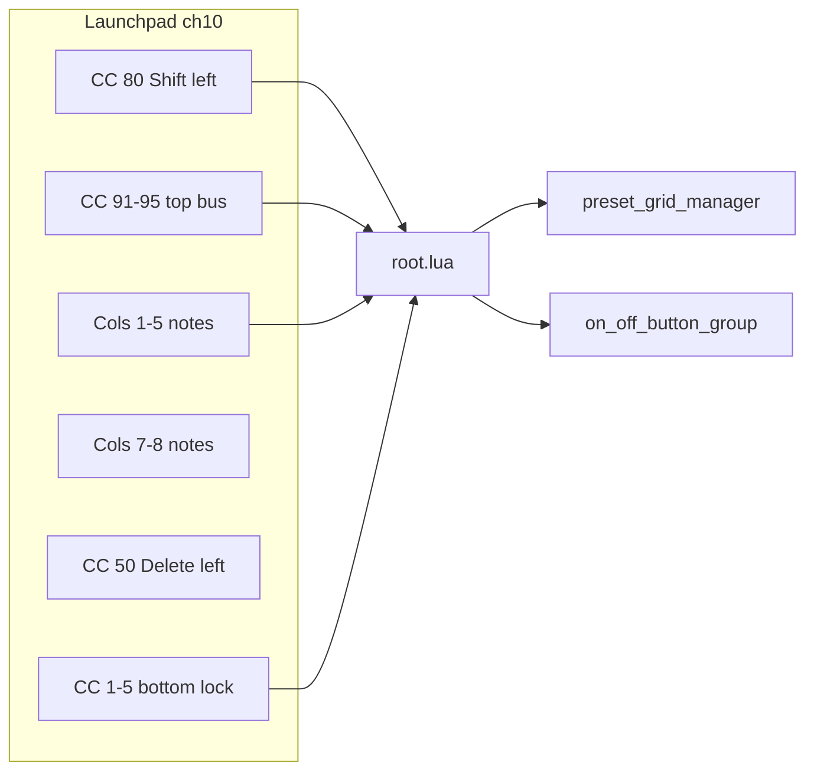

# Launchpad Pro enhancement roadmap

## Programmer layout & implemented behaviour

**Canonical reference (diagram, note formulas, gestures, LEDs):** `sp404-mk2/SP404/lua/README.md` → **Launchpad Pro** section. Update README when layout or mappings change; keep this plan for phase/deferred tracking only.

## Implementation status (Phases 1–3 done)

- **Phase 1**: Shift CC 80, Undo CC 60, bus CC 91–95 (toggle / Shift+grab / Undo+defaults), RGB LEDs; bus-off uses `LAUNCHPAD_BUS_OFF_BRIGHTNESS` (~0.02).
- **Phase 2**: Preset grab via Shift+stored pad and GRAB MODE button.
- **Phase 3**: `scene_manager` + TouchOSC `scene_grid` (2×8) + Launchpad cols 7–8; storage in `scene_manager` children `01`–`16` tags; `set_fx` with `showChooser` + `sceneLoad` flags; SP-404 sync via `new_value` + `sync_current_bus`.
- **Phase 4**: not started (see below).

## Current state (Launchpad ch 10)



## Shared infrastructure (do once in Phase 1)

Add a small Launchpad layer in [`root.lua`](sp404-mk2/SP404/lua/root.lua) (or extract `launchpad_handler.lua` later if it grows):

| Input | MIDI | Handling |
|-------|------|----------|
| **Shift** | CC **80**, 127 = held, 0 = released | `launchpadShiftHeld` boolean; never forwarded to TouchOSC UI |
| **Bus row** | CC **91–95** → buses 1–5 | New handler branch before preset note logic |
| **Delete** | CC **50** (existing) | Keep; ensure `toggle_delete_mode` notify fires reliably |
| **Preset pads** | Notes on ch 10 (existing map) | Extend in Phase 2 for Shift+grab preview |

**Round-button LED policy** (same SysEx as delete: `0x0A <ledIndex> <paletteColor> F7`; LED index = CC number, e.g. CC 50 → `0x32`):

Always show **usable** controls with a **dim idle** state and a **bright active** state (mirror delete: inactive = **7**, active = **5**).

| Control | CC / LED | Dim (idle / off) | Bright (active / on) |
|---------|----------|------------------|----------------------|
| **Delete** (existing) | 50 | 7 | 5 when delete mode on |
| **FX bus** | 91–95 | Bus palette color, **low** brightness | Same bus color, **full** brightness |
| **Bus lock** (Phase 4) | 1–5 | Red, dim (e.g. **7**) | Red, bright (e.g. **5**) when locked |

Bus colors reuse preset column velocities: `{ 35, 15, 59, 47, 21 }` ([`preset_grid_manager.lua`](sp404-mk2/SP404/lua/preset_grid_manager.lua)). If dim bus color is too strong on hardware, use a documented dim variant (e.g. palette index **1** or `max(1, busColor - N)` — tune in Phase 1).

Centralize in **`root.lua`**: `sendRoundButtonLED(cc, color)` + `refreshBusButtonLEDs()` / `refreshLockButtonLEDs()` called on init, state change, and after TouchOSC/BCR toggles sync back.

**Preset grid unchanged** — square pads 81–85 are still preset 1 for buses 1–5; bus controls use **round CC 91–95 above the grid**, not those pads.

---

## Phase 1: Bus enable, Shift+grab, reset to default (CC 91–95)

**Goal**: Mirror TouchOSC/BCR bus performance controls on the five buttons above the grid.

### Gestures (per bus, CC `90 + busNum`)

| Gesture | Action | Reuse |
|---------|--------|-------|
| **Press** (no modifier) | Toggle FX bus on/off | `set_state` |
| **Press** (Shift held, CC 80) | Momentary grab | `set_grab_state` on press / off on release |
| **Press** (Undo held, CC 60) | Recall effect defaults | `preset_grid` → `recall_defaults` |

Undo replaces Shift+short-tap (no timer). Undo LED: dim 7 idle, bright 5 while held.

### Wiring

1. **`root.lua` `onReceiveMIDI`** (Launchpad port 3):
   - Track CC 80 → `launchpadShiftHeld`
   - Track CC 91–95 press/release with per-bus state table (debounce short-tap vs grab)
   - Route to `busN_group` → `on_off_button_group` via existing notify keys (`set_state`, `set_grab_state`)
   - Route reset to `busN_group` → `preset_grid` → `recall_defaults`

2. **`on_off_button_group.lua`** (minimal):
   - Add optional `skipBcr` path already exists for BCR; Launchpad calls use `set_state` / `set_grab_state` with `skipBcr` implicit (no BCR CC echo needed)
   - Optionally add `launchpad_toggle` / `launchpad_grab` notify aliases if cleaner than reusing `set_state` directly from root

3. **LED sync — FX buttons (CC 91–95)**:
   - **Bus off**: dim bus-colored LED (always lit so button is discoverable)
   - **Bus on**: bright bus-colored LED (same palette index as preset column: 35/15/59/47/21)
   - **Grab held** (Shift + CC down): optional momentary brighten or flash on that bus’s CC LED
   - Refresh when: `init`, bus toggle (Launchpad / TouchOSC / BCR), `apply_bus_theme`, grab press/release
   - Subscribe via notify from `on_off_button_group` after `set_state` / `set_grab_state`, or poll `toggle_button.values.x` in refresh helper

4. **TouchOSC UI sync**: When Launchpad toggles bus, update `toggle_button.values.x` on that bus (mirror BCR `bcr_toggle` pattern).

### Test checklist (Phase 1)

- CC 91–95 show **dim bus color when off**, **bright when on** (all five always visibly lit)
- Shift+hold CC 9x sends grab on, release sends off
- Shift+short tap recalls defaults (faders move; no permanent preset write)
- Preset 1 pads (notes 81–85) still store/recall presets unchanged
- BCR and TouchOSC controls still work; no double MIDI echo

---

## Phase 2: Preset grab (Shift + preset pad)

**Goal**: While Shift is held, pressing a **stored** preset temporarily loads its values; releasing restores the pre-press state (preview/A-B compare).

### Behavior

- **Shift off**: existing `buttonPressed` logic (store / recall / delete) unchanged
- **Shift on + pad down** (stored preset color only):
  1. Snapshot current 6 fader MIDI values for that bus
  2. `recallPreset(bus, preset)` (read-only preview)
  3. LED press highlight as today
- **Shift on + pad up**:
  1. Restore snapshotted fader values via `control_fader:notify('new_value', ...)`
  2. Do **not** call `storePreset`

### Implementation

- **`root.lua`**: Pass `launchpadShiftHeld` into simulated pad press path, or add flag on `button_value_changed` notify: `{ busNum, presetNum, x, shiftHeld }`
- **`preset_grid_manager.lua`**: Branch in `button_value_changed` / new `previewPreset` + `restorePreview` functions; guard empty/white pads (no-op on shift+empty)

### Test checklist (Phase 2)

- Shift+preset preview recalls values; release restores exactly
- Shift+preset on empty pad does nothing
- Normal preset store/recall/delete without Shift unchanged
- Delete mode (CC 50) still works; define interaction: Shift+delete pad vs delete mode (recommend delete mode wins)

---

## Phase 3: Scenes (columns 7–8, 16 slots) — implemented

**Goal**: Store and recall **global** performance state: all 5 buses’ fader values, FX on/off, sync toggles, and selected effect per bus.

### Pad map (columns 7–8)

| Scene | Column | Note (top→bottom) |
|-------|--------|-------------------|
| 1–8 | 7 | 87, 77, 67, 57, 47, 37, 27, 17 |
| 9–16 | 8 | 88, 78, 68, 58, 48, 38, 28, 18 |

See **Scene note formula** in layout section above. Column 6 remains unused between presets and scenes.

### Data model (as built)

**[`scene_manager.lua`](sp404-mk2/SP404/lua/scene_manager.lua)** on root; one hidden **label** child per scene (`01`–`16`), JSON in each `tag`:

```lua
{ buses = { ["1"] = { fxNum=12, on=true, cc={...6}, sync={...6} }, ... } }
```

(`fxName` not stored — derived from `fxNum` on recall.)

Capture on **store**: per-bus `fxNum`, on/off, 6 fader CCs, sync button states.

Recall per bus: `set_fx` with `{ fxNum, fxName, showChooser=false, sceneLoad=true }` → apply CC/sync → `set_state` → `sync_current_bus`.

**Gestures** (implemented):

| Gesture | Action |
|---------|--------|
| Tap empty | Store current global state |
| Tap stored | Recall scene |
| Shift + tap stored | No-op (reserved for scene grab — see deferred) |
| CC 50 delete mode + tap | Delete (same as presets) |
| TouchOSC | `scene_grid` 2×8 (cols 1–8 / 9–16), same rules |

### Files

- New: `scene_manager.lua`, `scene_pad.lua` (optional, if mirroring preset pad pattern)
- [`root.lua`](sp404-mk2/SP404/lua/root.lua): note handler for cols 7–8; keep `buildPresetNoteMap` separate or add `buildSceneNoteMap`
- [`toscbuild.json`](sp404-mk2/SP404/toscbuild.json): inject scene manager
- README Launchpad section update

### Scene pad LEDs (cols 7–8)

Match **preset pad** behavior ([`preset_grid_manager.lua`](sp404-mk2/SP404/lua/preset_grid_manager.lua) `refreshMIDIButtons`):

- **Empty slot**: **off** (SysEx color **0** — not lit at all)
- **Stored scene**: lit (e.g. single scene color such as white **21**, or a dedicated scene palette index — not per-bus columns)
- **Press feedback**: brief brighten on press (same `baseVelocity - 2` / flash pattern as presets)
- **Delete mode** (CC 50) + stored scene: show delete color (**5** red) like preset delete state, if we support scene delete via delete mode

Round buttons (FX, lock, delete) keep the **always dim/bright** policy; only square scene pads use the preset-style **off when empty** rule.

### Test checklist (Phase 3)

- Store/recall all 16 scenes; empty pads **unlit**, stored pads **lit**
- Changing one bus FX then storing scene 2 does not overwrite scene 1
- Recall restores on/off + effect selection + faders on SP-404 MIDI

---

## Phase 4: Bus lock (bottom CC 1–5)

**Goal**: Locked buses are skipped on scene recall and cannot store/delete presets.

### Controls

| CC | Bus | Gesture |
|----|-----|---------|
| **1** | Bus 1 | Tap toggles lock on/off |
| **2** | Bus 2 | … |
| **3** | Bus 3 | … |
| **4** | Bus 4 | … |
| **5** | Bus 5 | … |

Dedicated lock buttons keep **CC 91–95** (top row) focused on on/off, Shift+grab, and Shift+reset only — no long-press gesture on bus buttons.

### State

- `root.tag.busLock` = `{ ["1"]=true, ... }` (JSON on root tag, same pattern as `busAccentHex`)
- Toggle on CC press (127) or on press+release pair — use **tap to toggle** on CC down (or release) so lock state is latched, not momentary

### Enforcement

| Subsystem | When locked |
|-----------|-------------|
| `scene_manager` recall | Skip bus; no fader/FX/on-off changes |
| `preset_grid_manager` | `buttonPressed` / `storePreset` / delete → no-op |
| Phase 1 CC 91–95 | Unchanged — lock does not block bus on/off from top row |

### LED — lock buttons (CC 1–5)

Same dim/bright pattern as delete and FX bus:

- **Unlocked**: **dim red** (always on — shows lock control is available)
- **Locked**: **bright red**
- Refresh on lock toggle, `init`, and when restoring `root.tag.busLock`

Optional later: dim preset **note** column for locked bus (separate from round-button policy).

**CC 91–95** keep Phase 1 bus-color LEDs; lock does not change FX button colors.

### Wiring

- **`root.lua`**: Handle CC 1–5 on Launchpad port; read/write `root.tag.busLock`; expose `isBusLocked(busNum)` helper used by `preset_grid_manager` and `scene_manager`
- No TouchOSC layout required unless you later add on-screen lock indicators

### Test checklist (Phase 4)

- CC 1–5: dim red when unlocked, bright red when locked (always visibly lit)
- CC 2 locked → preset column 2 and bus 2 skipped on scene recall
- CC 2 unlocked → presets and scenes work again
- CC 91–95 still toggle/grab/reset bus 2 while locked (lock only blocks preset/scene mutation + scene recall for that bus)
- All five locks independent

---

## Recommended implementation order

| Order | Phase | Why |
|-------|-------|-----|
| 1 | Bus CC 91–95 + Shift 80 | Foundational modifier + no preset grid changes |
| 2 | Preset grab | Builds on Shift tracking |
| 3 | Snapshots | Largest new subsystem |
| 4 | Bus lock | Cross-cuts scenes + presets |

Each phase: implement → `python3 tools/toscbuild.py build sp404-mk2/SP404` → hardware test on Launchpad Programmer layout ch 10.

---

## Deferred (this Launchpad rollout — not Phase 4)

From Phase 3 pre-implementation Q&A. Keep here until done or moved to a durable repo backlog (e.g. GitHub issue) if this plan is archived.

| Item | Notes |
|------|--------|
| **Per-scene colors** | v1 = single white on Launchpad + TouchOSC; later optional palette picker per scene |
| **Custom scene names** | v1 = pad numbers only (`tabLabel` 1–16) |
| **Exclude-tuning on store/recall** | Presets respect `exclude_tuning_from_presets`; scenes currently store all 6 CCs — revisit when buses can have different FX in one scene |
| **Scene grab** | Shift+stored scene pad = preview/restore whole performance (like preset grab); code path reserved (`shiftHeld` no-op on stored pads) |
| **OSC export/import** | Mirror `preset_manager` `/presets` pattern for scene JSON |

### Phase 3 design choices (locked for v1, not backlog)

- Scene naming: **Scene** not snapshot; 16 slots, top = 1 / 9
- Store/recall/delete: same UX as presets (no overwrite-without-delete)
- No `fxName` in scene JSON
- Recent values updated on scene recall
- Cleared bus (`fxNum=0`) stored and recalled via `clear_bus`
- Chooser: `set_fx` 3rd arg `showChooser`; 4th `sceneLoad` skips recent-value recall + `switch_to_effect`

---

## Phase 4 (next planned phase — not deferred trivia)

Bus lock on CC 1–5; skip locked buses on scene recall and preset store/delete. See section above.

---

## Open items (hardware / polish)

1. **SysEx LED index** — confirm CC number = LED index for CC 1–5, 50, 80, 91–95 (RGB `0x0B` path in use).
2. ~~**Dim bus color when FX off**~~ — done: `LAUNCHPAD_BUS_OFF_BRIGHTNESS` (~0.02).
3. ~~**Reset gesture**~~ — Undo CC 60 + bus row (replaces Shift+short-tap).
4. **Lock vs bus-on while locked** — confirm when Phase 4 lands: CC 91–95 still toggle FX; lock only blocks presets/scenes.
