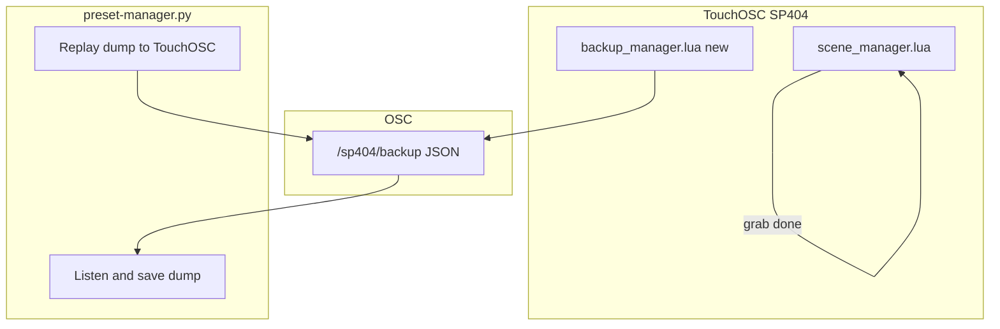

# Phase 3b: Scene follow-ups + unified backup

Extends [launchpad_pro_enhancements_13f97bae.plan.md](launchpad_pro_enhancements_13f97bae.plan.md) after completed Phases 1–3. Phase 4 (bus lock) stays separate; 3b should call a shared `isBusLocked(busNum)` helper once Phase 4 lands so recall/grab/backup-import respect locks.

**PyQt5:** No reason to change — it already works on Mac, dependencies are light (`PyQt5`, `python-osc`, `psutil`). Keep and extend [`preset-manager/python/preset-manager.py`](/Users/willellis/Documents/Development/Github/touchosc-controllers/preset-manager/python/preset-manager.py).

---

## Phase 3b scope (active tracks)



| Track | Status | Goal |
|-------|--------|------|
| **3b-1** | **Declined** | ~~Exclude-tuning on scene recall~~ — see decision below |
| **3b-2** | **Done** | Scene grab: Shift+stored pad = momentary full-performance preview |
| **3b-3** | **Done** | Unified OSC backup + Mac utility for store/replay |

Deferred items **not** in 3b (unchanged): per-scene colors, custom scene names.

---

## 3b-1: Exclude-tuning on scene recall — declined

**Decision (post-test):** We are **not** implementing exclude-tuning on scene recall. Scenes are **global performance snapshots** and should always reload full bus state (all fader CCs, sync, FX, on/off) — the same model as today’s `applyBusFadersAndSync` without preset-style filtering.

**Why it didn’t make sense:**

- Effect **presets** are per-FX, per-bus slots where “don’t recall tuning” is a deliberate performance choice (`exclude_tuning_from_presets_button` + `isExcludable` in [`preset_grid_manager.lua`](sp404-mk2/SP404/lua/preset_grid_manager.lua)).
- **Scenes** capture the whole rig; partial recall (skip tuning on some buses) produced confusing mixes when scenes had different FX or exclude settings than when stored.
- A prototype was added to [`scene_manager.lua`](sp404-mk2/SP404/lua/scene_manager.lua) and **reverted** after hardware testing; README documents full state reload only.

**Still true for presets:** Store always saves all 6 CCs; recall may skip excludable faders when exclude is on. **Scenes:** store and recall always use all 6 CCs (no exclude gate).

Do not re-open 3b-1 unless requirements change explicitly (e.g. per-scene exclude rules — previously deferred as too ambiguous).

---

## 3b-2: Scene grab (Shift + stored scene pad) — done

**Shipped:** [`scene_manager.lua`](sp404-mk2/SP404/lua/scene_manager.lua) — `applyGlobalState`, `scene_grab_restore` on `root.tag`, `handleSceneGrabPad`, delete mode cancels grab. README Launchpad gestures: Shift+stored scene = momentary preview/restore.

| Gesture | Action |
|---------|--------|
| Shift + stored pad **down** | Snapshot full performance → `recallScene` (preview) |
| Shift + same pad **up** | Restore snapshot (no write to scene slot) |
| Shift + empty pad | No-op |
| Delete mode | Cancels active scene grab |

**Note:** Scene grab restore applies the **full** pre-preview snapshot (not exclude-filtered). Scene **recall** (tap stored) is also full state — consistent with 3b-1 decline.

---

## 3b-3: Unified OSC backup + Mac utility

### What to include in one dump

| Section | Source | Notes |
|---------|--------|-------|
| `presets` | `preset_manager` children `1`–`46` tags | Same shape as today’s `/presets` payload |
| `scenes` | `scene_manager` children `01`–`16` tags | `{ buses: { ... } }` per slot |
| `defaults` | `default_manager.tag` | Per-FX default CC arrays |
| `recent` | `recent_values.tag` | Per-bus MRU stacks |
| `buses` | Each `busN_group.tag` | Current FX selection per bus — **recommended** so import restores UI state without requiring a scene recall |

**Not included:** ephemeral `grab_restore_*` / `scene_grab_restore`, runtime `launchpadShiftHeld`.

### OSC API (new; keep `/presets` working)

Add [`backup_manager.lua`](sp404-mk2/SP404/lua/backup_manager.lua) (root child node, build-injected):

- **Export:** `sendOSC('/sp404/backup', jsonString)` where decoded JSON is:

```json
{
  "version": 1,
  "name": "optional user label from TouchOSC or empty",
  "createdAt": "2026-05-24T12:00:00Z",
  "presets": { "1": {}, ... },
  "scenes": { "01": {}, ... },
  "defaults": {},
  "recent": {},
  "buses": { "1": {}, ... }
}
```

- **Import:** `onReceiveOSC` on a layout `backup_import_group` stores blob in tag; confirm button notifies `import_backup_from_osc` → write all sections → refresh:
  - All `preset_grid` → `refresh_presets_list`
  - `scene_manager` → `refresh_all_scenes`
  - Bus groups may need `set_fx` refresh if bus tags change (evaluate during impl)

**TouchOSC layout:** One **Export backup** button (notify `export_backup_to_osc`), reuse import-group pattern from existing preset export/import (layout scripts live in [`SP404.tosc`](sp404-mk2/SP404/SP404.tosc) — mirror via backup or `toscbuild tree`).

**Leave [`preset_manager.lua`](sp404-mk2/SP404/lua/preset_manager.lua) `/presets` path intact** for backward compatibility; new work uses `/sp404/backup` only.

**Opportunistic fix:** `importPresetsFromOSC` should `json.toTable(value)` if import receives a string; call `refresh_presets_list` after import (known gap).

### Mac utility ([`preset-manager.py`](/Users/willellis/Documents/Development/Github/touchosc-controllers/preset-manager/python/preset-manager.py))

Stay simple; extend in place:

| Feature | Detail |
|---------|--------|
| **Defaults** | Listen/send `127.0.0.1`, port from settings; OSC address `/sp404/backup` |
| **Capture** | Listen → parse args[0] → validate `version` + sections → save to `dumps/{name}_{YYYYMMDD_HHMMSS}.json` (sanitize name; default name `untitled`) |
| **Replay** | Pick file from list or file dialog → `send_message('/sp404/backup', [json])` |
| **UI** | Name field + “Capture” / “Replay” + log pane; drop generic multi-address cruft or hide behind “Advanced” |
| **Deps** | Add [`preset-manager/python/requirements.txt`](/Users/willellis/Documents/Development/Github/touchosc-controllers/preset-manager/python/requirements.txt): `PyQt5`, `python-osc`, `psutil` |

TouchOSC connection: user configures OSC receive/send ports in TouchOSC app to match utility (document in preset-manager README snippet).

---

## Build & docs

- [`toscbuild.json`](sp404-mk2/SP404/toscbuild.json): map `backup_manager.lua` → `backup_manager` node (layout node added manually or via inject script).
- `python3 tools/toscbuild.py build sp404-mk2/SP404`
- Update [`sp404-mk2/SP404/lua/README.md`](sp404-mk2/SP404/lua/README.md): scene grab, backup OSC address (exclude-tuning on scenes: **not** planned).
- Update parent plan deferred table: move grab/OSC to Phase 3b status; mark exclude as declined.

---

## Suggested implementation order (remaining)

1. ~~**3b-1** exclude-tuning~~ — **declined**
2. ~~**3b-2** scene grab~~ — **done**
3. **3b-3a** `backup_manager.lua` + layout export/import
4. **3b-3b** Python utility (unblocks automated round-trip testing)

---

## Test checklist (Phase 3b)

- ~~Exclude on + scene recall~~ — N/A (declined)
- Shift+scene preview: full performance changes; release restores exact prior state — **done**
- Shift+empty scene: no-op — **done**
- Export → Python saves file with metadata → Import restores presets, scenes, defaults, recent, bus FX selections — **pending 3b-3**
- Legacy `/presets` export still works — **pending 3b-3**
- Delete mode cancels scene grab mid-hold — **done**
