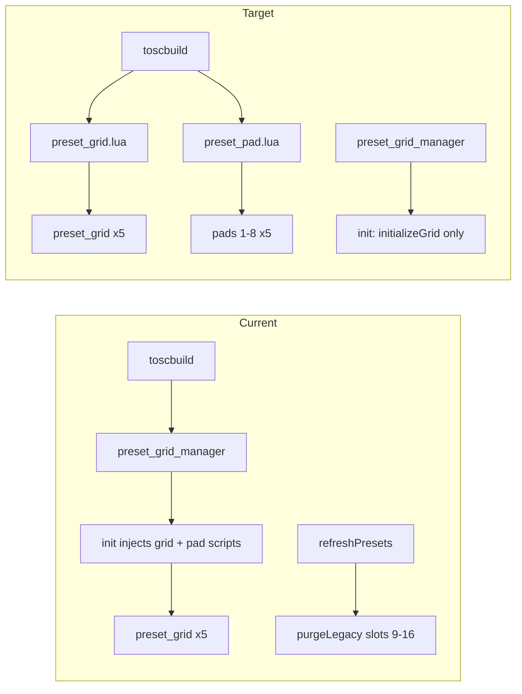

# Preset 16→8 cleanup and build-time grid scripts

## Context

Commit `0be91cf` reduced presets from 16 to 8 per bus. Layout migration is **already applied** (all five `preset_grid` groups contain pads `1`–`8` only). What remains:

| Item | Location | Why remove / change |
|------|----------|---------------------|
| Runtime tag purge | [`preset_grid_manager.lua`](sp404-mk2/SP404/lua/preset_grid_manager.lua) | `purgeLegacyPresetSlots()` strips keys `"09"`–`"16"` on every `refreshPresets`; no longer needed once data is migrated |
| One-off layout tool | [`tools/migrate_preset_grid_8.py`](tools/migrate_preset_grid_8.py) | Documented as one-off; layout already migrated |
| Orphan stub | [`bus_group_instances.lua`](sp404-mk2/SP404/lua/bus_group_instances.lua) | Single comment; not in [`toscbuild.json`](sp404-mk2/SP404/toscbuild.json), not in `.tosc` |
| Runtime script injection | Same manager file, `init()` lines 494–567 | User requested build-time migration; scripts are identical across grids/pads (bus comes from `self.tag` / `parent.tag`) |

**Keep** (not migration leftovers):

- `PRESETS_PER_BUS = 8` and the `presetNum <= PRESETS_PER_BUS` guard in `refreshPresets` — correct behavior, cheap safety
- [`tools/sync_bus1_ui_to_buses.py`](tools/sync_bus1_ui_to_buses.py) / [`tools/tosc_layout_utils.py`](tools/tosc_layout_utils.py) — ongoing layout maintenance from the same PR, not one-off migration
- `init()` in `preset_grid_manager` for `initializeGrid` + fxNum resync — still required after dropping injection loop



## 1. Remove runtime migration from `preset_grid_manager.lua`

Delete:

- `LEGACY_PRESET_SLOT_MAX`
- `purgeLegacyPresetSlots()` (lines 42–52)
- Call block in `refreshPresets` (lines 206–208)

No other logic changes in store/recall/LED paths.

## 2. Extract preset grid scripts to standalone Lua files

Create two files under [`sp404-mk2/SP404/lua/`](sp404-mk2/SP404/lua/):

- **`preset_grid.lua`** — content from current `presetGridScript` `[[...]]` block (notify relay to `preset_grid_manager`)
- **`preset_pad.lua`** — content from current `presetButtonScript` `[[...]]` block (`onValueChanged` → `button_value_changed`)

Trim verbose `print` calls only if you want quieter logs; otherwise move verbatim to avoid behavior drift.

## 3. Extend `toscbuild` for scoped child injection

Pad buttons are named `"1"`–`"8"` but appear **22× each** layout-wide — injecting by `node_name: "1"` alone would corrupt unrelated nodes.

Add manifest support (minimal API):

```json
{
  "lua": "preset_pad.lua",
  "under_name": "preset_grid",
  "node_names": ["1", "2", "3", "4", "5", "6", "7", "8"]
}
```

Implementation in [`tools/toscbuild.py`](tools/toscbuild.py):

- Reuse [`find_node_block`](tools/tosc_layout_utils.py) and [`find_direct_child_block`](tools/tosc_layout_utils.py) from `tosc_layout_utils` (import shared module; avoid duplicating `migrate_preset_grid_8` logic)
- For each `preset_grid` block (expect 5), inject into each direct child BUTTON/LABEL matching `node_names` via existing `_replace_script_in_range` on that child’s `<properties>` section
- Update `_resolve_targets`, `_count_total_targets`, and `_inject_mapping` to handle `under_name` + `node_names`
- Document the new mapping shape in [`docs/tosc-format.md`](docs/tosc-format.md) (build manifest section)

## 4. Update [`toscbuild.json`](sp404-mk2/SP404/toscbuild.json)

Add mappings:

```json
{"lua": "preset_grid.lua", "node_name": "preset_grid"},
{"lua": "preset_pad.lua", "under_name": "preset_grid", "node_names": ["1","2","3","4","5","6","7","8"]}
```

## 5. Slim down `preset_grid_manager.lua`

- Remove embedded `presetGridScript` / `presetButtonScript` strings and the `init()` loop that assigns `.script` on grids and pads
- Keep `init()` that runs `initializeGrid(1..5)` and the fxNum resync loop (lines 569–581)
- Update the comment block at ~494 to note scripts are build-injected

## 6. Delete obsolete files

- [`tools/migrate_preset_grid_8.py`](tools/migrate_preset_grid_8.py)
- [`sp404-mk2/SP404/lua/bus_group_instances.lua`](sp404-mk2/SP404/lua/bus_group_instances.lua)

## 7. Rebuild and verify

```bash
python3 tools/toscbuild.py build sp404-mk2/SP404
python3 tools/toscbuild.py tree sp404-mk2/SP404/SP404.tosc
```

Expected build output:

- `preset_grid.lua` → `preset_grid` ×5
- `preset_pad.lua` → scoped pads ×40 (5 buses × 8 pads)
- `preset_grid_manager.lua` → single manager node

Smoke test in TouchOSC: load layout, pick FX on a bus, store/recall/delete presets 1–8, Launchpad LED feedback, delete mode toggle.

## 8. Doc touch-up

Update [`CLAUDE.md`](CLAUDE.md) bullet for `preset_grid_manager.lua`: remove “Injects pad scripts at runtime via `init()`”; note build-time `preset_grid.lua` / `preset_pad.lua`.

## Out of scope

- Migrating [`control_mapper.lua`](sp404-mk2/SP404/lua/control_mapper.lua) runtime fader injection (separate, parameterized build-time work)
- Renaming pad nodes to globally unique names (unnecessary with `under_name` scoping)
