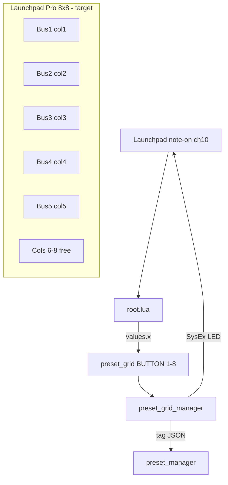

# 8-Preset Grid + Launchpad 5-Bus Layout

## Current state

- **TouchOSC**: Each of the 5 `preset_grid` groups has **16** `BUTTON` children named `"1"`…`"16"` (mixed layout: large pads 1–3, then 2 columns for 4–16). Label overlay `perform_preset_label_grid` uses **gridY=8** (2-column label grid).
- **Lua**: [`preset_grid_manager.lua`](sp404-mk2/lua/preset_grid_manager.lua) and [`root.lua`](sp404-mk2/lua/root.lua) hard-code **16** in loops and `(busNum - 1) * 16 + presetNum` indexing.
- **Launchpad**: `presetNoteMap` has **64** entries = **4 buses × 16 pads** (2 columns × 8 rows per bus). **Bus 5 is broken** on hardware (indices 65–80 are out of range).
- **Storage**: Sparse JSON in `preset_manager` child tags, keys `"01"`…`"16"` — no fixed array length; logic only limits what the UI/Launchpad expose.



## Target Launchpad layout

**One column per bus**, preset **1 at top**, **8 at bottom**, buses **1→5** left to right (columns 1–5). Columns **6–8** unused (future features).

| Bus | Column | Notes (top → bottom) |
|-----|--------|----------------------|
| 1 | 1 | 81, 71, 61, 51, 41, 31, 21, 11 |
| 2 | 2 | 82, 72, 62, 52, 42, 32, 22, 12 |
| 3 | 3 | 83, 73, 63, 53, 43, 33, 23, 13 |
| 4 | 4 | 84, 74, 64, 54, 44, 34, 24, 14 |
| 5 | 5 | 85, 75, 65, 55, 45, 35, 25, 15 |

**Formula** (replace duplicated static 64-entry tables):

```lua
local PRESETS_PER_BUS = 8
local NUM_BUSES = 5

local function buildPresetNoteMap()
  local map = {}
  for bus = 1, NUM_BUSES do
    for preset = 1, PRESETS_PER_BUS do
      map[(bus - 1) * PRESETS_PER_BUS + preset] = 81 + (bus - 1) - (preset - 1) * 10
    end
  end
  return map
end
```

**`root.lua` routing** (note-on handler ~lines 195–197):

- `busIndex = math.floor(presetIndex / PRESETS_PER_BUS)`
- `presetNumber = (presetIndex % PRESETS_PER_BUS) + 1`

**Unchanged**: Programmer layout SysEx (`0x03`), MIDI channel 10, delete mode on **CC 50** / LED index `0x32`.

## Lua changes

### 1. [`preset_grid_manager.lua`](sp404-mk2/lua/preset_grid_manager.lua)

- Add `PRESETS_PER_BUS = 8` (UPPER_SNAKE_CASE per project conventions).
- Replace static `presetNoteMap` with `buildPresetNoteMap()` (same in `root.lua`; add a one-line comment in both files: *keep formula in sync*).
- Replace all `for i = 1, 16` loops with `PRESETS_PER_BUS` in:
  - `sendSysexAllPadsOff`
  - `initialiseButtons`
  - `refreshMIDIButtons`
  - `init()` pad script injection
- Replace `(busNum - 1) * 16 + i` with `* PRESETS_PER_BUS + i` everywhere (including `updateButtonMIDIHighlight` ~line 330).
- **Bus 5 LED color**: extend `velocityColours` to 5 entries (today index 5 falls back to bus 1’s color `35`); pick a distinct palette index for green bus theme (e.g. `21` or `60` — verify on hardware).
- **Purge slots 09–16 on refresh** (your choice): in `refreshPresets`, after loading `presetArray` from `presetManagerChild.tag`, remove keys `"09"`…`"16"` and write tag back if any were removed, *before* coloring buttons:

```lua
local function purgeLegacyPresetSlots(presetArray)
  local dirty = false
  for i = 9, PRESETS_PER_BUS + 8 do  -- 9..16
    local key = formatPresetNum(i)
    if presetArray[key] ~= nil then
      presetArray[key] = nil
      dirty = true
    end
  end
  return dirty
end
```

(Simpler: `for i = 9, 16 do` since `PRESETS_PER_BUS` is 8.)

- Guard `refreshPresets` coloring loop: only touch `grid.children[tostring(presetNum)]` when `presetNum` is 1..8 (defensive after purge).

### 2. [`root.lua`](sp404-mk2/lua/root.lua)

- Same `PRESETS_PER_BUS`, `buildPresetNoteMap()`, and division/modulo update in `onReceiveMIDI`.
- Remove duplicate 64-element static table.

### 3. No changes required

- [`bus_group_instance.lua`](sp404-mk2/lua/bus_group_instance.lua) — still notifies `preset_grid` by name.
- [`preset_manager.lua`](sp404-mk2/lua/preset_manager.lua) — storage model unchanged.
- Python preset-manager app — no hardcoded 16-slot assumption found.

## TouchOSC layout ([`SP404.tosc`](sp404-mk2/SP404.tosc))

Apply the **same edit to all 5** `busN_group` → `preset_grid` groups (bus1 currently has buttons at two x positions: `x=5` and `x=49`; target is a **single column**).

**Recommended workflow**: edit in **TouchOSC Editor** (visual), then run build to re-inject Lua:

```bash
python3 tools/toscbuild.py build sp404-mk2
```

| Element | Action |
|---------|--------|
| `BUTTON` `"9"`…`"16"` | Delete from each `preset_grid` (5×) |
| `BUTTON` `"1"`…`"8"` | Reposition into **one column** (uniform size; ~41×43 to match pads 5–7 today) |
| `preset_grid_background_box` | Shrink width/height to fit 8 pads |
| `preset_grid` group `frame` | Shrink to match (frees horizontal space in bus panel) |
| `perform_preset_label_grid` | Set **gridX=1, gridY=8**; remove extra label cells if editor created 16 |

**Note**: `preset_grid_manager.init()` only injects scripts into buttons that exist (`findByName(tostring(i))`); removing nodes 9–16 is sufficient — no orphan script references.

## Documentation

- Update [`CLAUDE.md`](CLAUDE.md) line “16 slots per effect” → **8 slots**.
- Optional one-liner in [`sp404-mk2/lua/README.md`](sp404-mk2/lua/README.md) documenting Launchpad column layout and free columns 6–8.

## Verification checklist

1. **Build**: `python3 tools/toscbuild.py build sp404-mk2` — no errors.
2. **TouchOSC**: Each bus shows 8 preset pads in one column; store/recall/delete still work; labels 1–8 visible.
3. **Launchpad**: All 5 columns light correctly per bus accent when presets stored; bus 5 works (regression fix).
4. **Mapping**: Press top pad → preset 1, bottom → preset 8; each column maps to correct bus.
5. **Migration**: Effect with stored `"09"`–`"16"` — after selecting that effect, keys are removed from tag and pads 9–16 no longer appear in OSC export for that FX.
6. **Delete mode**: CC 50 toggle still works; red/delete LED behavior unchanged.

## Risk / scope notes

- **Layout coupling**: Bus panel may need minor repositioning of neighbors (`exclude_tuning_from_presets_button`, etc.) after shrinking `preset_grid` — adjust in editor if overlap occurs.
- **Duplicate map logic**: Two files still define `buildPresetNoteMap()`; acceptable for now (same pattern as today’s duplicate static tables). A shared `launchpad_preset_map.lua` would require a new build-time include mechanism — out of scope unless you want that refactor.
- **OSC preset backup**: Exported JSON may still contain `"09"`–`"16"` from backups made before upgrade; re-importing old files could restore them until the next `refreshPresets` purge.
