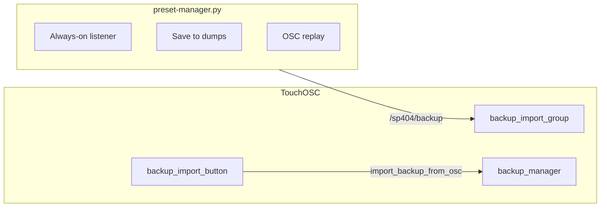

# Backup feature UX improvements

## Context

| Area | Current behavior |
|------|------------------|
| **TouchOSC IMPORT** | [`backup_import_confirm_button.lua`](sp404-mk2/SP404/lua/backup_import_confirm_button.lua) runs import on button release only; does not close overlay ([`backup_import_exit_button.lua`](sp404-mk2/SP404/lua/backup_import_exit_button.lua) has the close logic). |
| **Utility UI** | Single scrolling column in [`preset-manager/python/preset-manager.py`](preset-manager/python/preset-manager.py): ports, IP links, name, Start/Stop listener, dump list, log, **Save settings**. |
| **Listener toggle** | Manual start/stop only needed if ports are wrong or user wants to free the UDP port — not required for normal use; **plan: always-on**. |
| **`version` in JSON** | Fixed **schema** version `1` from [`backup_manager.lua`](sp404-mk2/SP404/lua/backup_manager.lua) / `BACKUP_VERSION` — not a per-dump counter. Log line `version 1` on every capture is expected today. |
| **Save settings** | Writes `settings.json` (listen/send IPs, ports, backup name). Nothing auto-saves; closing the app loses edits unless the user clicks Save. |



---

## 1. Close import popup after IMPORT (TouchOSC)

**Change:** After a successful import notify, close the overlay the same way as Exit.

**Approach (minimal):** Add shared close helper in [`backup_import_group.lua`](sp404-mk2/SP404/lua/backup_import_group.lua) (`closeImportOverlay()`), call it from:

- [`backup_import_confirm_button.lua`](sp404-mk2/SP404/lua/backup_import_confirm_button.lua) — after `import_backup_from_osc` (only when parent tag has valid JSON, or always close and let import no-op on invalid)
- Optionally refactor [`backup_import_exit_button.lua`](sp404-mk2/SP404/lua/backup_import_exit_button.lua) to `notify("close_import_overlay")` for one code path

**Build:** `python3 tools/toscbuild.py build sp404-mk2/SP404`

---

## 2. Simplify Backup Utility UI (Python)

Refactor [`preset-manager/python/preset-manager.py`](preset-manager/python/preset-manager.py) to `QTabWidget` with two tabs:

### Tab: **Backup** (default after first run)

- Short hint: TouchOSC **Export** / **Import** + port summary (read-only one line from settings: `Listening 127.0.0.1:5005 → replay to :5006`)
- **Always-on capture listener** — start `BackupListenerThread` on app launch (and restart when listen IP/port change in Settings); no Start/Stop button
  - **Why always-on:** Capture is passive UDP; cost is negligible. The only reasons to toggle were manual control and port conflicts — port errors surface in the log; user fixes ports in Settings tab
  - Small status in log on startup: `Listening on …` / `Error: address in use` if bind fails
- **No separate “Save capture” button** — saving happens after the name confirm dialog (§3)
- **Dump list** with **double-click → replay** (`itemDoubleClicked` → existing `replay_file`)
- Compact **log** (fixed height ~120px)
- Remove **Replay selected**, **Replay from file…**, and **Save settings** buttons (double-click replay; optional “Open file…” only if needed later)

### Tab: **Settings** (shown first only on first load)

- Listen IP/port, Send IP/port
- IP quick-pick links (moved here from main tab)
- Mark first-run complete in `settings.json`: e.g. `"settingsConfigured": true`

**First-load behavior:**

```python
# On __init__: if not settings.get("settingsConfigured"):
#   tabs.setCurrentIndex(settings_tab_index)
# Settings tab includes "Done" or auto-set flag when user leaves tab / edits ports
```

After `settingsConfigured` is true, open on **Backup** tab.

### Remove **Save settings** button

Replace with **auto-persist**:

- `save_settings()` on `closeEvent` (always)
- Debounced save on Settings tab field changes (e.g. 500ms)
- Persist `lastBackupName` in settings when user confirms a capture name (§3)
- Restart listener thread when listen IP/port change (after debounced save)

Document in [`preset-manager/python/README.md`](preset-manager/python/README.md): settings live in `settings.json` next to the script; no manual save.

---

## 3. Confirm backup name on every capture

In `on_backup_received`, when capture is valid, **always** show a name dialog (confirm, not only when empty):

- **Prefill order:** `settings.lastBackupName` → incoming `data.get("name")` → `"untitled"`
- `QInputDialog.getText(..., "Backup name for this capture", text=prefill)`
- **OK:** sanitize name → update `lastBackupName` in settings → write dump immediately (increment `saveId`, §4) → refresh list → log `Saved #N: …`
- **Cancel:** discard pending capture (do not write file); log `Capture discarded`

No persistent “backup name” text field on the Backup tab — the dialog is the naming step. Settings tab stays ports-only.

Optional: remove the old Backup-name `QLineEdit` from the main UI entirely to avoid two sources of truth.

---

## 4. Per-save counter (not schema version)

**User intent:** Incrementing save identity, not JSON `version`.

| Field | Role |
|-------|------|
| `version` | Keep `1` in dump JSON for TouchOSC [`backup_manager.lua`](sp404-mk2/SP404/lua/backup_manager.lua) validation — unchanged |
| `saveId` (new, optional) | Integer from utility `settings.json` `"nextSaveId"` incremented on each file write |
| Filename | e.g. `{name}_{saveId:04d}_{YYYYMMDD_HHMMSS}.json` or `{name}_{saveId:04d}.json` |

**Utility changes:**

- On successful save: `nextSaveId += 1`, write into dump as `"saveId": N`, update log: `Saved #N: …`
- Main tab: small label `Next save: #N` (optional)
- Stop logging “version 1” as the headline; log `format v1, save #N` if needed for debugging

**TouchOSC:** Ignore unknown fields in import (`saveId` harmless in JSON). No Lua change required unless you want to display saveId in export `name` — not required for v1.

---

## 5. Files to touch

| File | Changes |
|------|---------|
| [`backup_import_group.lua`](sp404-mk2/SP404/lua/backup_import_group.lua) | `closeImportOverlay()`, `onReceiveNotify("close_import_overlay")` |
| [`backup_import_confirm_button.lua`](sp404-mk2/SP404/lua/backup_import_confirm_button.lua) | Close overlay after import |
| [`backup_import_exit_button.lua`](sp404-mk2/SP404/lua/backup_import_exit_button.lua) | Delegate to shared close (optional) |
| [`preset-manager.py`](preset-manager/python/preset-manager.py) | Tabbed UI, auto-settings, double-click, name dialog, saveId |
| [`preset-manager/python/README.md`](preset-manager/python/README.md) | Updated workflow, settings auto-save, saveId vs format version |

No `.tosc` layout changes unless IMPORT button behavior needs editor tweak (scripts only via toscbuild).

---

## 6. Test checklist

- TouchOSC: Import overlay closes after **IMPORT**; state resets like **Exit**
- Utility: First launch opens **Settings**; second launch opens **Backup**
- Listener active on launch without a button; changing listen port restarts listener
- Ports persist after quit without **Save settings** button
- Double-click dump → TouchOSC receives replay (import overlay + **IMPORT** flow)
- Every capture → name dialog with last name prefilled → OK saves with incrementing `saveId`; Cancel discards
- Re-import dump: TouchOSC still accepts `version: 1`; empty buses still clear (existing fix)
