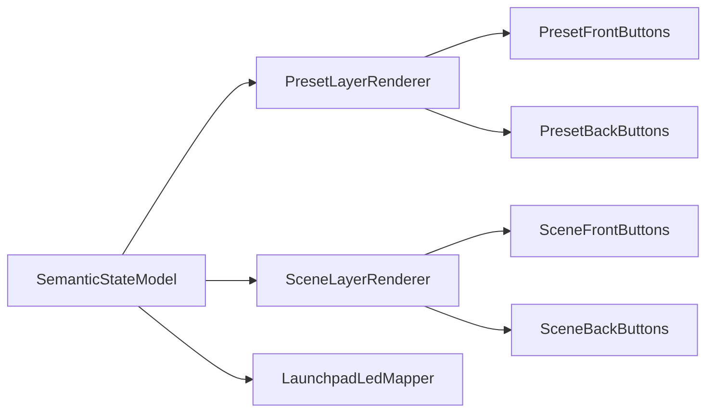

# Preset + Scene Layered Highlight Plan

## Goal

Adopt a robust layered highlight system (per-cell back buttons) for both preset and scene grids in TouchOSC, with:
- **~75% brightness for available/idle visual states**
- **100% brightness for press/active visual states**
- no regressions in store/recall/delete/grab/morph behavior
- no regressions in Launchpad LED behavior

## Why This Needs Refactor (not just color tweaks)

Current logic in both grid managers uses **front button color as behavior state** (e.g. deciding recall vs store/delete), so changing visuals directly can break behavior.

Examples:
- Preset grid behavioral branching currently compares button color values in [`/Users/willellis/Documents/Development/Github/touchosc-controllers/sp404-mk2/lua/preset_grid_manager.lua`](/Users/willellis/Documents/Development/Github/touchosc-controllers/sp404-mk2/lua/preset_grid_manager.lua).
- Scene grid behavioral branching currently compares button color values in [`/Users/willellis/Documents/Development/Github/touchosc-controllers/sp404-mk2/lua/scene_manager.lua`](/Users/willellis/Documents/Development/Github/touchosc-controllers/sp404-mk2/lua/scene_manager.lua).

To make layered visuals safe, we should separate:
- **semantic state** (available/stored/delete/morph/locked)
- **rendering state** (front vs back layer colors/brightness)

## Implementation Strategy

### 1) Layout Additions (TouchOSC UI)

Add per-cell back buttons behind front grid buttons:
- Preset grids: 8 back buttons behind each `preset_grid` button in every bus group.
- Scene grid: 16 back buttons behind each scene button.

Naming convention (example):
- Presets: `back_1`..`back_8` under each `preset_grid`
- Scenes: `back_1`..`back_16` under `scene_grid`

Then map scripts for these with no-op (or minimal) behavior so they are non-interactive visual layers.

Files to update:
- [`/Users/willellis/Documents/Development/Github/touchosc-controllers/sp404-mk2/toscbuild.json`](/Users/willellis/Documents/Development/Github/touchosc-controllers/sp404-mk2/toscbuild.json)
- new helper script(s) in [`/Users/willellis/Documents/Development/Github/touchosc-controllers/sp404-mk2/lua`](/Users/willellis/Documents/Development/Github/touchosc-controllers/sp404-mk2/lua)

### 2) Preset Grid: Semantic State Table + Layered Renderer

In [`/Users/willellis/Documents/Development/Github/touchosc-controllers/sp404-mk2/lua/preset_grid_manager.lua`](/Users/willellis/Documents/Development/Github/touchosc-controllers/sp404-mk2/lua/preset_grid_manager.lua):
- Introduce explicit semantic state per bus/preset (e.g. `AVAILABLE`, `STORED`, `DELETE`, `MORPH_SELECT`, optional `PRESSED`).
- Replace behavior checks that rely on `Color.toHexString(button.color)` with semantic-state checks.
- Render pipeline:
  - front button = transparent or minimal overlay layer
  - back button = bus-tinted 75% for idle available/stored visual, 100% for active/press visual
- Preserve existing lock/delete/morph semantics exactly.

### 3) Scene Grid: Semantic State Table + Layered Renderer

In [`/Users/willellis/Documents/Development/Github/touchosc-controllers/sp404-mk2/lua/scene_manager.lua`](/Users/willellis/Documents/Development/Github/touchosc-controllers/sp404-mk2/lua/scene_manager.lua):
- Introduce explicit semantic state per scene slot (`AVAILABLE`, `STORED`, `DELETE`, optional `PRESSED`).
- Replace behavior checks currently based on front button color with semantic-state checks.
- Render back-layer brightness the same way (75% idle, 100% press/active).

### 4) Launchpad LED Mapping Consistency

Keep Launchpad LED decisions aligned to semantic state (not front color), so UI layer changes do not alter hardware behavior:
- Presets (`refreshMIDIButtons`, `updateButtonMIDIHighlight`) in preset manager
- Scenes (`refreshSceneMidiLed`, `updateSceneMidiPressHighlight`) in scene manager

### 5) Incremental Rollout + Compatibility Guard

Implement in two guarded steps:
1. Add back buttons + renderer while preserving current behavior path fallback.
2. Flip behavior logic fully to semantic-state path once verified.

This allows quick rollback if any edge case appears during live testing.

## Validation Plan

### Preset grid checks (all buses)
- Empty tap stores, stored tap recalls.
- Delete mode deletes stored only.
- Locked buses block store/delete as before.
- Grab/morph interactions unchanged.
- Visual brightness targets achieved: idle ~75%, active/press 100%.

### Scene grid checks
- Empty tap stores, stored tap recalls.
- Delete mode deletes stored.
- Shift scene grab still works.
- Visual brightness targets achieved.

### Hardware parity
- Launchpad preset/scene LEDs and press feedback unchanged functionally.

## Key Files

- [`/Users/willellis/Documents/Development/Github/touchosc-controllers/sp404-mk2/lua/preset_grid_manager.lua`](/Users/willellis/Documents/Development/Github/touchosc-controllers/sp404-mk2/lua/preset_grid_manager.lua)
- [`/Users/willellis/Documents/Development/Github/touchosc-controllers/sp404-mk2/lua/scene_manager.lua`](/Users/willellis/Documents/Development/Github/touchosc-controllers/sp404-mk2/lua/scene_manager.lua)
- [`/Users/willellis/Documents/Development/Github/touchosc-controllers/sp404-mk2/toscbuild.json`](/Users/willellis/Documents/Development/Github/touchosc-controllers/sp404-mk2/toscbuild.json)
- new layer scripts in [`/Users/willellis/Documents/Development/Github/touchosc-controllers/sp404-mk2/lua`](/Users/willellis/Documents/Development/Github/touchosc-controllers/sp404-mk2/lua)

## Sequence Diagram

