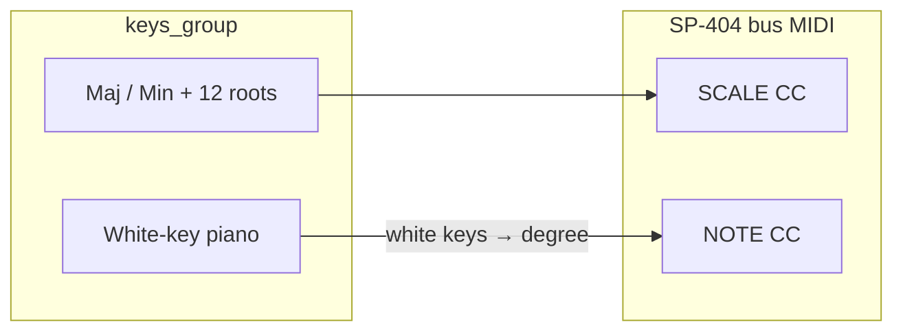

# Hyper Reso scale grid + relative keyboard

**Status:** Implemented (2026). Contributor runtime notes: [`lua/README.md`](../lua/README.md) (Hyper Reso section). Code: [`keyboard_manager.lua`](../lua/keyboard_manager.lua), [`keys.lua`](../lua/keys.lua), [`chord_pad_button.lua`](../lua/chord_pad_button.lua).

## SP-404 parameter model

Hyper Reso (FX 31) in [`controls_info.lua`](../lua/controls_info.lua):

| Control | Role | Discrete values |
| -------- | ------ | ----------------- |
| **NOTE** (`note_fader`, CC 16) | Scale **degree** | 35 steps: `-17…-1`, `1…18` (no 0) — [`getNote`](../lua/control_mapper.lua) |
| **SCALE** (`scale_fader`, CC 80) | **Root + quality** | 24 steps: `C Maj` … `B Min` — [`getScale`](../lua/control_mapper.lua) |

Harmonic spelling is applied by the SP-404; the controller sends discrete NOTE + SCALE CC only.



## Design (implemented)

### 1) Scale UI on `chord_grid` / `chord_label_grid`

- Pads stay named **`1` … `16`** (top row 1–8, bottom row 9–16).
- **When:** Keyboard grab + Hyper Reso (FX 31). `keys_group.tag.chordGridMode = "hyper_reso_scale"`.
- **Resonator / Vocoder:** Same pads, `chordGridMode = "chord_pads"` — chord CC tables unchanged. (Auto Pitch and Harmony keyboard control are out of scope.)
- **State:** `hyperResoRoot`, `hyperResoMinor` on bus `tag`; perform `scale_grid` synced via `applyFaderCc` + `setGridIndex`.
- **Perform → UI:** `scale_fader` / `chord_fader` changes notify `keyboard_perform_cc` → pad highlights + NOTE label.

#### Pad map (confirmed)

| Pad | Role | Label |
| --- | ---- | ----- |
| 1 | major | Maj |
| 2 | unused | *(hidden)* |
| 3–4, 6–8 | roots | C#, D#, F#, G#, A# |
| 5 | unused | *(hidden)* |
| 9 | minor | Min |
| 10–16 | roots | C–B |

```lua
Keyboard.HYPER_RESO_PAD_MAP = {
  [1] = "major", [2] = "unused",
  [3] = 1, [4] = 3, [5] = "unused",
  [6] = 6, [7] = 8, [8] = 10,
  [9] = "minor",
  [10] = 0, [11] = 2, [12] = 4, [13] = 5, [14] = 7, [15] = 9, [16] = 11,
}
```

### 2) Relative NOTE keyboard (Launchkey + on-screen)

**White keys only** for Hyper Reso (black keys hidden on layout; MIDI black keys ignored).

- **Anchor:** **MIDI 60 (middle C) = NOTE degree `1`**. On-screen labels: **UI octave 3** → left span **C3** shows degrees **1–7** (`HYPER_RESO_ANCHOR_MIDI`, `HYPER_RESO_ANCHOR_UI_OCTAVE`).
- **Mapping:** Build white-key table 0–127; `degree = 1 + (whiteIndex - whiteIndexOf60)`, clamp to `[-17, 18]` \ {0}. Out-of-range whites clamp to **-17** or **+18** at edges.
- **C-to-C spans:** Each span = 7 white keys = 7 degrees. On-screen widget shows **two spans** (like default piano): left = UI octave `o`, right = `o+1` (see [`keys.lua`](../lua/keys.lua) `hyper_reso_octave` notify).
- **Octave buttons:** UI values **0–4**; default **3** on grab. **Auto-scroll:** only when highest held degree exceeds visible range (**upward only**); manual octave buttons for scrolling down.
- **Independence from SCALE:** Fingerings stay fixed relative to middle C; scale grid only updates SCALE CC.
- **Key mode:** Toggle press (not momentary) for Hyper Reso, same as Resonator root tuning.

Original plan used semitone formula `midiNote - 59`; implementation uses **white-key step map** from anchor MIDI 60.

### 3) Launchkey

- **Keybed:** Connection index **4**; pads on channel 10; route through `handleKeyboardMidi` when keyboard attached.
- **Drum pads:** Map to on-screen chord/scale pads via `LAUNCHKEY_DRUM_PAD_NOTE_TO_INDEX` → `handleChordPadPress`.
- **Resonator chord labels:** Match [`getChord`](../lua/control_mapper.lua) (pad 9 = **m9**, not m0 — SP-404 display).

### 4) Perform strip

- Bus NOTE / SCALE / CHORD faders and grids unchanged for BCR.
- Keyboard path uses same CCs via `applyFaderCc`.
- `control_mapper.lua` perform faders emit `keyboard_perform_cc` on wheel turn for attached-bus sync.

## Visibility matrix

| Attach mode | `chord_grid` |
| ----------- | ------------ |
| Chromatic | hidden |
| Hyper Reso + keyboard grab | scale picker (maj/min + roots) |
| Resonator / Vocoder | chord pads |

## Files

| File | Role |
| ---- | ---- |
| [`keyboard_manager.lua`](../lua/keyboard_manager.lua) | Core: modes, CC tables, white-key map, pad/perform sync, Launchkey routing |
| [`keys.lua`](../lua/keys.lua) | Hyper Reso octave layout (two spans, white slots only) |
| [`chord_pad_button.lua`](../lua/chord_pad_button.lua) | Generic pads 1–16; mode-aware notify |
| [`chord_grid.lua`](../lua/chord_grid.lua) | Legacy perform-strip grid parent (keys_group parent has no script slot) |
| [`control_mapper.lua`](../lua/control_mapper.lua) | `keyboard_perform_cc` from perform faders |
| [`toscbuild.json`](../toscbuild.json) | `chord_pad_button.lua` under `chord_grid` children 1–16 |

## Testing checklist

- [ ] Hyper Reso grab: scale grid visible; Resonator grab: chord pads; chromatic: hidden.
- [ ] UI octave **3**: left **C3** key = degree **1**; MIDI **60** sets NOTE **1**.
- [ ] White keys advance degrees; black keys (MIDI + UI) do nothing in Hyper Reso mode.
- [ ] Scale grid Maj/Min + root ↔ perform SCALE wheel and pad highlights.
- [ ] NOTE wheel ↔ highlighted white key + `root_label` degree text.
- [ ] Launchkey drum pads drive scale/chord pads when keyboard grabbed.
- [ ] Octave view stays put until playing above visible range; then scrolls up only.
- [ ] Edge MIDI: clamp highlight + NOTE to -17 / +18.

## Out of scope

- Vocoder live NOTE/SCALE on bus 5 (separate live-note model).
- Launchpad scale pad map.
- Custom scales beyond SP-404 maj/min.
- Script on `keys_group/chord_grid` parent (layout has no script property — radio via `keyboard_manager` selection sync).
