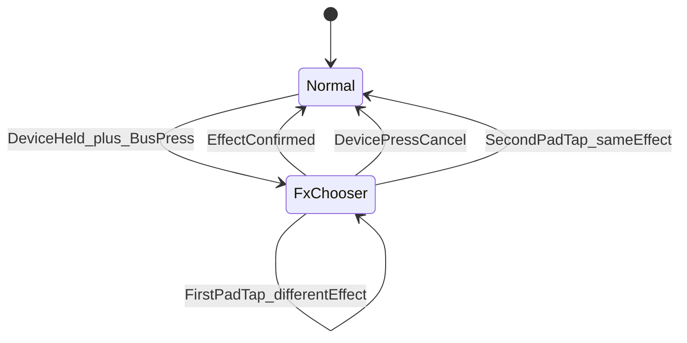
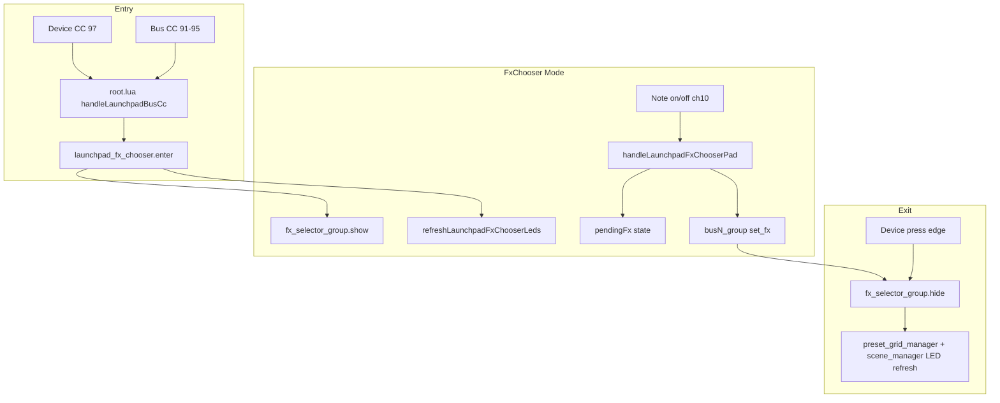

# Launchpad Pro Effect Chooser

## Goal

Enable choosing SP-404 effects from Launchpad Pro using **Device (CC 97) + bus button (CC 91–95)**, with the same 8×6 effect layout as the TouchOSC modal, two-tap confirmation on pads, and a simplified TouchOSC popup that uses **bus accent colors** instead of legacy BCR highlighting.

## Current State

| Area | Today |
|------|--------|
| Launchpad CC 97 | Unused (BCR perform encoder only, on MIDI port 2) |
| Bus buttons | Delete / Click / Undo / Shift / Quantise modifiers + plain tap = FX toggle |
| Effect modal | TouchOSC only via **Choose**; [`fx_selector_button_group.lua`](sp404-mk2/lua/fx_selector_button_group.lua) paints orange available, bus-accent **current**, green **pending** (pending logic is dead — never wired to MIDI) |
| Pad routing | [`root.lua`](sp404-mk2/lua/root.lua) `onReceiveMIDI` forwards all note-ons to preset/scene pads |

## Interaction Design



### Enter
- **Hold Device (CC 97)** and **press a bus button (91–95)** → open chooser for that bus.
- Must work even when the bus has **no FX loaded** (exception to the existing `busHasFxLoaded` guard in `handleLaunchpadBusCc`).
- Latched mode: user can **release Device** and browse.
- Sync TouchOSC: show [`fx_selector_group`](sp404-mk2/lua/fx_selector_group.lua) and light that bus’s `choose_button` (reuse `on_off_button_group` → `set_chooser_state` path).

### Browse / confirm (Launchpad only)
- **First tap** on a lit pad → highlight that effect as **pending** (Launchpad LED only).
- **Second tap** on the **same** pad → `set_fx`, close modal, exit chooser, restore normal Launchpad LEDs.
- **Double-tap** (second note-on on same pad within ~350 ms) → confirm immediately.
- **Tap a different** lit pad → move pending highlight (no load).
- TouchOSC grid stays **single-tap to load** (unchanged gesture on iPad).

### Cancel
- **Device press** (CC rising edge while chooser is already open) → close modal, exit chooser, restore LEDs.  
  (Opening uses Device-held + bus press; cancel uses a fresh Device press after chooser is latched — avoids cancel-on-open if Device stays held.)

### While chooser is active
- Preset, scene, morph, grab, and delete pad gestures are **blocked** in `root.lua` (notes handled by chooser first).
- Bus buttons and other modifiers do not perform their normal actions (except Device cancel).

## Pad / Effect Mapping

Reuse the same row-major index as TouchOSC ([`fx_selector_button_group.lua`](sp404-mk2/lua/fx_selector_button_group.lua)):

```
fxIndex = (row - 1) * 8 + col    -- col 1..8, row 1..6
```

Launchpad Programmer note formula (already in [`launchpad_led.lua`](sp404-mk2/lua/launchpad_led.lua)):

```
note = 10 * row + col    -- row 1 = bottom row
```

| Grid | Notes (examples) |
|------|------------------|
| Row 1 (bottom) | 11–18 |
| Row 6 (top of grid) | 61–68 |
| Rows 7–8 | Off (unused; avoids preset top-row notes 81–85) |

46 effects fill rows 1–6; cells 47–48 (row 6 cols 7–8) are unused. Bottom-row cells overlap scene note addresses (e.g. note 17) — safe because chooser mode overrides routing and repaints all pads on entry.

**Availability:** `isEffectOnMidiAvailable(fxIndex, busNum)` from [`sp404_effect_on_values.lua`](sp404-mk2/lua/sp404_effect_on_values.lua). Unavailable cells stay **unlit**.

## Color Strategy

### TouchOSC popup ([`fx_selector_button_group.lua`](sp404-mk2/lua/fx_selector_button_group.lua))
- **Remove** current-effect (bus accent) and pending (green) highlights — legacy BCR UX.
- **Remove** dead column/pending machinery: `activeColumn`, `columnRow`, `columnEffects`, `getPendingFxIndex`, `initPendingSelection`, `findTopLeftAvailableFx`, `getAvailableForColumn`, `selectEffectByIndex`, `COLOR_PENDING`, `toggle_visibility` handler.
- **Available** buttons → bus accent from `root.tag.busAccentHex[bus]`.
- **Unavailable** → existing gray `8D8D8AFF`.

### Launchpad LEDs
- **Available** pads → bus RGB via `launchpadBusRgb(busNum, LAUNCHPAD_IDLE_BRIGHTNESS)`.
- **Pending** pad → same hue at `LAUNCHPAD_ON_BRIGHTNESS` (or `LAUNCHPAD_PRESS_BRIGHTNESS`).
- **Unavailable** → off (`sendLaunchpadLedPalette(note, 0)`).
- **Active bus button** (top row) → full bus brightness while chooser open.

**Per-effect unique colors:** defer for v1. Bus accent + brightness gives clear bus context and pending feedback without 46-color maintenance. Can add HSV-hash offsets later as an optional enhancement.

### Device button LED (CC 97)
Recommend **light blue** — distinct from existing modifiers (white Shift, green Click, magenta Undo, red Delete, orange Quantise):

```lua
-- launchpad_led.lua
function launchpadDeviceRgb(brightness)
  return launchpadRgb255(51, 153, 255, brightness)  -- ~#3399FF
```

Idle = `LAUNCHPAD_IDLE_BRIGHTNESS`, held = `LAUNCHPAD_ON_BRIGHTNESS`.

## Architecture

Add a focused module and wire it through existing notify paths:



### New file: [`launchpad_fx_chooser.lua`](sp404-mk2/lua/launchpad_fx_chooser.lua)

Included from `root.lua` via [`toscbuild.json`](sp404-mk2/toscbuild.json) (`include`: `launchpad_led.lua`, `sp404_effect_on_values.lua`).

Core API:
- `launchpadFxChooserActive()`, `launchpadFxChooserBus()`
- `enterLaunchpadFxChooser(busNum)` — global pads-off SysEx, show TouchOSC modal, paint grid
- `exitLaunchpadFxChooser()` — clear state, refresh preset + scene Launchpad LEDs
- `handleLaunchpadFxChooserNote(note, velocity)` — pending / confirm / double-tap
- `handleLaunchpadDeviceCancel()` — called on Device rising edge when active
- `refreshLaunchpadFxChooserLeds()` — batch RGB via `sendLaunchpadLedRgbBatch`
- Shared helpers: `launchpadEffectIndexForNote(note)`, `launchpadNoteForEffectIndex(fxIndex)` (add to [`launchpad_led.lua`](sp404-mk2/lua/launchpad_led.lua))

State (module locals): `active`, `busNum`, `pendingFx`, `lastTapFx`, `lastTapTime`.

### Changes to [`root.lua`](sp404-mk2/lua/root.lua)

1. `DEVICE_CC = 97`, `launchpadDeviceHeld`, Device LED refresh in `init` + `handleLaunchpadControlChange`.
2. **`handleLaunchpadBusCc`**: if `launchpadDeviceHeld` on bus press → `enterLaunchpadFxChooser(busNum)` (before `busHasFxLoaded` early return).
3. **Device CC handler**: track held state + LED; on **rising edge** while chooser active → `handleLaunchpadDeviceCancel()`.
4. **`onReceiveMIDI`**: if chooser active, delegate grid notes (rows 1–6, cols 1–8) to chooser handler and **return** (skip preset/scene/morph).
5. **`onReceiveNotify`**: handle `launchpad_fx_chooser_exit` from modal hide (TouchOSC close button sync).

### Changes to [`fx_selector_group.lua`](sp404-mk2/lua/fx_selector_group.lua)

- `hideSelector()` → `root:notify("launchpad_fx_chooser_exit")` so TouchOSC close also restores Launchpad.

### Cleanup in [`bus_group_instance.lua`](sp404-mk2/lua/bus_group_instance.lua)

- Remove unused `setSelectedBusHighlight` / `set_bus_highlight` handler (zero callers).

### [`toscbuild.json`](sp404-mk2/toscbuild.json)

```json
{"lua": "root.lua", "node_id": "root", "include": ["launchpad_led.lua", "sp404_effect_on_values.lua", "launchpad_fx_chooser.lua"]}
```

(Keep `launchpad_fx_chooser.lua` self-contained; it calls shared helpers from the includes.)

### Docs: [`README.md`](sp404-mk2/README.md)

Add to Launchpad section:
- Device button row in modifier table (CC 97, blue LED).
- New gesture row: **Device + bus** → effect chooser; **tap pad twice** (or double-tap) to load; **Device** to cancel.
- Note that unavailable effects are unlit for the selected bus.

## Edge Cases

| Case | Behavior |
|------|----------|
| Open chooser on empty bus | Allowed (primary use case) |
| Device + bus while Delete/Shift/etc. held | Ignore bus action; prefer chooser entry only when Device held and no other modifier (match existing modifier exclusivity) |
| Load effect | `busGroup:notify('set_fx', { fxNum, fxName, false })` — third arg `false` closes modal via existing `applyChooserVisibility` |
| Scene recall while chooser open | Block pad routing; scene_manager unaffected until exit |
| `clear_button` / bus unload during chooser | If chooser open for that bus, cancel chooser on `clear_bus` notify (optional guard in `bus_group_instance`) |

## Testing Checklist

1. Device+each bus (1–5) opens modal with correct bus label and bus-colored available buttons on TouchOSC.
2. Launchpad shows 8×6 grid; unavailable effects dark; bus accent on available.
3. Two-tap confirm loads effect, closes modal, perform strip appears, preset LEDs restore.
4. Double-tap confirms in one gesture.
5. Device cancel closes modal and restores preset/scene LEDs without loading.
6. TouchOSC close button also restores Launchpad (via `launchpad_fx_chooser_exit`).
7. TouchOSC single-tap still loads immediately; no current/pending colors on grid.
8. Device+bus works on bus with no FX loaded.
9. No regression: Delete/Shift/Click/Undo/Quantise+bus still work when chooser inactive.
