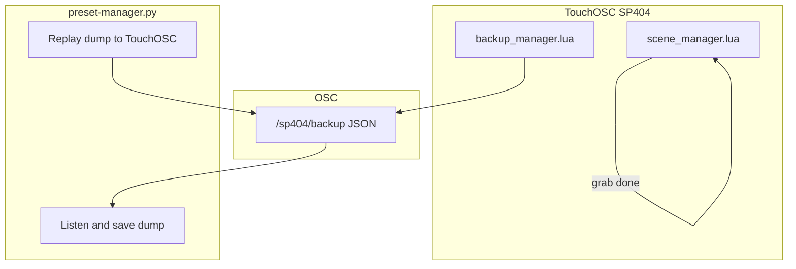

# Phase 3b: Scene follow-ups + unified backup

**Status: complete** (committed `42bae1a`, May 2026).

Extends [launchpad_pro_enhancements_13f97bae.plan.md](launchpad_pro_enhancements_13f97bae.plan.md) after completed Phases 1–3. Phase 4 (bus lock) stays separate; when Phase 4 lands, recall/grab/backup-import should call a shared `isBusLocked(busNum)` helper.

**PyQt5:** No reason to change — it already works on Mac, dependencies are light (`PyQt5`, `python-osc`, `psutil`). Keep and extend [`../preset-manager/python/preset-manager.py`](../preset-manager/python/preset-manager.py).

---

## Phase 3b scope (active tracks)



| Track | Status | Goal |
|-------|--------|------|
| **3b-1** | **Declined** | ~~Exclude-tuning on scene recall~~ — see decision below |
| **3b-2** | **Done** | Scene grab: Shift+stored pad = momentary full-performance preview |
| **3b-3** | **Done** | Unified OSC backup + Mac utility for store/replay |

Deferred items **not** in 3b (unchanged): per-scene colors, custom scene names.

---

## 3b-1: Exclude-tuning on scene recall — declined

**Decision (post-test):** We are **not** implementing exclude-tuning on scene recall. Scenes are **global performance snapshots** and should always reload full bus state (all fader CCs, sync, FX, on/off) — the same model as today’s `applyBusFadersAndSync` without preset-style filtering.

**Why it didn’t make sense:**

- Effect **presets** are per-FX, per-bus slots where “don’t recall tuning” is a deliberate performance choice (`exclude_tuning_from_presets_button` + `isExcludable` in [`preset_grid_manager.lua`](sp404-mk2/lua/preset_grid_manager.lua)).
- **Scenes** capture the whole rig; partial recall (skip tuning on some buses) produced confusing mixes when scenes had different FX or exclude settings than when stored.
- A prototype was added to [`scene_manager.lua`](sp404-mk2/lua/scene_manager.lua) and **reverted** after hardware testing; README documents full state reload only.

**Still true for presets:** Store always saves all 6 CCs; recall may skip excludable faders when exclude is on. **Scenes:** store and recall always use all 6 CCs (no exclude gate).

Do not re-open 3b-1 unless requirements change explicitly (e.g. per-scene exclude rules — previously deferred as too ambiguous).

---

## 3b-2: Scene grab (Shift + stored scene pad) — done

**Shipped:** [`scene_manager.lua`](sp404-mk2/lua/scene_manager.lua) — `applyGlobalState`, `scene_grab_restore` on `root.tag`, `handleSceneGrabPad`, delete mode cancels grab. README Launchpad gestures: Shift+stored scene = momentary preview/restore.

| Gesture | Action |
|---------|--------|
| Shift + stored pad **down** | Snapshot full performance → `recallScene` (preview) |
| Shift + same pad **up** | Restore snapshot (no write to scene slot) |
| Shift + empty pad | No-op |
| Delete mode | Cancels active scene grab |

**Note:** Scene grab restore applies the **full** pre-preview snapshot (not exclude-filtered). Scene **recall** (tap stored) is also full state — consistent with 3b-1 decline.

---

## 3b-3: Unified OSC backup + Mac utility — done

### Shipped (beyond original sketch)

| Area | Delivered |
|------|-----------|
| **TouchOSC** | `backup_manager.lua`, export/import UI, `/sp404/backup` via `root.lua` `onReceiveOSC`; legacy `/presets` layout removed |
| **Import** | Restores presets, scenes, defaults, recent, buses; **FX on/off forced off** per loaded bus (not in dump) |
| **Mac utility** | Always-on listener; Settings + Backup tabs; config library (`name`, `configVersion`, `createdAt`); newest-first sort; rename/delete (context menu); window position in `settings.json`; `run-backup.sh` |
| **Tools** | `inject_backup_layout.py`, `remove_legacy_preset_osc_layout.py`; `.gitignore` for `dumps/` and local `settings.json` |

### What to include in one dump

| Section | Source | Notes |
|---------|--------|-------|
| `presets` | `preset_manager` children `1`–`46` tags | Same shape as today’s `/presets` payload |
| `scenes` | `scene_manager` children `01`–`16` tags | `{ buses: { ... } }` per slot |
| `defaults` | `default_manager.tag` | Per-FX default CC arrays |
| `recent` | `recent_values.tag` | Per-bus MRU stacks |
| `buses` | Each `busN_group.tag` | Current FX selection per bus — **recommended** so import restores UI state without requiring a scene recall |

**Not included:** ephemeral `grab_restore_*` / `scene_grab_restore`, runtime `launchpadShiftHeld`.

### OSC API (new; keep `/presets` working)

Add [`backup_manager.lua`](sp404-mk2/lua/backup_manager.lua) (root child node, build-injected):

- **Export:** `sendOSC('/sp404/backup', jsonString)` where decoded JSON is:

```json
{
  "version": 1,
  "name": "config display name (set by Mac utility on capture)",
  "configVersion": 1,
  "createdAt": "2026-05-24T12:00:00Z",
  "presets": { "1": {}, ... },
  "scenes": { "01": {}, ... },
  "defaults": {},
  "recent": {},
  "buses": { "1": {}, ... }
}
```

- **Import:** `root.lua` receives `/sp404/backup` → `backup_import_group` → confirm → `import_backup_from_osc` → write sections → `turnOffBusEffectsAfterImport` → refresh preset grids + scenes.
- **Export:** layout **Export** button → `export_backup_to_osc`.

**TouchOSC layout:** Export/Import buttons + `backup_import_group` (see [`SP404.tosc`](sp404-mk2/SP404.tosc)); built via `toscbuild` + layout inject scripts.

### Mac utility ([`preset-manager.py`](../preset-manager/python/preset-manager.py))

See [`../preset-manager/python/README.md`](../preset-manager/python/README.md). Summary:

| Feature | Detail |
|---------|--------|
| **OSC** | Listen `/sp404/backup` (TouchOSC outgoing); replay to TouchOSC incoming |
| **Capture** | Name prompt per capture; `dumps/{key}_{version}_{stamp}.json` (filename internal) |
| **Library** | Configs + versions from JSON metadata; double-click replay; right-click rename/delete |
| **Settings** | `settings.json` (gitignored): ports, `lastConfigName`, `nextConfigVersionByKey`, `windowGeometry` |
| **Deps** | [`../preset-manager/python/requirements.txt`](../preset-manager/python/requirements.txt): `PyQt5`, `python-osc`, `psutil` |

---

## Build & docs — done

- [`toscbuild.json`](sp404-mk2/toscbuild.json): backup script mappings
- `python3 tools/toscbuild.py build sp404-mk2`
- [`sp404-mk2/lua/README.md`](sp404-mk2/lua/README.md): scene grab, `/sp404/backup`, import FX-off behaviour
- [`../preset-manager/python/README.md`](../preset-manager/python/README.md): utility workflow
- Parent plan deferred table updated in [launchpad_pro_enhancements_13f97bae.plan.md](launchpad_pro_enhancements_13f97bae.plan.md)

---

## Implementation order — complete

1. ~~**3b-1** exclude-tuning~~ — **declined**
2. ~~**3b-2** scene grab~~ — **done**
3. ~~**3b-3a** TouchOSC backup~~ — **done**
4. ~~**3b-3b** Mac utility~~ — **done**

---

## Test checklist (Phase 3b)

- ~~Exclude on + scene recall~~ — N/A (declined)
- Shift+scene preview: full performance changes; release restores exact prior state — **done**
- Shift+empty scene: no-op — **done**
- Export → utility saves dump with `name` / `configVersion` / `createdAt` → Import restores presets, scenes, defaults, recent, bus FX; loaded buses start **FX off** — **done**
- Utility: config library, rename, delete, window position restore — **done**
- Delete mode cancels scene grab mid-hold — **done**
