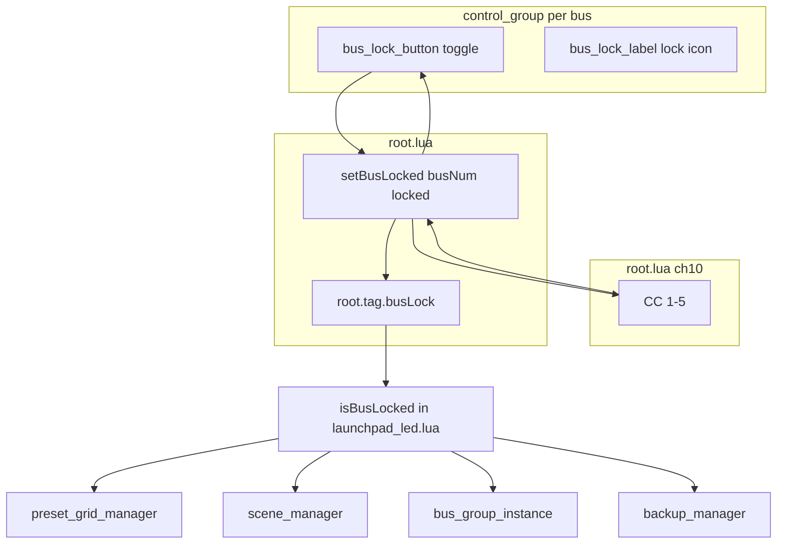

# Phase 4: Bus lock implementation

## Decisions (from plan + your answers)

| Behavior | Locked bus |
|----------|------------|
| Preset **recall** | Allowed |
| Preset **store** / **delete** | Blocked |
| Preset **grab** (Shift / grab mode) | Allowed |
| Scene **recall** | Skip bus (no FX/fader/on-off change) |
| Scene **store** | **Capture live** for all buses (including locked) |
| Scene **grab** preview/restore | Apply/restore **only unlocked** buses |
| **Recall** defaults (Undo+bus, TouchOSC) | Allowed |
| **Store** defaults (Click+bus, TouchOSC) | Blocked |
| **Clear bus** (Delete+bus, clear button) | Blocked |
| Morph (Quantise+bus, pads, aftertouch) | Allowed |
| Bus FX on/off (CC 91–95 tap) | Allowed |
| TouchOSC enforcement | Same rules on preset/scene pads (guards in managers, not Launchpad-only) |

**Persistence:** `root.tag.busLock` = `{ ["1"]=true, ... }` — performance state only; **not** in `/sp404/backup` export.

**Backup import:** Skip `writeBuses` for locked buses; merge `buses[N]` in `writeScenes` from existing tags. Global `presets` still import (optional stricter rule deferred).

---

## Architecture



**Single writer:** All lock toggles go through **`setBusLocked(busNum, locked)`** in [`root.lua`](sp404-mk2/lua/root.lua) so TouchOSC UI, Launchpad CC, and `init()` stay in sync.

---

## TouchOSC UI — `control_group` (new)

Place a **circular toggle** + **icon label** directly under the existing edit-mode control on each bus (mirror [`edit_mode_button`](sp404-mk2/extracted/group__perform_group__bus1_group__control_group__edit_mode_button.lua) / `edit_mode_label` pattern).

| Node | Type | Notes |
|------|------|--------|
| `bus_lock_button` | BUTTON (toggle) | Clone sizing from `edit_mode_button` (~27×27, outline on). Position **below** edit button (bus1 ref frame ~258,397 → lock ~258,428). |
| `bus_lock_label` | LABEL | Padlock icon **U+1F512** (decimal **128274**, same style as edit’s **`✏`**). In layout CDATA use the literal character; in Lua if needed: `string.char(0xF0, 0x9F, 0x94, 0x92)` or UTF-8 `"\u{1F512}"` depending on TouchOSC Lua build. Sits under lock button like `edit_mode_label`. |

**Chrome** (extend `applyBusGroupTheme` in `root.lua`, same pattern as edit mode):

| Lock state | Button | Label |
|------------|--------|-------|
| Unlocked | Bus accent fill (via `setChromeColor`) | Accent `textColor` |
| Locked | Red fill (`FF0000FF` or similar) | Black on red when active, red when idle |

**Script:** new [`bus_lock_button.lua`](sp404-mk2/lua/bus_lock_button.lua) (build-injected):

```lua
function onValueChanged(key, value)
  if key == "x" then
    local busTag = json.toTable(self.parent.parent.tag) or {}
    local busNum = tonumber(busTag.busNum) or 1
    root:notify("set_bus_locked", { busNum, self.values.x == 1 })
  end
end
```

`root.lua` `onReceiveNotify("set_bus_locked", …)` → `setBusLocked` (update tag, sync `bus_lock_button.values.x` without re-firing if needed, refresh Launchpad CC LED).

**Layout workflow** (match existing repo patterns):

1. Add nodes on **bus1** `control_group` (TouchOSC Editor **or** one-shot [`inject_bus_lock_layout.py`](sp404-mk2/tools/inject_bus_lock_layout.py) cloning `edit_mode_*` frames with Y offset).
2. Run [`sync_bus1_ui_to_buses.py`](sp404-mk2/tools/sync_bus1_ui_to_buses.py) — extend `SYNC_PREFIXES` / child sync so buses 2–5 get identical lock controls (new UUIDs per bus).
3. [`toscbuild.json`](sp404-mk2/toscbuild.json): `{ "lua": "bus_lock_button.lua", "under_name": "control_group", "node_names": ["bus_lock_button"] }`.

`edit_mode_button` script stays inline in `.tosc` today; lock uses the **build-time injected** script path like `morph_choose_button.lua`.

---

## Shared helper — [`launchpad_led.lua`](sp404-mk2/lua/launchpad_led.lua)

```lua
function isBusLocked(busNum)
  local tag = json.toTable(root.tag) or {}
  local locks = tag.busLock
  return type(locks) == "table" and locks[tostring(busNum)] == true
end

function launchpadLockRgb(brightness)
  return launchpadRgb255(255, 0, 0, brightness)
end
```

---

## Launchpad CC 1–5 — [`root.lua`](sp404-mk2/lua/root.lua)

- `LOCK_CC_FIRST` / `LOCK_CC_LAST` = 1–5; LED index = CC (RGB `0x0B`, same as other round buttons).
- CC press → `setBusLocked(busNum, not isBusLocked(busNum))`.
- `refreshLockButtonLED(busNum)` — dim red unlocked, bright red locked (always lit).
- `init()` — load `busLock` from tag → set all `bus_lock_button` + all lock LEDs.
- `handleLaunchpadBusCc` — block **Delete+clear** and **Click+store_defaults** when locked.

---

## Enforcement (unchanged logic)

### Presets — [`preset_grid_manager.lua`](sp404-mk2/lua/preset_grid_manager.lua)

| Function | Guard |
|----------|--------|
| `storePreset` | Early return if locked |
| `buttonPressed` | Locked: recall stored only; block store/delete |
| `storeDefaults` | Early return if locked |
| Grab / morph | No guard |

### Scenes — [`scene_manager.lua`](sp404-mk2/lua/scene_manager.lua)

`applyGlobalState(data, { skipLockedBuses = true })` for `recallScene`, scene grab preview, and scene grab restore. Store still uses full `captureGlobalState`.

### Clear bus — [`bus_group_instance.lua`](sp404-mk2/lua/bus_group_instance.lua)

`clear_bus` → return if `isBusLocked(busNum)`.

### Backup — [`backup_manager.lua`](sp404-mk2/lua/backup_manager.lua)

Skip `writeBuses` / FX-off for locked; merge locked `buses[N]` in `writeScenes`.

---

## Docs

[`sp404-mk2/README.md`](sp404-mk2/README.md):

- **TouchOSC:** Lock toggle under edit mode on each bus perform strip (padlock label U+1F512 / 128274).
- **Launchpad:** Bottom row Record buttons CC 1–5 (same state as UI).
- Gesture table (recall OK, store/delete/clear/scene-overwrite blocked, etc.).

**Deferred:** dim preset column on Launchpad for locked bus only.

---

## Build & test

```bash
python3 sp404-mk2/tools/inject_bus_lock_layout.py sp404-mk2/SP404.tosc   # if using inject helper
python3 sp404-mk2/tools/sync_bus1_ui_to_buses.py sp404-mk2/SP404.tosc
python3 tools/toscbuild.py build sp404-mk2
```

**Checklist**

- TouchOSC lock toggle ↔ Launchpad CC 1–5 stay in sync per bus.
- Locked: red lock UI; preset recall/grab/morph OK; store preset, store defaults, clear bus blocked.
- Scene recall/grab skip locked bus; scene store captures locked bus live values.
- Backup import does not overwrite locked bus live state or scene bus slices.

---

## Optional confirm (unchanged)

Import still replaces global `presets` JSON — say if locked buses should also skip preset tag writes for their current FX.
