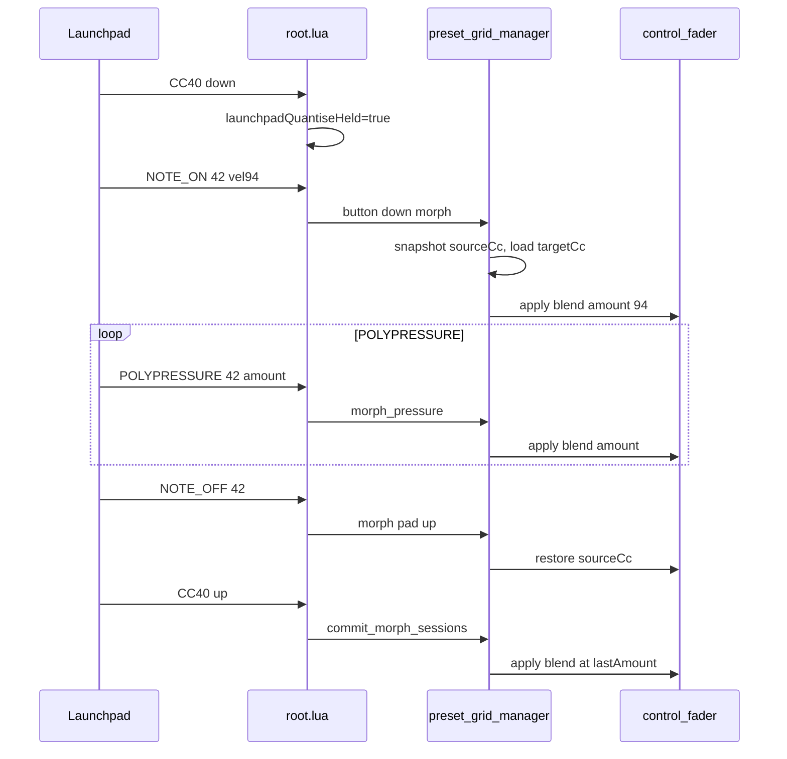

# Quantise + aftertouch preset morph

## Gesture (confirmed)

| Step | Action |
|------|--------|
| 1 | Hold **Quantise** (CC **40**, left column — same LED index as CC number, `0x28`) |
| 2 | Press a **stored** preset pad (cols 1–5) |
| 3 | While pad held, **poly pressure** on that note blends CCs: **0 = snapshot before morph**, **127 = stored preset** |
| 4 | **Pad release** (`NOTE_ON` vel 0) → restore faders to pre-morph snapshot (preview only) |
| 5 | **Quantise release** (CC 40 → 0) → **commit** live state at the **last** aftertouch value recorded during that morph session |

Your capture on note **42** is bus **2**, preset **5** (`81 + (bus-1) - (preset-1)*10`).



## Architecture

Reuse the same building blocks as **Shift+grab** in [`preset_grid_manager.lua`](sp404-mk2/SP404/lua/preset_grid_manager.lua): `snapshotFadersForGrab`, `getBusFaderContext`, exclude-tuning flags, and `control_fader:notify('new_value', midiToFloat(cc))` (which already pushes SP-404 + BCR MIDI via `control_mapper`).

**New morph session state** (per bus, last-pressed pad wins — mirror `activeGrabByBus`):

```lua
-- busNum -> { presetNum, sourceCc, targetCc, lastAmount, pendingCommit }
```

- **`sourceCc`**: MIDI table from `snapshotFadersForGrab` at morph start  
- **`targetCc`**: preset JSON for that slot (same data `recallPreset` uses)  
- **`lastAmount`**: 0–127, updated on every `POLYPRESSURE` (and initial `NOTE_ON` velocity on pad down)  
- **`pendingCommit`**: set `true` on pad release after a morph; cleared after Quantise release commit

**Blend helper** (integer MIDI space, matches existing `floatToMIDI` / `midiToFloat` usage):

```lua
local function lerpMidi(a, b, amount)
  return math.floor(a + (b - a) * amount / 127 + 0.5)
end
```

Apply only fader indices that participate in presets (respect `isExcludable` + `exclude_tuning_from_presets_button`, same as `recallPreset` / `snapshotFadersForGrab`).

## File changes

### 1. [`root.lua`](sp404-mk2/SP404/lua/root.lua)

- Add `QUANTISE_CC = 40`, `launchpadQuantiseHeld`, `syncLaunchpadModifierTags()` (extend existing `syncLaunchpadShiftTag` to also write `launchpadQuantiseHeld` on `root.tag`).
- In `handleLaunchpadControlChange`:
  - CC 40 → set held flag, RGB LED via new `launchpadQuantiseRgb` (dim/bright like Shift/Click).
  - On **release** → `preset_grid_manager:notify('commit_morph_sessions')` (or iterate buses and notify once globally).
- In `onReceiveMIDI` (Launchpad port only), after `NOTE_ON` / `CC` branches, add **`POLYPRESSURE`**:

```lua
elseif message[1] == MIDIMessageType.POLYPRESSURE + noteMidiChannel - 1 then
  -- map note -> bus/preset via presetNoteMap; ignore scene notes
  manager:notify('morph_pressure', { busNum, presetNum, message[3] })
```

- Optional: extract `noteToPreset(bus, preset)` helper next to `buildPresetNoteMap()` to avoid duplicating the linear search in both NOTE and POLY handlers.
- **`init`**: idle Quantise LED; `launchpadQuantiseHeld = false`.
- **Modifier interaction**: entering delete mode should cancel morph sessions (notify from `setLaunchpadDeleteMode` or inside manager on `toggle_delete_mode`).

### 2. [`preset_grid_manager.lua`](sp404-mk2/SP404/lua/preset_grid_manager.lua)

New functions (place after grab helpers ~line 205, before `recallPreset`):

| Function | Role |
|----------|------|
| `loadPresetCcForMorph(busNum, presetNum)` | Read preset JSON into `targetCc` table (no fader writes) |
| `applyMorphBlend(busNum, amount)` | Lerp `sourceCc`→`targetCc`, `new_value` per fader |
| `beginMorphPreset(busNum, presetNum, initialAmount)` | Stored pad only; snapshot source; store session; apply initial blend |
| `endMorphPad(busNum, presetNum)` | Restore `sourceCc`; set `pendingCommit`, clear `padHeld` |
| `commitMorphSessions()` | For each bus with `pendingCommit`, `applyMorphBlend(busNum, lastAmount)` then clear session |
| `cancelAllMorphSessions()` | On delete mode / quantise+delete / bus clear |

Extend `button_value_changed` payload to `{ busNum, presetNum, isPressed, shiftHeld, quantiseHeld, noteVelocity }`.

**Branch priority** in `button_value_changed`:

1. `deleteMode` (unchanged)  
2. `quantiseHeld` → `beginMorphPreset` on press (pass `noteVelocity` or 0); `endMorphPad` on release; **no** `buttonPressed` / store / recall  
3. `grabMode or shiftHeld` (unchanged)  
4. normal tap

New `onReceiveNotify` keys: `morph_pressure`, `commit_morph_sessions`, `cancel_morph_sessions`.

Guard: ignore morph on empty (non-stored) pads — same `isStoredPresetButton` check as `beginGrabPreset`.

### 3. [`preset_pad.lua`](sp404-mk2/SP404/lua/preset_pad.lua)

- Read `rootTag.launchpadQuantiseHeld` and pass into `button_value_changed` (5th/6th field).
- TouchOSC UI pads have no poly pressure — morph is Launchpad-only unless a future UI control is added.

### 4. [`launchpad_led.lua`](sp404-mk2/SP404/lua/launchpad_led.lua)

- Add `launchpadQuantiseRgb(brightness)` (pick a distinct modifier color, e.g. orange `{255,128,0}` — tune in implementation).

### 5. Docs

- [`lua/README.md`](sp404-mk2/SP404/lua/README.md): surface table row for CC 40, gesture table entry, mermaid/diagram update.
- Optional one-line note in [`plans/launchpad_pro_enhancements_13f97bae.plan.md`](sp404-mk2/SP404/plans/launchpad_pro_enhancements_13f97bae.plan.md) deferred/new feature row (not a full new phase file unless you want it tracked separately).

## Interaction matrix

| Modifier | Preset pad |
|----------|------------|
| Delete | Delete stored (unchanged) |
| **Quantise** | Morph stored (aftertouch); pad up = restore; Quantise up = commit |
| Shift / grab mode | Grab preview (unchanged) |
| None | Store / recall (unchanged) |

**Quantise vs Shift+grab**: Quantise wins when `launchpadQuantiseHeld` (check quantise before grab branch). Holding Quantise should call `cancelAllMorphSessions` / `restoreAllActiveGrabs` when entering delete or grab mode (mirror delete↔grab cleanup).

## Edge cases

| Case | Behavior |
|------|----------|
| Quantise + empty pad | No-op |
| POLYPRESSURE without active morph session | Ignore |
| POLYPRESSURE on scene note (cols 7–8) | Ignore in root |
| Quantise released without prior morph | No-op commit |
| Multiple buses morphed before Quantise up | Commit each bus with `pendingCommit` |
| Bus FX = 0 | No-op (existing guard) |
| Note-on velocity without following POLY | Use velocity as first `lastAmount` (matches your log starting at 94) |

## Testing (manual on hardware)

1. Store preset on bus 2 slot 5; set distinctive fader values vs current.
2. Hold CC 40, press note 42 — hear/see partial move; wiggle aftertouch — smooth blend.
3. Release pad — faders return to pre-morph values.
4. Press pad again, morph to ~127, release pad, release CC 40 — faders jump to committed preset-level blend.
5. Confirm normal recall/store/delete/Shift+grab unchanged without Quantise.
6. Confirm SP-404 receives interpolated CCs during morph (MIDI monitor).

## Out of scope (v1)

- TouchOSC Quantise button / aftertouch on screen pads  
- Scene pad morph  
- Throttling POLYPRESSURE (add only if TouchOSC or SP-404 struggles under load)
