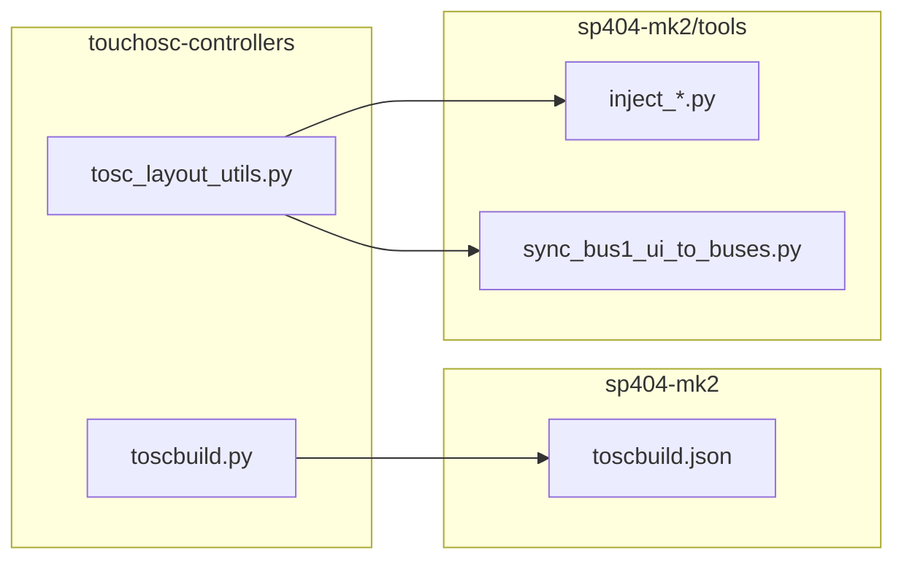
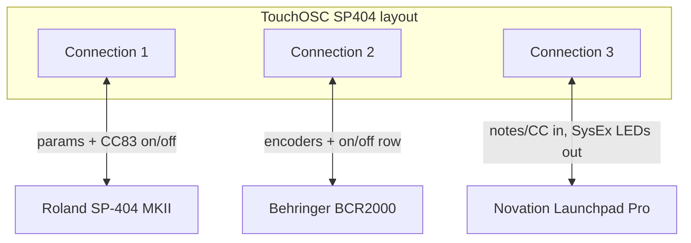

# sp404-mk2 folder tidy and user guide

## Target layout

After the move, `sp404-mk2/` becomes the single SP-404 TouchOSC project root:

```text
touchosc-controllers/
├── tools/                          # shared only
│   ├── toscbuild.py
│   └── tosc_layout_utils.py
├── docs/tosc-format.md
├── p6-granular/ …
├── s-1/ …
└── sp404-mk2/
    ├── README.md                   # NEW — end-user guide
    ├── SP404.tosc
    ├── toscbuild.json
    ├── lua/                        # 35 build sources (+ slim dev README)
    ├── plans/                      # historical design notes
    ├── backups/                    # gitignored (was SP404/backups/)
    ├── extracted/                  # gitignored scratch (unchanged location)
    ├── preset-manager/
    │   └── python/
    └── tools/
        ├── patch_sp404_disable_layout_midi.py   # already here
        ├── sync_bus1_ui_to_buses.py
        ├── inject_backup_layout.py
        ├── inject_morph_layout.py
        ├── inject_scene_layout.py
        └── remove_legacy_preset_osc_layout.py
```

**Keep at repo root:** [`tools/toscbuild.py`](tools/toscbuild.py) and [`tools/tosc_layout_utils.py`](tools/tosc_layout_utils.py) — used by [`p6-granular/BCR2000_P6/toscbuild.json`](p6-granular/BCR2000_P6/toscbuild.json) and any future layouts.

**Remove:** empty `sp404-mk2/SP404/` directory after `git mv`.



---

## Phase 1 — Flatten `SP404/` (git mv)

Use **`git mv`** (not copy/delete) so history is preserved.

| From | To |
|------|-----|
| `sp404-mk2/SP404/SP404.tosc` | `sp404-mk2/SP404.tosc` |
| `sp404-mk2/SP404/toscbuild.json` | `sp404-mk2/toscbuild.json` |
| `sp404-mk2/SP404/lua/` | `sp404-mk2/lua/` |
| `sp404-mk2/SP404/plans/` | `sp404-mk2/plans/` |
| `sp404-mk2/SP404/backups/` | `sp404-mk2/backups/` (if present locally) |

[`toscbuild.json`](sp404-mk2/SP404/toscbuild.json) needs **no content changes** — `source`/`output`/`lua_dir` are already relative (`SP404.tosc`, `lua`).

**New build/dev commands** (replace `sp404-mk2/SP404` everywhere):

```bash
python3 tools/toscbuild.py build sp404-mk2
python3 tools/toscbuild.py dev sp404-mk2
python3 tools/toscbuild.py tree sp404-mk2/SP404.tosc
```

Keep the layout filename **`SP404.tosc`** — it is the TouchOSC project name users already load.

---

## Phase 2 — Move `preset-manager/`

```bash
git mv preset-manager sp404-mk2/preset-manager
```

**No code changes** inside [`preset-manager/python/preset-manager.py`](preset-manager/python/preset-manager.py) — paths are relative to `__file__`.

**Update paths in:**

| File | Change |
|------|--------|
| [`.gitignore`](.gitignore) | `preset-manager/python/…` → `sp404-mk2/preset-manager/python/…` |
| [`sp404-mk2/preset-manager/python/README.md`](preset-manager/python/README.md) | `cd` and example alias paths |
| New + slimmed [`lua/README.md`](sp404-mk2/SP404/lua/README.md) | Mac utility link |

---

## Phase 3 — Consolidate SP404 layout tools

**Move from repo `tools/` → `sp404-mk2/tools/`:**

- `sync_bus1_ui_to_buses.py`
- `inject_backup_layout.py`
- `inject_morph_layout.py`
- `inject_scene_layout.py`
- `remove_legacy_preset_osc_layout.py`

**Fix default paths and imports** in each moved script:

| Script | Path logic today | After move |
|--------|------------------|------------|
| `sync_bus1_ui_to_buses.py` | `parents[1] / "sp404-mk2/SP404/SP404.tosc"` | `parents[1] / "SP404.tosc"` (`parents[1]` = `sp404-mk2`) |
| `inject_*.py`, `remove_legacy_*.py` | `_REPO / "sp404-mk2/SP404/SP404.tosc"` + `sys.path` → repo `tools/` | `_SP404 = parents[1]`; `TOSC = _SP404 / "SP404.tosc"`; `sys.path` → `parents[2] / "tools"` for `tosc_layout_utils` / `toscbuild` |
| `patch_sp404_disable_layout_midi.py` | docstring only | default arg `sp404-mk2/SP404.tosc` → `sp404-mk2/SP404.tosc` |

**Backup naming** in [`tools/tosc_layout_utils.py`](tools/tosc_layout_utils.py): docstring references `SP404/backups/SP404_*` — update prose to `sp404-mk2/backups/SP404_*` (behavior unchanged; backups are created relative to the build dir passed to `toscbuild`).

---

## Phase 4 — Update references repo-wide

**Must update (active docs / config):**

- [`.gitignore`](.gitignore): `sp404-mk2/SP404/SP404.tosc.bak` → `sp404-mk2/SP404.tosc.bak`; `sp404-mk2/SP404/backups/` → `sp404-mk2/backups/`
- [`CLAUDE.md`](CLAUDE.md): all `sp404-mk2/SP404/…` paths; build commands; `preset-manager` location
- [`docs/tosc-format.md`](docs/tosc-format.md): build/tree/open examples; link to new user README
- [`sp404-mk2/lua/README.md`](sp404-mk2/SP404/lua/README.md): paths for build, patch, sync, preset-manager
- [`sp404-mk2/preset-manager/python/README.md`](preset-manager/python/README.md): install/run paths
- Root [`README.md`](README.md): add a short “Projects” section linking to `sp404-mk2/README.md`

**Optional / low priority:** [`sp404-mk2/plans/*.md`](sp404-mk2/SP404/plans/) — historical; batch-replace `sp404-mk2/SP404` → `sp404-mk2` if you want plans to stay accurate, or leave as archival.

**Search pattern** (verify zero hits after tidy):

```
sp404-mk2/SP404
preset-manager/python   # without sp404-mk2 prefix
tools/sync_bus1_ui
tools/inject_
```

---

## Phase 5 — New user guide: [`sp404-mk2/README.md`](sp404-mk2/README.md)

**Source material:** [`sp404-mk2/SP404/lua/README.md`](sp404-mk2/SP404/lua/README.md) (lines 141–301 already cover MIDI, Launchpad, morph, backup) plus [`preset-manager/python/README.md`](preset-manager/python/README.md) for the Mac utility.

**Split documentation roles:**

| Document | Audience | Content |
|----------|----------|---------|
| `sp404-mk2/README.md` | **Users** | Setup, hardware, workflows, diagrams |
| `sp404-mk2/lua/README.md` | **Contributors** | Naming, grid/tag rules, `local function` order, `notify` patterns, layout sync / patch commands |

### Proposed README outline

1. **What this is** — 5 buses, 46 FX, 8 presets/FX/bus, 16 scenes; optional BCR2000 + Launchpad Pro.
2. **Quick start** — Load `SP404.tosc` in TouchOSC; wire 3 MIDI connections; optional OSC backup ports.
3. **MIDI setup** (mermaid diagram):



   Table from lua README: port indices `{true,false,false}` etc.; SP-404 channel = bus number; CC 83 on/off per effect.

4. **BCR2000** — Channel map (buses 1–4 → ch 6–9, bus 5 → ch 10); encoder CC table (81/89/97/82/90/98); button CCs 65/66/73/74; morph CC 1; note “FX chooser from BCR not implemented.”
5. **Launchpad Pro** — Programmer mode + init SysEx; ch 10; **retain ASCII grid** from lua README; gesture table; LED color summary; note **bus lock (CC 1–5) not implemented**.
6. **TouchOSC features** — Presets, scenes, morph, delete/grab modes, effect defaults (Click/Undo on Launchpad), unified backup.
7. **OSC backup & Mac utility** — `/sp404/backup`, default ports 5005/5006, link to `preset-manager/python/README.md`.
8. **Limitations / not yet shipped** — BCR FX selector, Launchpad FX chooser, bus lock; import forces FX off (use scenes for on/off).
9. **For developers** — one-liner pointing to `lua/README.md` and `python3 tools/toscbuild.py build sp404-mk2`.

**Diagrams to include:**

- Mermaid: 3-way MIDI routing (above).
- Mermaid or table: BCR channel + CC map per bus.
- ASCII: Launchpad Programmer grid (copy from existing lua README — renders well on GitHub).
- Optional mermaid: preset gesture decision flow (`delete → morph → grab → store/recall`).

**Do not duplicate** in the user README: Lua naming conventions, `local function` hoisting, grid `tag` JSON patterns (stay in `lua/README.md`).

---

## Verification checklist

After all moves and doc updates:

1. `python3 tools/toscbuild.py build sp404-mk2` — succeeds, writes backup under `sp404-mk2/backups/`.
2. `python3 tools/toscbuild.py tree sp404-mk2/SP404.tosc` — node tree looks correct.
3. `python3 sp404-mk2/tools/sync_bus1_ui_to_buses.py --diff-only` — resolves default `.tosc` path.
4. Grep repo for stale `sp404-mk2/SP404` and `preset-manager/python` (without `sp404-mk2/`).
5. Open `SP404.tosc` in TouchOSC and smoke-test: one bus FX, preset store/recall, Launchpad LED refresh, BCR encoder echo.

---

## Risk notes

- **Local-only paths:** Users with TouchOSC shortcuts, aliases, or CI pointing at `sp404-mk2/SP404/SP404.tosc` must update manually (call out in README “Quick start”).
- **`extracted/`** stays at `sp404-mk2/extracted/` (already gitignored) — no move needed.
- **Plans folder** is dev history, not user-facing; moving with the flatten is fine; no need to rewrite plan content unless you want clean grep.
