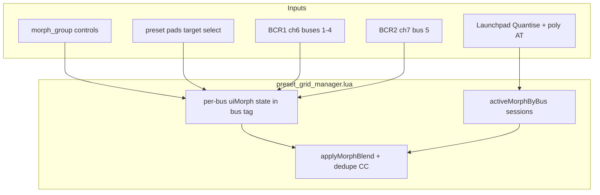

# TouchOSC + BCR morph controls

## Goal

Bring the Launchpad **Quantise + aftertouch** morph behavior to the TouchOSC perform UI and BCR2000, with a **persistent per-bus** morph setup:

| Control | TouchOSC |
|---------|----------|
| Morph on/off | Toggle at bottom of `control_group` |
| Morph amount 0→127 | Horizontal fader |
| Target-select mode | Button toggles preset grid |
| Choose morph target preset | Tap stored pad in select mode (or BCR right encoder turn) |

**Morph toggle off = commit** (matches Launchpad Quantise release): faders stay at the last blend; next enable re-snapshots a new source from live values.

Launchpad Quantise path ([`root.lua`](sp404-mk2/SP404/lua/root.lua) CC 40 + `POLYPRESSURE`) stays as-is (momentary pad + restore on pad up + commit on Quantise up).

---

## BCR2000 MIDI mapping (corrected)

### Hardware convention (both BCRs, top row)

- **Encoder turn**: CC **1–8** (encoder 1 → CC 1, … encoder 8 → CC 8)
- **Encoder push**: CC **9–16** (encoder 1 → CC 9, … encoder 8 → CC 16)

All morph/top-row traffic uses **fixed MIDI channels**, not per-bus perform channels (6–10). Perform faders still use bus-specific channels for CC 81/89/… as today.

### Two units, two channels

| Hardware | MIDI channel (TouchOSC index) | Buses | Encoders used |
|----------|------------------------------|-------|----------------|
| **BCR #1** | **6** (index **5**) | **1, 2, 3, 4** | Top-row encoders **1–8** (four bus pairs) |
| **BCR #2** | **7** (index **6**) | **5** only | Top-row encoders **1–2** (one bus pair, same layout as bus 1 on BCR1) |

### Per-bus CC assignment

Each bus gets **two encoder pairs**: **left** = morph (amount turn + on/off push), **right** = target (step turn + select-mode push).

Column order: `morphTurn`, `targetTurn`, `targetPush`, `morphPush`.

**BCR #1 — channel 6**

| Bus | Morph turn | Target turn | Target push | Morph push |
|-----|------------|-------------|-------------|------------|
| **1** | **1** | **2** | **10** | **9** |
| **2** | **3** | **4** | **12** | **11** |
| **3** | **5** | **6** | **14** | **13** |
| **4** | **7** | **8** | **16** | **15** |

**BCR #2 — channel 7** (bus 5 = first pair on unit 2, mirrors bus 1)

| Bus | Morph turn | Target turn | Target push | Morph push |
|-----|------------|-------------|-------------|------------|
| **5** | **1** | **2** | **10** | **9** |

Per bus pair (left encoder = morph, right = target; encoder *E* = `2*N - 1`):

- `morphTurn = E`, `targetTurn = E + 1`
- `morphPush = 8 + E` (bus 1 → **9**)
- `targetPush = 9 + E` (bus 1 → **10**)

Then +2 per bus for both pushes (11/12, 13/14, 15/16).

Implement as explicit `MORPH_BCR_BY_BUS` in [`root.lua`](sp404-mk2/SP404/lua/root.lua).

Implement as a lookup table in [`root.lua`](sp404-mk2/SP404/lua/root.lua) (e.g. `MORPH_BCR_BY_BUS[busNum] = { midiChannel, morphTurn, targetTurn, morphPush, targetPush }`) — do **not** derive bus from `msgChannel - 4`.

### Conflict with FX selector

[`handleFxSelectorBcrMidi`](sp404-mk2/SP404/lua/root.lua) owns **all** CC **1–16** on **channel 6** while `fx_selector_group` is visible.

- **Buses 1–4** morph CCs on ch 6 are inactive during FX chooser (same as today’s selector encoders).
- **Bus 5** morph on **channel 7** remains available while the modal is open (BCR2 is independent of selector ch 6).

### BCR gesture → UI morph

| BCR input | Action |
|-----------|--------|
| **Morph push** (127/0) | `set_morph_enabled` |
| **Morph turn** (2’s complement ticks) | accumulate → adjust `morphAmount` 0–127 |
| **Target push** (127/0) | `toggle_morph_target_select` |
| **Target turn** | step `morphTargetPreset` through **stored** slots only (wrap); works without select mode so the right encoder always picks a target |

Reuse encoder tick decoding from [`fx_selector_button_group.lua`](sp404-mk2/SP404/lua/fx_selector_button_group.lua) (`encoderValueToDirection`, `ENCODER_STEPS_PER_SLOT` or a morph-specific constant).

---

## Architecture



### Per-bus persistent state (`busN_group.tag` JSON)

Extend tag written/read in [`bus_group_instance.lua`](sp404-mk2/SP404/lua/bus_group_instance.lua):

```lua
{
  fxNum, fxName, busNum,
  morphEnabled = false,
  morphTargetPreset = nil,  -- 1..8 when set
  morphAmount = 0           -- 0..127 integer, mirrored from fader
}
```

Runtime-only (not in tag): `sourceCc`, `targetCc`, `lastAppliedCc` — rebuilt when morph enables or target changes.

### Per-bus UI-only mode

`morphTargetSelectMode[busNum]` in [`preset_grid_manager.lua`](sp404-mk2/SP404/lua/preset_grid_manager.lua) (parallel to global `deleteMode` / `grabMode`):

- Toggle via `morph_target_select_button` on that bus (and BCR **target push** for that bus).
- **Preset pad tap**: stored pad only → `setMorphTarget(bus, preset)`; no store/recall.
- **LED/color**: new state — e.g. `MORPH_TARGET` accent on the chosen target pad; in select mode, stored pads use a “pickable” highlight (e.g. `00FF88FF`).
- Exiting select mode refreshes grid colors.

### Pad gesture priority (update `button_value_changed`)

1. `deleteMode`
2. `morphTargetSelectMode[bus]` → set target only
3. `launchpadQuantiseHeld` → existing Launchpad morph session
4. `grabMode` / Shift
5. normal store/recall

---

## Refactor morph core ([`preset_grid_manager.lua`](sp404-mk2/SP404/lua/preset_grid_manager.lua))

Keep existing `lerpMidi`, `applyCcValuesToFaders`, `loadPresetCcValues`, `activeMorphByBus` for Launchpad.

Add **UI morph** API (notify keys from bus scripts / `preset_grid` relay):

| Notify | Action |
|--------|--------|
| `set_morph_enabled` | `{ busNum, enabled }` — on: require `morphTargetPreset`, snapshot `sourceCc`, apply current amount; off: **commit**, clear runtime tables, write tag |
| `set_morph_amount` | `{ busNum, amount 0..127 }` — if enabled, `applyMorphBlend`; update tag |
| `set_morph_target` | `{ busNum, presetNum }` — stored preset only; reload `targetCc`; reset amount to 0; if enabled, re-snapshot source + apply 0 |
| `toggle_morph_target_select` | `{ busNum, on }` — cancel delete/grab on that bus; refresh preset colors |

**Guards**: `fxNum == 0` → no-op; no target → enable toggle ignored.

**Interaction with Launchpad**: on Quantise CC down, cancel UI morph enable (Launchpad session owns blend until commit).

**Dedupe**: keep existing `lastAppliedCc` for both UI and Launchpad paths.

---

## TouchOSC layout (bus1 first, then sync)

Add under each `control_group` (bottom strip, below `preset_grid`):

| Node | Type | Role |
|------|------|------|
| `morph_group` | GROUP | container |
| `morph_enable_button` | BUTTON toggle | morph on/off |
| `morph_amount_fader` | FADER horizontal | 0.0–1.0 → amount 0–127 |
| `morph_target_select_button` | BUTTON toggle | target-select mode |
| `morph_target_label` | LABEL | shows target slot e.g. `→ 3` or `—` |

Workflow: layout in TouchOSC Editor on **bus1** → [`tools/sync_bus1_ui_to_buses.py`](tools/sync_bus1_ui_to_buses.py) → new node IDs on buses 2–5.

New scripts + [`toscbuild.json`](sp404-mk2/SP404/toscbuild.json) mappings; [`preset_grid.lua`](sp404-mk2/SP404/lua/preset_grid.lua) relays new notify keys.

---

## BCR routing ([`root.lua`](sp404-mk2/SP404/lua/root.lua))

Add `handleBcrMorphMidi(message)`:

1. `midiFromBcr(connections)`
2. If `fx_selector_group.visible` **and** `msgChannel == 5` (ch 6) → return false (let `handleFxSelectorBcrMidi` handle CC 1–16)
3. Parse CC; lookup `busNum` from `MORPH_BCR_BY_BUS` by matching `(midiChannel, cc)` to one of the four CCs for that bus
4. Require `control_group` visible for that bus + FX loaded
5. Dispatch morph push/turn or target push/turn to `preset_grid_manager` notifies

Order in `onReceiveMIDI` (BCR branch):

```lua
if handleBcrMorphMidi(message) then return end
if handleBcrOnOffMidi(message) then return end
if handleBcrPerformMidi(message) then return end
handleFxSelectorBcrMidi(message)
```

No outbound BCR LED echo in v1.

---

## Visual / chrome

- `applyBusGroupTheme`: tint `morph_group` with bus accent.
- Target pad highlight in `refreshPresets` / Launchpad LED for morph target note.

---

## Docs and plans

- [`sp404-mk2/SP404/lua/README.md`](sp404-mk2/SP404/lua/README.md): morph UI + BCR table (ch 6 / ch 7, CCs per bus).
- Copy or link plan into [`sp404-mk2/SP404/plans/`](sp404-mk2/SP404/plans/) when implementing.

---

## Test plan

1. TouchOSC: target select → tap preset → morph on → fader 0/127; toggle off commits.
2. **Bus 1** BCR ch6: morph push **9**, turn **1**; target push **10**, turn **2**.
3. **Bus 2** BCR ch6: morph **11** / **3**; target **12** / **4**.
4. **Bus 3** BCR ch6: morph **13** / **5**; target **14** / **6**.
5. **Bus 4** BCR ch6: morph **15** / **7**; target **16** / **8**.
6. **Bus 5** BCR ch7: morph **9** / **1**; target **10** / **2**.
7. FX selector open: ch6 CC 1–16 → modal; buses 1–4 morph disabled; bus 5 on ch7 still works.
8. Launchpad Quantise unchanged; perform faders on bus channels still work.
9. Duplicate CC suppression under heavy encoder turn.

---

## Out of scope (v1)

- Time-based MIDI throttling (duplicate CC skip only)
- Scene morph / cross-bus morph
- BCR LED feedback for morph state
- OSC backup `morphTargetPreset` per bus in `/sp404/backup`
