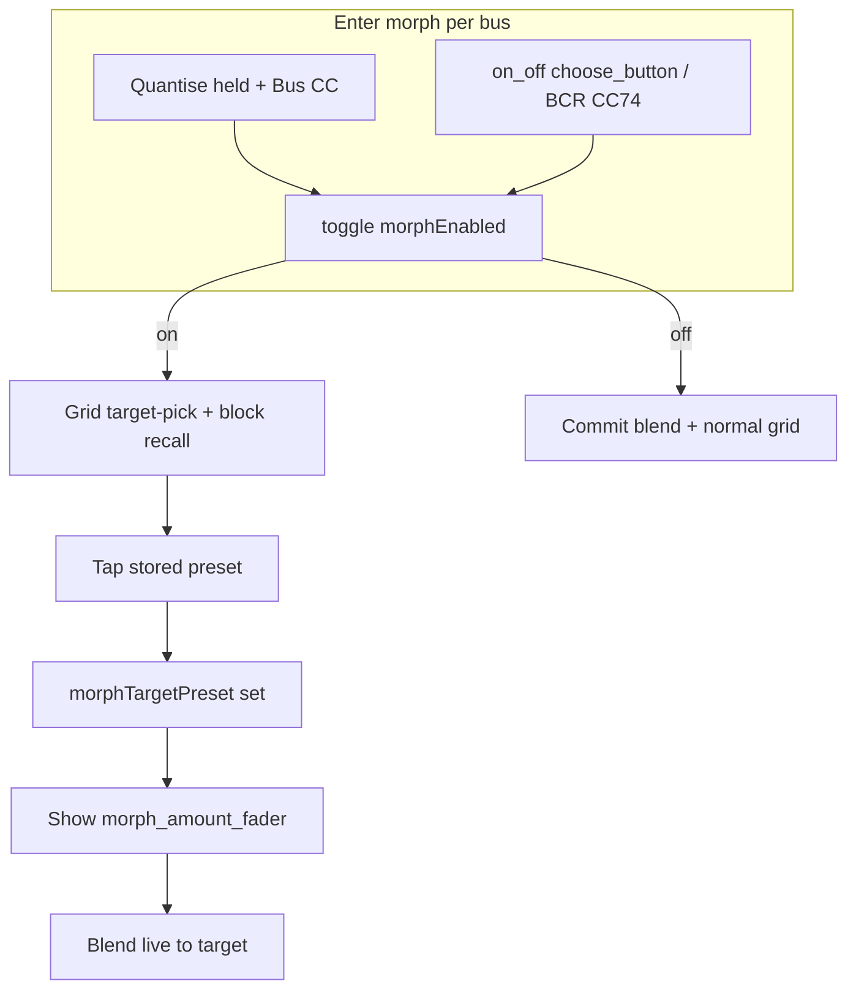

# Unified per-bus morph UX

## Target behavior (confirmed)

| Input | Action |
|-------|--------|
| **Launchpad Quantise + bus CC 91–95** (press) | Toggle morph on/off **for that bus only** |
| **Morph on** | Preset grid enters target-pick (magenta stored pads); **no** store/recall on TouchOSC pads |
| **Morph on + tap stored pad** | Set morph target (TouchOSC + Launchpad) |
| **Morph on + Launchpad aftertouch** | Blend amount 0–127 |
| **Morph off** | Commit last blend (same as today’s disable), normal preset grid |
| **`on_off_button_group` choose_button** (repurposed) | Primary TouchOSC morph on/off toggle (perform strip — more visible than `morph_group`) |
| **BCR CC 74** (per bus perform channel) | Morph on/off toggle (replaces former FX-chooser `bcr_choose`) |
| **BCR CC 1** (absolute turn) | Morph amount while morph on |

**Removed:** Shift+Quantise combo, `morph_target_select_button`, `morph_enable_button` in `morph_group`, BCR top-row morph (**CC 2/9/10**), old **Quantise-held momentary morph** (`activeMorphByBus` + pad release restore + Quantise release commit).

**Unchanged:** `effect_chooser` header `choose_button` still opens the TouchOSC FX modal on tap (Launchpad FX chooser is a follow-up).

---

## Gaps / fixes you’d otherwise miss

1. **Two morph engines today** — [`preset_grid_manager.lua`](sp404-mk2/SP404/lua/preset_grid_manager.lua) has `activeMorphByBus` (Launchpad Quantise+pad) and `activeUiMorphByBus` (TouchOSC/BCR). These must **merge** into one session model tied to `morphEnabled` in `busN_group.tag`, or Launchpad pressure and TouchOSC fader will fight.

2. **Launchpad bus CC conflict** — [`root.lua`](sp404-mk2/SP404/lua/root.lua) `handleLaunchpadBusCc` uses bare bus press for FX toggle. Add **Quantise-held branch before FX toggle** (after delete/click/undo/shift): `grid:notify('set_morph_enabled', { busNum, not tag.morphEnabled })`.

3. **Quantise CC handler cleanup** — Remove `cancel_ui_morph` on Quantise down and `commit_morph_sessions` on Quantise up ([`root.lua` ~374–377](sp404-mk2/SP404/lua/root.lua)). Quantise becomes a **modifier** for bus morph toggle + LED only.

4. **Poly aftertouch routing** — Today aftertouch only runs when `launchpadQuantiseHeld` ([`root.lua` ~831](sp404-mk2/SP404/lua/root.lua)). Change to: if **that bus’s `morphEnabled`**, map pressure → `set_morph_amount` (or internal blend); drop `morph_pressure` / `handleMorphPressure` quantise path.

5. **`setMorphEnabled` gate** — Remove “reject if no target” ([`preset_grid_manager.lua` ~549–555](sp404-mk2/SP404/lua/preset_grid_manager.lua)). Morph on **without** target = target-pick only; fader stays hidden until target set.

6. **Collapse `morphTargetSelectMode`** — Treat `morphEnabled` as the single flag for grid target-pick visuals and pad routing (remove `toggle_morph_target_select` / separate mode).

7. **Pad gesture priority** — In `button_value_changed`, when `tag.morphEnabled`: tap → `setMorphTarget` only (block `buttonPressed` recall/store). Order: delete → **morph** → grab/shift → normal. Decide explicitly: **delete while morph on** still deletes? (recommend: yes, delete wins).

8. **Grab / Shift preview while morph on** — Block or allow? (recommend: **block grab** while morph on to avoid fighting blended faders; document in README).

9. **TouchOSC aftertouch** — TouchOSC preset pads don’t send poly pressure; amount stays **fader + BCR CC1 + Launchpad** only.

10. **UI layout — `morph_group` slimmed** — Remove `morph_target_select_button` and **`morph_enable_button`** from [`inject_morph_layout.py`](tools/inject_morph_layout.py); keep `morph_amount_fader` + `morph_target_label`. Re-run inject + [`toscbuild.json`](sp404-mk2/SP404/toscbuild.json) (drop `morph_enable_button.lua`, `morph_target_select_button.lua` mappings).

11. **Perform-strip morph toggle** — Repurpose [`choose_button`](sp404-mk2/SP404/lua/choose_button.lua) under **`on_off_button_group` only**:
    - New script e.g. [`morph_choose_button.lua`](sp404-mk2/SP404/lua/morph_choose_button.lua) (or parent branch): `preset_grid:notify('set_morph_enabled', { busNum, on })`.
    - [`toscbuild.json`](sp404-mk2/SP404/toscbuild.json): map morph script to `under_name: on_off_button_group` + `choose_button`; keep existing `choose_button.lua` on `effect_chooser` only for TouchOSC FX modal.
    - Optional: relabel control in layout (`tabLabel` / nearby label) to “Morph” for clarity in editor.

12. **BCR CC 74** — Restore inbound handler in [`root.lua`](sp404-mk2/SP404/lua/root.lua) `BCR_ON_OFF_CC_HANDLERS` as `bcr_morph` → [`on_off_button_group.lua`](sp404-mk2/SP404/lua/on_off_button_group.lua): toggle `morphEnabled` via `preset_grid` (mirror `bcr_toggle` pattern, **127 = on**). Outbound: echo CC 74 when morph state changes (replace old `sendBcrCc(BCR_CHOOSE_CC, …)` chooser LED sync in `setChooserState` with morph-state sync in `setMorphEnabled` / `syncMorphControlsUi`).

13. **`syncMorphControlsUi`** — Sync **`on_off_button_group` `choose_button.values.x`** from `tag.morphEnabled`; drive `morph_amount_fader.visible` only when `morphEnabled and morphTargetPreset`. Keep `morph_target_label` as “Target N” / “Target —”.

14. **BCR top-row** — [`root.lua`](sp404-mk2/SP404/lua/root.lua): remove **all** top-row morph handling (`morph_push` CC 9, `target_push` CC 10, `target_turn` CC 2); keep **CC 1** absolute amount only when morph on.

15. **LED feedback** — Optional but useful: Launchpad bus CC LED distinct when that bus morph is on (avoid looking like FX-off). Scene column unchanged.

16. **Docs** — Update [`lua/README.md`](sp404-mk2/SP404/lua/README.md): morph toggle on perform `choose_button`, BCR CC 74, Quantise+bus; remove CC 9/10 morph rows.

---

## Implementation outline

### Core logic — `preset_grid_manager.lua`
- Delete `activeMorphByBus`, `handleMorphPad`, `handleMorphPressure`, `commitMorphSessions`/`cancelAllMorphSessions` quantise coupling (keep commit on **morph off** only).
- `setMorphEnabled(on)`: on → set flag, `refreshPresets` (magenta pick), no blend until target; off → commit via existing `applyUiMorphBlend` + clear session.
- `setMorphTarget`: keep; clear “exit select mode” that turned off `morphTargetSelectMode` — stay in morph with new target.
- `button_value_changed`: if `readBusTag(bus).morphEnabled` → target tap + return; poly amount via new notify `morph_amount` from root only.
- `refreshPresets`: magenta when `morphEnabled` (not separate `morphTargetSelectMode`).
- `syncMorphControlsUi`: fader visibility rule; drop select button refs.

### Launchpad — `root.lua`
- `handleLaunchpadBusCc`: Quantise+press → toggle morph (needs reading bus tag or notify round-trip).
- `handleLaunchpadControlChange` (Quantise): LED only, no morph cancel/commit.
- Poly aftertouch: if bus `morphEnabled` → `set_morph_amount` with pressure.
- Remove `quantiseHeld` from preset pad path in `preset_pad.lua` / `button_value_changed` for morph (or pass `morphEnabled` from bus tag).

### Perform strip + BCR — `on_off_button_group.lua` / `root.lua`
- Replace `set_chooser_state` usage from on_off `choose_button` with morph toggle path.
- Add `set_morph_state(enabled, skipBcr)` (or extend `setMorphEnabled` notify chain): updates bus tag, syncs choose button + BCR CC 74 LED, delegates to `preset_grid` `set_morph_enabled`.
- Remove dead `setChooserState` BCR echo for CC 74 unless effect_chooser still needs it (only from effect_chooser choose, not on_off).

### Relay cleanup
- [`preset_grid.lua`](sp404-mk2/SP404/lua/preset_grid.lua): drop `toggle_morph_target_select`, `morph_target_step`.
- Delete [`morph_enable_button.lua`](sp404-mk2/SP404/lua/morph_enable_button.lua), [`morph_target_select_button.lua`](sp404-mk2/SP404/lua/morph_target_select_button.lua).

### Build
- `python3 tools/inject_morph_layout.py` + `toscbuild.py build sp404-mk2/SP404`

### Test checklist
- Quantise+bus3: morph on → tap LP pad → aftertouch blends → Quantise+bus3 off commits; FX toggle still works without Quantise.
- Perform-strip **choose_button**: toggles morph; fader hidden until target; no recall while morph on.
- BCR **CC 74** toggles morph + LED echo; **CC 1** amount; CC 2/9/10 ignored.
- `effect_chooser` choose still opens FX modal (TouchOSC only).
- Delete mode still works on morph-on bus.
