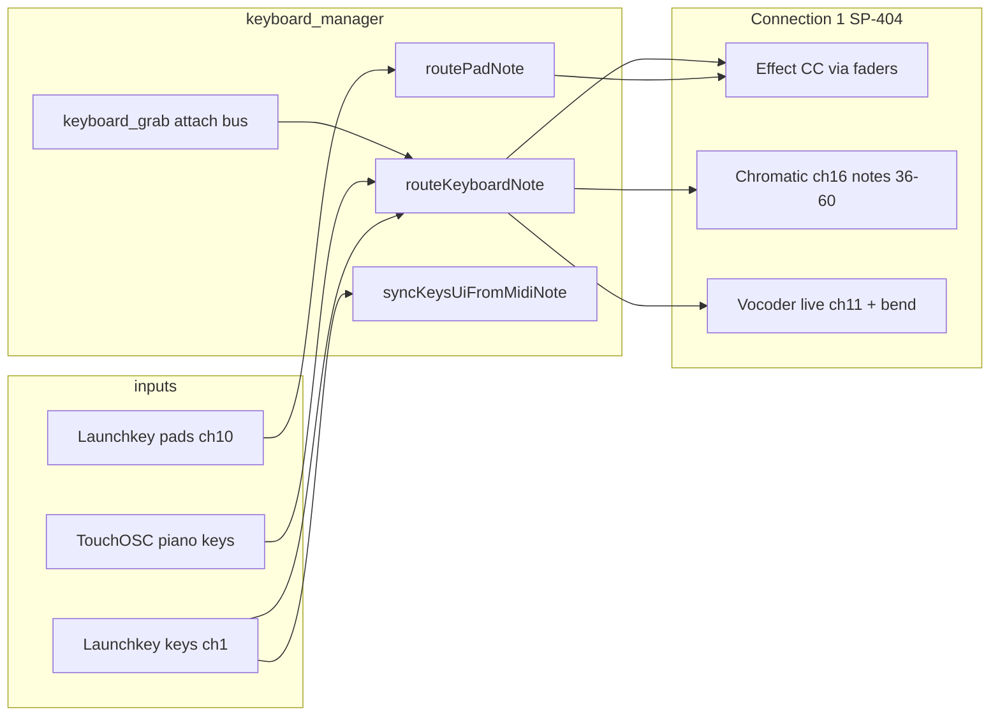

# Keyboard feature — structured test and bug-bash plan

## Scope and code map

The keyboard work landed in [`ec67810`](https://github.com) (`Add Launchkey keyboard routing and on-screen keys UI sync`). Core logic lives in [`sp404-mk2/lua/keyboard_manager.lua`](sp404-mk2/lua/keyboard_manager.lua), included into root via [`sp404-mk2/toscbuild.json`](sp404-mk2/toscbuild.json). UI/build pieces:

| Area | Scripts / nodes |
|------|-----------------|
| Central routing | `keyboard_manager.lua` → root include |
| Bus attach | `keyboard_grab_button.lua` → `control_group/keyboard_grab_button` (×5 buses) |
| Chromatic toggle | `chromatic_keyboard_button.lua` |
| Sound Gen toggle | `soundgen_keyboard_button.lua` |
| Piano (2 octaves) | `keys.lua` + build-injected `keyboard_key.lua` under `keys/white/*`, `keys/black/*` |
| Octave UI | `keys_group/octave_grid` (notifies `keys` with `octave`) |
| Chord pads | `chord_grid.lua` on bus + mirrored `keys_group/chord_grid` (pads 1–16) |
| Panic | `panic_button.lua` |
| MIDI ingress | [`sp404-mk2/lua/root.lua`](sp404-mk2/lua/root.lua) — `handleKeyboardMidi` before Launchpad; `handleKeyboardNotify` on notify |

**Note:** Piano key buttons are `buttonType=1` (toggle). Radio type (2) was causing spurious note-offs when a second key was pressed — TouchOSC's radio-group auto-clear fired `onValueChanged` on the previous key before the highlighting flag could suppress it. All key state management is now script-only via `selectPianoKeyByNote` / `refreshPianoKeysFromUiActive` / `setPianoKeyHighlight`.

**Regression neighbor:** [`d9a38f9`](sp404-mk2/lua/bus_group_instance.lua) changed effect load/recall (`recallValues(true)` after CC 83). Keyboard tuning uses `control_fader:notify("new_cc_value", cc)` — verify fader moves still reach the SP-404 after FX changes.



---

## Phase 0 — Session prep (15 min)

1. **Rebuild layout** (so injected scripts match `lua/`):
   ```bash
   python3 tools/toscbuild.py build sp404-mk2
   ```
2. **Reload** `SP404.tosc` in TouchOSC (or `toscbuild.py dev sp404-mk2` during fixes).
3. **MIDI connections** (extend README table mentally — connection 4 is new):

   | Conn | Device | Must do |
   |------|--------|---------|
   | 1 | SP-404 MKII | Required; only outbound path for routed notes/CC |
   | 2 | BCR2000 | Optional; ensure no CC clash during keyboard tests |
   | 3 | Launchpad Pro | Optional; confirm keyboard MIDI does not steal Launchpad note handling |
   | 4 | Launchkey Mk4 | **Input only** — root comment warns: do **not** route conn 4 to SP-404 output or notes double |

4. **Logging:** `KEYBOARD_DEBUG = true` in `keyboard_manager.lua` — keep TouchOSC log open; filter `[Keyboard]` and `[root] onReceiveNotify keyboard_*`.
5. **Bug log:** one row per issue: `ID | Area | Steps | Expected | Actual | Severity | Fix PR`.

---

## Phase 1 — Attach / detach and chrome (no notes yet)

**Goal:** `keys_group` visibility, bus theming, and exclusive attach.

| # | Action | Pass criteria |
|---|--------|---------------|
| 1.1 | Cold start layout | `keys_group` hidden; all `keyboard_grab_button` off |
| 1.2 | Bus N → keyboard grab ON | `keys_group` visible; grab on bus N lit; label contrast on active bus; `keys_group.color` matches bus accent from `root.tag.busAccentHex` |
| 1.3 | Bus M → keyboard grab ON | Bus N detaches (only one attach); notes flushed (no hung notes on SP-404) |
| 1.4 | Keyboard grab OFF on active bus | `keys_group` hidden; grab cleared |
| 1.5 | Reload layout mid-session | `initKeyboardManager()` restores `keyboardAttachedBus` / chromatic flag from `root.tag` if persisted |

**Files if broken:** `setAttachedBus`, `refreshKeyboardUi`, `keyboard_grab_button.lua`.

---

## Phase 2 — On-screen piano and octave (attached bus, non-tuning FX)

Use a **non-keyboard effect** (e.g. Filter on bus 1) with chromatic **off**.

| # | Action | Pass criteria |
|---|--------|---------------|
| 2.1 | Tap white/black keys | Log: `keyboard_key_select` → highlight one key; **no** SP-404 MIDI (no route without chromatic/tuning) |
| 2.2 | Velocity | Louder touch (higher on key) → higher velocity in log when chromatic/tuning enabled later |
| 2.3 | Octave grid 1–10 | `keys` range shifts; `C0`/`C1` labels update; keys above MIDI 127 hidden |
| 2.4 | Key release | With chromatic off, release should not spam MIDI |

**Key press mode:** keys are `buttonType=1` (toggle) — they latch visually until script clears them. Key state is managed entirely by `selectPianoKeyByNote` / `refreshPianoKeysFromUiActive`.

**Files if broken:** `keyboard_key.lua`, `keys.lua`, `selectPianoKeyByNote`, `keyboardHighlighting` guard.

---

## Phase 3 — Chromatic mode (SP-404 ch16) ✓ confirmed working

Chromatic button ON. Still use non-tuning FX or FX cleared.

| # | Action | Pass criteria |
|---|--------|---------------|
| 3.1 | TouchOSC key press | Note on **MIDI ch16** (status `0x9F`), note **clamped 36–60** regardless of on-screen octave naming |
| 3.2 | Release with sustain off | Note off ch16 |
| 3.3 | Sustain pedal (Launchkey CC64 ch1) | Note-offs deferred while held; all released on pedal up |
| 3.4 | **Panic** | All tracked notes off; sustain cleared; button resets |
| 3.5 | Bus switch while holding notes | `flushTrackedNotes("switch_bus")` — no stuck chromatic notes |

**Files if broken:** `sendRoutedNote`, `onSustainChanged`, `panic_button.lua`, `chromatic_keyboard_button.lua`.

---

## Phase 3b — Sound Gen mode ✓ confirmed working

Sound Gen button ON (purple, `4C00ADFF`). Mutually exclusive with Chromatic and bus grab.

| # | Action | Pass criteria |
|---|--------|---------------|
| 3b.1 | Press key | Note on ch16, **full range 0–127** (no clamping) |
| 3b.2 | Hold multiple keys simultaneously | All notes sent; no 4-voice cap (SP-404 handles internally) |
| 3b.3 | Sustain pedal + new note while holding | Previous notes (held and deferred) flushed; only new note active |
| 3b.4 | Release sustain | All remaining notes off |
| 3b.5 | Panic | Flush all; sustain cleared |
| 3b.6 | Octave auto-follow | On-screen octave view tracks played notes via `syncKeysOctaveFromHeldMidiNotes` |
| 3b.7 | Keys group colour | Background shows `4C00ADFF` purple |

**SP-404 note:** does not implement last-note-priority for incoming MIDI (only for its own pads), so overlapping notes sound polyphonically until the SP-404's own voice allocation cuts them.

---

## Phase 4 — Effect note tuning (priority over chromatic)

Routing rule: **if bus has tuning-capable FX and velocity > 0, tuning wins** — chromatic ignored even if enabled.

| FX | ID | Status | Control | Notes |
|----|-----|--------|---------|-------|
| Resonator | 2 | ✓ confirmed | `root_fader` full MIDI 0–127 | Root label updates; key highlight tracks fader |
| Hyper Reso | 31 | ✓ confirmed | `note_fader` 0–127 | Degree mapping fixed; bidirectional octave auto-scroll; C label numbering correct |
| Vocoder | 44 | ⬜ untested | **Not** note-tuning via keys | Use Phase 5 pads + Phase 6 live |
| Auto Pitch | 43 | n/a | — | Out of scope — no keyboard control |
| Harmony | 45 | n/a | — | Out of scope — no keyboard control |

**Per-effect checklist (repeat on 2+ buses):**

| # | Step | Pass |
|---|------|------|
| 4.x.1 | Choose FX, keyboard grab that bus | Perform faders visible |
| 4.x.2 | Press key (screen) | Correct fader moves; value label updates; MIDI to SP-404 on that CC |
| 4.x.3 | Chromatic ON + repeat | Still tuning only (no ch16 notes) |
| 4.x.4 | Launchkey white keys | Same CC result; log `routeKeyboardNote` + `applyFaderCc` |
| 4.x.5 | Launchkey + tuning FX | Octave grid auto-shifts if note outside 24-key window; pressed key highlighted (`syncKeysUiFromMidiNote`) |
| 4.x.6 | Change effect while attached | New FX routing; no stale CC on wrong fader names |
| 4.x.7 | **d9a38f9 regression** | After FX change, recall recent/default — then keyboard key still sends correct CC (not overwritten silently) |

**Files if broken:** `setTuningFromNote`, `getPerformControlFader`, `applyFaderCc`, `controls_info` slot names.

---

## Phase 5 — Chord / harmony pads

**Resonator (2):** 16 chord steps → `chord_fader` + `chord_grid` on bus **and** `keys_group`.

**Vocoder (44):** 10 harmony values → `chord_fader` + `chord_grid`.

**Harmony (45):** 10 values → `harmony_fader` + `harmony_grid`.

| # | Source | Pass criteria |
|---|--------|---------------|
| 5.1 | TouchOSC `keys_group/chord_grid` pad | Grid + bus grid sync (`setGridIndex`); fader CC correct |
| 5.2 | Bus-side `chord_grid` (if visible) | Same index when pad pressed on bus perform strip |
| 5.3 | Launchkey drum pads (ch10) | Map per `LAUNCHKEY_DRUM_PAD_NOTE_TO_INDEX` — top row 9–16 (Root/Oct labels on device), bottom 1–8; log `routePadNote` |
| 5.4 | Pad note unmapped | Log `unmapped drum pad` only; no crash |
| 5.5 | Wrong FX (e.g. Filter) | Pads no-op or harmless (no wrong CC) |

**Pad layout reference** (from `keyboard_manager.lua` comments — verify on Mk4):

- Screen top row ↔ Launchkey notes 36–39, 44–47  
- Screen bottom row ↔ 40–43, 48–51  

**Files if broken:** `applyChordPad`, `chord_grid.lua`, `enableKeysGroupChordGrid`.

---

## Phase 6 — Vocoder live (bus 5 only)

Condition: `busNum == 5` and `fxNum == 44`.

| # | Action | Pass criteria |
|---|--------|---------------|
| 6.1 | Launchkey keys | Notes on **ch11** (`SP404_VOCODER_CHANNEL`), not tuning faders |
| 6.2 | TouchOSC keys with chromatic on | Still live route (vocoder overrides chromatic) |
| 6.3 | Pitch bend (Launchkey) | Bend forwarded on ch11 |
| 6.4 | Sustain + panic | Same tracking as chromatic |

---

## Phase 7 — Launchkey Mk4 integration

| # | Test | Pass criteria |
|---|------|---------------|
| 7.1 | `connections[4] == true` only | Keyboard handler runs; other ports ignored |
| 7.2 | No attach | Launchkey MIDI ignored (`return false` from `handleKeyboardMidi`) |
| 7.3 | Device octave buttons | MIDI note numbers shift; routing uses raw MIDI (comment in code); UI octave may auto-sync only for tuning FX |
| 7.4 | Duplicate routing check | With conn4 **not** forwarded to SP-404, each action causes **one** note on hardware |
| 7.5 | InControl / mode | If keys dead, confirm Mk4 mode matches what you used when mapping pads (empirical map may differ in other modes) |

---

## Phase 8 — Cross-feature regression (30 min)

Run after keyboard phases to catch integration breaks:

| # | Scenario | Watch for |
|---|----------|-----------|
| 8.1 | Launchpad preset store/recall while keyboard attached | No MIDI port confusion |
| 8.2 | BCR encoder move + keyboard same param | Last write wins; no runaway feedback |
| 8.3 | Effect chooser (Launchpad Device) + keyboard | Attach state preserved |
| 8.4 | Scene load | Bus FX recall then keyboard still maps to new `fxNum` |
| 8.5 | Morph / grab on **perform** grab vs **keyboard** grab | Independent buttons; no stuck `values.x` |

---

## Phase 9 — Known risk areas (targeted probes)

These are **high-yield bug hunt** targets from code review, not necessarily failures:

1. **Chromatic range clamp** — UI may show any octave but chromatic MIDI always clamps to 36–60; confirm intentional and consistent with on-screen labels.
2. **Note-off with chromatic off** — screen key release only sends `keyboard_ui_note` vel=0 when `pianoKeysMomentaryFromTag` true; confirm non-momentary modes don't leak stuck highlights.
3. **Debug noise** — `KEYBOARD_DEBUG = false` in `keyboard_manager.lua` before release.
4. **README gap** — Connection 4 / Launchkey setup and Sound Gen mode not yet in end-user README.
5. **Hyper Reso / Auto Pitch / Harmony on buses without FX** — `applyFaderCc` logs `missing … on bus` — UI should fail gracefully, no crash.

---

## Suggested session order (half-day)

```text
Prep → 1 Attach → 2 Piano/octave → 3 Chromatic → 4 Tuning (2,31,43,45) → 5 Chords → 6 Vocoder bus5 → 7 Launchkey → 8 Cross-feature → 9 Risk probes
```

Fix bugs in small loops: reproduce → adjust `lua/` → `toscbuild build` → reload → re-run only the failed rows from the table above.

---

## Quick reference — routing priority

From `routeKeyboardNote` in [`keyboard_manager.lua`](sp404-mk2/lua/keyboard_manager.lua):

1. Bus 5 + Vocoder → live MIDI ch11  
2. Tuning-capable FX + note-on → fader CC (`new_cc_value`)  
3. Chromatic enabled → ch16 note 36–60  
4. Else → no-op (log `no route applied`)

Pads (Launchkey ch10, velocity > 0) → `applyChordPad` only; independent of chromatic toggle.
