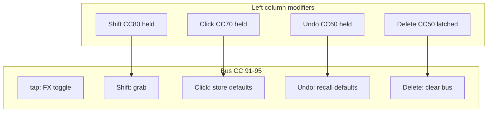

# Launchpad Click → store defaults

## Decision (locked)

| Control | Gesture | Action |
|---------|---------|--------|
| **Click** | CC **70** held (left, row 7) | Modifier only — not a latched mode |
| **Click + bus CC 91–95** | Hold Click, press bus button | **Store** current effect defaults for that bus (`preset_grid` → `store_defaults`) |
| **Undo + bus CC** | (existing) | **Recall** defaults — symmetric pair |

**Out of scope for Click:** FX chooser / choose effect — planned on a **different** spare Launchpad control (bottom CC 6–8, top CC 96–98, side notes 19–89, or col 6). BCR already uses CC 74 → `bcr_choose`; Launchpad mapping TBD in a follow-up.

---

## Target behavior

Mirror the existing Undo path in [`root.lua`](sp404-mk2/lua/root.lua) `handleLaunchpadBusCc`:

- On **press** (with FX loaded, not Delete mode):
  - If `launchpadClickHeld`: `presetGrid:notify('store_defaults', busNum)`
  - Optional: momentary `store_defaults_button.values.x = 1` if that node exists in layout (same pattern as `recall_defaults_button` for Undo)
- On **release** after Click+store: reset `store_defaults_button` to 0 if present
- Track per-bus press in `busClickPress` (parallel to `busUndoPress` / `busGrabPress`)

**Guards** (same as Undo/Shift/toggle):

- `Delete + bus` → clear bus (unchanged; wins over Click)
- No FX loaded (`busHasFxLoaded`) → ignore Click+bus (no-op + debug log)
- Click does **not** toggle grab, delete, or FX on/off

**Modifier priority** in `handleLaunchpadBusCc`:

1. Delete + bus → clear
2. No FX → ignore (except delete)
3. **Click + bus → store defaults**
4. Undo + bus → recall defaults
5. Shift + bus → grab
6. Tap → toggle FX

---

## Code changes

### 1. [`launchpad_led.lua`](sp404-mk2/lua/launchpad_led.lua)

- Add `launchpadClickRgb(brightness)` — distinct from Undo (magenta) and Shift (white); suggest **cyan/teal** or **amber** so Click vs Undo is obvious on hardware.
- Export for `root.lua` include.

### 2. [`root.lua`](sp404-mk2/lua/root.lua)

- `CLICK_CC = 70`
- `local launchpadClickHeld = false`
- `local busClickPress = {}`
- `handleLaunchpadControlChange`: branch for `cc == CLICK_CC` — set held, `sendLaunchpadLedRgb(CLICK_CC, …)`
- `handleLaunchpadBusCc`: Click+press/release branches calling `store_defaults` (see above)
- `getStoreDefaultsButton(busNum)` — `findByName('store_defaults_button', true)` under bus group (nil-safe)
- `init()`: dim Click LED on startup (like Undo/Shift)

Backend already implemented: [`preset_grid_manager.lua`](sp404-mk2/lua/preset_grid_manager.lua) `storeDefaults(busNum)` → `defaultManager` tag per `fxNum`.

### 3. [`README.md`](sp404-mk2/lua/README.md)

- Surface table: **Click** CC 70 → store-defaults modifier
- Gestures table: Click+hold bus CC = store defaults; note symmetry with Undo
- Update mermaid / modifier list in Launchpad section
- **Deferred:** Launchpad choose-effect (separate button, not documented as shipped)

### 4. Build

```bash
python3 tools/toscbuild.py build sp404-mk2
```

No `.tosc` layout change required unless you later add a visible `store_defaults_button` for TouchOSC feedback.

---

## Testing

1. Load an effect on a bus; tweak faders; **Click + hold bus CC** → verify `default_manager` tag updates for that `fxNum`.
2. **Undo + hold same bus CC** → faders return to stored defaults (exclude-tuning rules apply as today).
3. Empty bus: Click+bus and Undo+bus do nothing (Delete+clear still works).
4. Confirm MIDI monitor shows **CC 70** for Click in Programmer mode.

---

## Deferred: Launchpad choose effect

**Goal:** Open/close FX chooser for a bus from Launchpad (same as [`choose_button.lua`](sp404-mk2/lua/choose_button.lua) / BCR CC 74 → `bcr_choose` → `set_chooser_state`).

**Not using Click** — reserved for store-defaults modifier.

**Open design (pick when implementing):**

| Approach | Pros | Cons |
|----------|------|------|
| **Side note + bus context** | Last bus CC touched sets active bus | Needs `root.tag.activeBus` or similar |
| **Dedicated CC per bus** | Explicit (e.g. spare top row) | Uses scarce CC slots |
| **Single global CC + cycle bus** | One button | Extra UI state |

Candidate spare controls: CC **96–98** (top row), bottom **6–8**, side notes **71–79** (row 7 right of Click), preset **col 6**.

Wire to: `on_off_button_group:notify('set_chooser_state', on)` and sync header/perform `choose_button` values (see [`on_off_button_group.lua`](sp404-mk2/lua/on_off_button_group.lua)).

---

## Architecture (after Click implementation)


