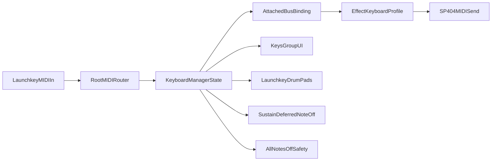

# Launchkey 49 MK4 keyboard integration

**Status:** Implemented (v1, 2026). Runtime code: [`keyboard_manager.lua`](../lua/keyboard_manager.lua) (included from [`root.lua`](../lua/root.lua)). Hyper Reso scale/NOTE specifics: [hyper_reso_keyboard_423aa07a.plan.md](hyper_reso_keyboard_423aa07a.plan.md).

## Goals (locked)

- Single keyboard owner: one bus at a time (`single-active-steal`); chromatic mode is mutually exclusive.
- `keys_group` hidden when detached; per-bus **Keyboard grab** claims ownership.
- Launchkey on TouchOSC **MIDI connection 4** (standalone mode; no SP-404 relay).
- Reuse `octave_grid` for octave UI (chromatic octaves 3–4; Hyper Reso octaves 0–4).
- **V1:** keybed + pitch wheel + sustain + Launchkey 8×2 drum pads → chord/scale grid.
- Vocoder **live** notes only when bus 5 + FX 44 (MIDI ch 11); chromatic uses ch 16 (C2–C4).
- **Chromatic** via `chromatic_keyboard_button` in `perform_group` even with no FX loaded.
- Sustain: CC64 hold/release; **panic** sends explicit note-offs for tracked notes; auto-flush on attach/mode/bus/FX change.

## Architecture

## Code touchpoints

| File | Role |
| ---- | ---- |
| [`root.lua`](../lua/root.lua) | MIDI ingress; forwards Launchkey to `handleKeyboardMidi` |
| [`keyboard_manager.lua`](../lua/keyboard_manager.lua) | State, routing, profiles, sustain/panic, UI sync |
| [`keyboard_grab_button.lua`](../lua/keyboard_grab_button.lua) | `keyboard_attach_bus` / `keyboard_detach_bus` |
| [`chromatic_keyboard_button.lua`](../lua/chromatic_keyboard_button.lua) | `keyboard_attach_chromatic` / detach |
| [`panic_button.lua`](../lua/panic_button.lua) | `keyboard_panic` |
| [`keys.lua`](../lua/keys.lua), [`keyboard_key.lua`](../lua/keyboard_key.lua) | On-screen piano |
| [`octave_button.lua`](../lua/octave_button.lua) | `keyboard_octave_select` |
| [`chord_pad_button.lua`](../lua/chord_pad_button.lua) | Chord/scale pads 1–16 |
| [`control_mapper.lua`](../lua/control_mapper.lua) | Perform faders → `keyboard_perform_cc` |
| [`toscbuild.json`](../toscbuild.json) | All `keys_group` scripts mapped at build time |

## Effect profiles (implemented)

| FX | ID | Keyboard UI | Launchkey pads |
| --- | --- | --- | --- |
| Resonator | 2 | ROOT + 16 chords | 16 chord pads |
| Hyper Reso | 31 | White-key NOTE degrees + scale grid | Scale maj/min + roots ([detail plan](hyper_reso_keyboard_423aa07a.plan.md)) |
| Vocoder | 44 | Scale + 10 chords; **live** keybed on bus 5 | First 10 pads active |
| Auto Pitch | 43 | ~~KEY only~~ | Out of scope — no keyboard control |
| Harmony | 45 | ~~KEY + 10 harmony chords~~ | Out of scope — no keyboard control |

`chordGridMode` on `keys_group.tag`: `hyper_reso_scale` vs `chord_pads`.

## Notify contract

| Notify | Source | Action |
| ------ | ------ | ------ |
| `keyboard_attach_bus` | `keyboard_grab_button` | Attach bus; flush notes; refresh UI |
| `keyboard_detach_bus` | grab off | Detach if current bus |
| `keyboard_attach_chromatic` / `detach` | chromatic button | Chromatic ch16 mode |
| `keyboard_panic` | panic button | Flush tracked notes + sustain off |
| `keyboard_octave_select` | octave grid | Update octave window |
| `keyboard_ui_note` / `keyboard_ui_chord_pad` | on-screen keys/pads | Route to SP-404 |
| `keyboard_perform_cc` | perform faders | Sync keyboard highlights |
| `keyboard_bus_fx_changed` | bus group | Re-profile keyboard UI |

Root tag fields: `keyboardAttachedBus`, `keyboardChromaticAttached`, `keyboardSustainDown` (via `updateKeyboardRootTag`).

## Launchkey constants

- Connection index: **4** (`LAUNCHKEY_CONNECTION_INDEX`)
- Drum pads: channel 10 (0-based 9); map in `LAUNCHKEY_DRUM_PAD_NOTE_TO_INDEX`
- Keybed: channels 1–2 depending on device mode
- Sustain: CC 64 on keybed channels

## Encoder control (implemented 2026-06, commit f590bce)

CCs 21–26 on channel 1 (connection 4, standalone Custom Mode) control the 6 FX parameters of the grabbed keyboard bus. Bidirectional sync via `keyboard_perform_cc`.

### Pad + encoder custom mode switching

Fires from `refreshKeyboardUi`. Sent to **connection 5 (DAW port)**.
Feature controls enable `9F 0B 7F` must precede each mode select.
Standalone mode only supports custom encoder modes (06h–09h); built-in modes require DAW mode.

| Keyboard mode | Pad mode | Encoder mode | Pad CC | Enc CC |
|---------------|----------|--------------|--------|--------|
| Hyper Reso    | Custom 1 | Custom 2     | `B6 1D 05` | `B6 1E 07` |
| Resonator     | Custom 2 | Custom 3     | `B6 1D 06` | `B6 1E 08` |
| Vocoder       | drum (default) | Custom 4 | `B6 1D 01` | `B6 1E 09` |
| none/other    | drum (default) | Custom 1 (reset) | `B6 1D 01` | `B6 1E 06` |

Vocoder sets `chordGridMode = nil` (chord grid hidden) — must check `attachedFx == FX_VOCODER` directly, not via `chordMode`, otherwise it falls through to the reset branch.

### Encoder parameter mapping

| Encoder | CC | Hyper Reso (FX 31) | Resonator (FX 2) | Vocoder (FX 44) |
|---------|----|--------------------|-----------------|-----------------|
| 1 | 21 | `note_fader`       | `root_fader`    | `note_fader`    |
| 2 | 22 | `spread_fader`     | `bright_fader`  | `formant_fader` |
| 3 | 23 | `character_fader`  | `feedback_fader`| `tone_fader`    |
| 4 | 24 | `scale_fader`      | `chord_fader`   | `scale_fader`   |
| 5 | 25 | `feedback_fader`   | `panning_fader` | `chord_fader`   |
| 6 | 26 | `env_mod_fader`    | `env_mod_fader` | `balance_fader` |

Encoder position sync (`syncEncoderPositionsToLaunchkey`) sends CCs 21–26 on **connection 4** (not 5).
`LAUNCHKEY_MIDI_OUT_CONNECTION = { false, false, false, true }`.

### Vocoder pitch bend

Forwarded to SP-404 ch11 (index 10). Uses raw `0xE0` — `MIDIMessageType.PITCH_BEND` may not be defined in TouchOSC Lua and would silently fail as nil.

### Encoder screen display (still pending)

Parameter names are configured in Novation Connections custom encoder modes (static). Dynamic value display requires DAW mode SysEx — see `deferred-encoder-screen-display` todo. Risk: DAW mode resets pad layout; pad custom mode must be re-sent immediately after.

Screen SysEx outline:
- Enable DAW mode: `9F 0C 7F`
- Configure encoder target `0x15`–`0x1A`: `F0 00 20 29 02 14 04 <target> <config> F7`
- Write text field: `F0 00 20 29 02 14 06 <target> <field> <ASCII bytes> F7`
- Trigger display: `F0 00 20 29 02 14 04 <target> 7F F7`

## Out of scope (v1)

- Launchkey **encoder** integration and screen SysEx feedback.
- Launchkey pads → **preset recall** (pads drive chord/scale grid only; presets stay on Launchpad/TouchOSC grid).
- Alternate pad modes (delete/grab/morph).

## Testing checklist

- [ ] Attach/detach: `keys_group` visibility + bus color theme
- [ ] Chromatic: notes 36–60 on ch16; octave UI 3–4
- [ ] Bus 5 vocoder: full-range live notes + pitch on ch11
- [ ] Effect profiles switch when FX changes on attached bus
- [ ] Sustain hold/release; no stuck notes after bus switch
- [ ] Panic clears held + deferred notes
- [ ] Launchkey drum pads mirror on-screen chord/scale pads
- [ ] No Launchpad/BCR regressions in `root.lua`

## Acceptance criteria

- Exactly one attached bus or chromatic mode; panel hidden when detached.
- Chromatic works with no FX; sustain and panic reliable.
- Vocoder live only on bus 5 + vocoder FX.
- Effect keyboard adapts to FX (16 vs 10 chord slots).
- Launchkey pads select chords/scales per profile; inactive pads ignored.
- Bus/mode switches never leave hanging notes.
