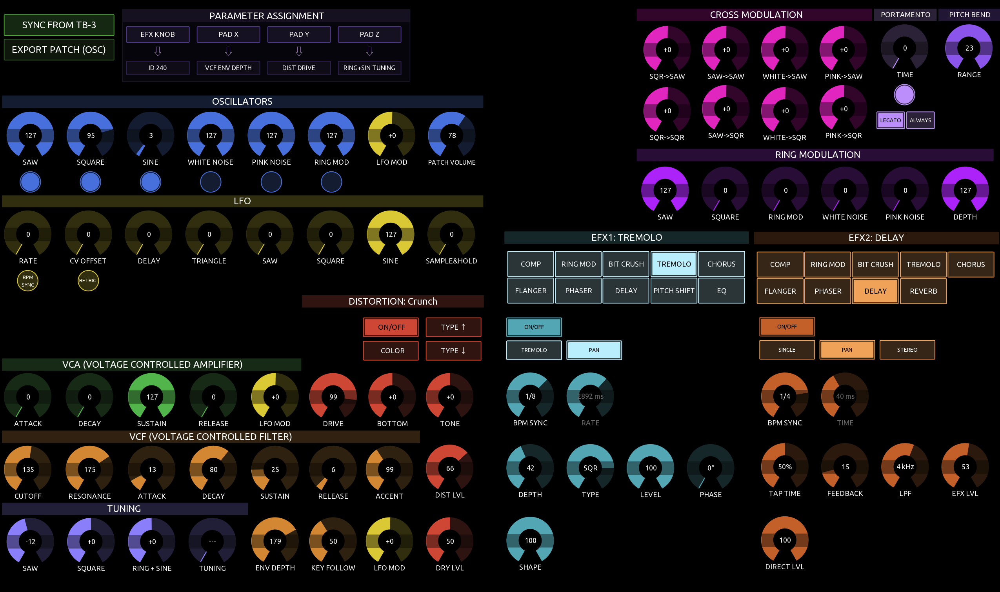

# TB-3 TouchOSC Controller

A full-featured TouchOSC layout for the Roland TB-3 synthesizer, providing complete parameter control via SysEx. Works standalone from a touchscreen, with optional Behringer BCR2000 hardware encoder support for hands-on knob control.

The BCR2000 integration is designed for **two units** (one for tone/distortion, one for effects), but works equally well with a **single BCR2000** — load both presets onto it and switch between them to access each half of the feature set.



---

## Requirements

- **[TouchOSC](https://hexler.net/touchosc)** (Windows, macOS, Linux, iOS, Android) — `TB3.tosc`
- **Roland TB-3** connected via USB or DIN MIDI
- **BCR2000** *(optional)* — one unit (switch presets) or two units (simultaneous access)

---

## MIDI Setup

### TouchOSC Connections

| Connection | Device | Notes |
|------------|--------|-------|
| **Connection 2** | BCR2000 (both units) | Both units share one port; differentiated by MIDI channel |
| **Connection 3** | Launchpad Pro *(optional)* | Preset grid control + LED feedback |
| **Connection 4** | Launchkey MK4 *(optional)* | Note/pitchbend passthrough + encoder control |
| **Connection 6** | TB-3 (USB or DIN MIDI) | Bidirectional — SysEx out and patch dump receive |

The TB-3 and BCR2000 units use separate connections so SysEx to the TB-3 never reaches the BCR2000.

| Device | MIDI Channel | Purpose |
|--------|-------------|---------|
| BCR2000 #1 | Ch 1 | Tone + Distortion |
| BCR2000 #2 | Ch 2 | EFX1 + EFX2 |

### BCR2000 Presets

Send **[`bcr2000/TB-3-TouchOSC-BCR2000.syx`](bcr2000/TB-3-TouchOSC-BCR2000.syx)** to your BCR2000 unit(s) using a SysEx librarian (e.g. MIDI-OX, SysEx Librarian, or similar). The file contains two presets:

| Preset | Channel | Covers |
|--------|---------|--------|
| 1 | Ch 1 | Tone + Distortion (Oscillators, LFO, VCA, VCF, Tuning) |
| 2 | Ch 2 | EFX1 + EFX2 |

**Two BCR2000 units:** load preset 1 into unit #1 and preset 2 into unit #2 for simultaneous access to everything.

**One BCR2000:** load both presets onto the same unit and switch between them as needed — you get full control of each half of the feature set, just not at the same time.

See [`bcr2000/bcr2000-1-tone-dist.md`](bcr2000/bcr2000-1-tone-dist.md) and [`bcr2000/bcr2000-2-efx.md`](bcr2000/bcr2000-2-efx.md) for the full CC maps.

---

## Launchkey MK4 (optional)

Connect the Launchkey MK4 on **Connection 4** in TouchOSC. MIDI channel 1 (the Launchkey's default).

### Notes + Pitchbend

All note-on / note-off and pitch-bend messages from the Launchkey are translated to the TB-3's MIDI channel and forwarded to the TB-3 hardware. Use the Launchkey as a keyboard controller for the TB-3 without any DAW in the loop.

### Encoders

The seven Launchkey encoders are mapped to key TB-3 parameters:

| Encoder | CC | TB-3 parameter |
|---------|-----|----------------|
| 1 | 74 | VCF Cutoff |
| 2 | 71 | VCF Resonance |
| 3 | 16 | Accent Level |
| 4 | 17 | Effect Knob (assign control) |
| 5 | 12 | XY PAD X (assign control) |
| 6 | 13 | XY PAD Y (assign control) |
| 7 | 104 | Global Tuning |

The on-screen encoders update in sync as you turn the Launchkey encoders. The mod wheel (CC 1) is routed through the XY MOD assign slot for expression control.

Encoder LED rings stay in sync with the on-screen controls after a patch receive.

---

## Launchpad Pro (optional)

Connect the Launchpad Pro on **Connection 3** in TouchOSC. The layout switches the Launchpad into Programmer mode on load and blanks all LEDs before syncing the preset grid state.

### Pad → slot mapping

The top two rows of pads map to the 16 preset grid slots:

| Row | Pads | Slots |
|-----|------|-------|
| Top row | 81–88 | 1–8 |
| Second row | 71–78 | 9–16 |

Pad colours match the on-screen grid:

| State | Launchpad colour |
|-------|-----------------|
| Empty slot | Off |
| Filled slot | Blue (dim) |
| Filled + delete mode | Red |
| Filled + grab mode | White (dim) |
| Filled + morph mode | Orange (dim) |
| Active morph target | Orange (bright) |

Pressing a pad brightens it momentarily to confirm the action (grab mode press → full white; others → full colour). The Launchpad LEDs update whenever the preset grid changes.

### Control buttons (side column)

| Button | CC | Action |
|--------|----|--------|
| **Quantise** | 40 | Morph (toggle) |
| **Delete** | 50 | Delete (momentary hold — held = active, release = off) |
| **Click** | 70 | Sync from TB-3 (green LED) |
| **Shift** | 80 | Grab (momentary hold — held = active, release = off) |
| **User** | 98 | Cycle brightness profile (very dim / night / normal / day) |

Delete and grab are **momentary**: holding the button activates the mode; releasing it exits. Morph is a toggle (press once to arm, press again to exit). The Click button drives the on-screen SYNC FROM TB-3 button for visual confirmation.

Brightness profiles are persisted across layout reloads.

---

## Syncing with the TB-3

Two buttons at the top of the layout control patch transfer:

| Button | Direction | Action |
|--------|-----------|--------|
| **SYNC FROM TB-3** | TB-3 → TouchOSC | Requests a full patch dump; all on-screen controls (and BCR2000 LED rings if connected) update to match the current TB-3 patch |
| **SYNC TO TB-3** | TouchOSC → TB-3 | Sends the current TouchOSC patch state to the TB-3 hardware |

> Press **SYNC FROM TB-3** whenever you change a patch on the TB-3 itself, or at the start of a session.

To export the current patch to the desktop preset manager, use **Pull Patch** in
the app (not a TouchOSC button) — see [`preset-manager/README.md`](preset-manager/README.md).

---

## Presets (16-slot grid)

The **PRESETS** section provides a 16-slot grid for storing, recalling, and
manipulating patches without leaving TouchOSC.

### Store & Recall

- **Tap an empty slot** (light grey) → stores the current patch into that slot.
- **Tap a filled slot** (blue) → recalls it, sending only the blocks that differ from the current state.

If blocks are not yet cached (e.g. right after loading the layout), tapping an
empty slot triggers a sync request — tap again after **SYNC FROM TB-3** completes.

### Mode Buttons

Two mode buttons sit to the right of the grid (red **DEL. MODE**, orange **GRAB MODE**).
Pressing the active mode again turns it off. While a mode is active, **filled** preset
slots change colour to match the mode (red for delete, orange for grab) so it is
clear which action will apply on tap. Empty slots stay grey.

| Button | Behaviour when a slot is tapped |
|--------|----------------------------------|
| **DEL. MODE** | Clears the slot (works on empty slots too) |
| **GRAB MODE** | Previews the slot while held — restores the previous patch when released |

### Morph

Morph lives in the separate **MORPH** group (not a third grid mode button):

1. Press the **MORPH** button in the MORPH group to arm morph mode. Filled
   preset slots turn orange. The target label shows `-` and the **AMOUNT** encoder
   is disabled with *Pick Preset* shown in white in the value label.
2. Tap any filled preset slot — it becomes the morph target (lit bright orange).
   The **AMOUNT** encoder becomes active.
3. Turn the **AMOUNT** encoder from minimum (0 %) to maximum (100 %) to blend
   from the current patch towards the target.
4. Press **MORPH** again to exit; the BCR2000 LED rings snap to the final blended position.

**Hardware control:** BCR2000 #1 Group 1 pos 8 (NRPN 8) controls morph amount. CC 40
at the BCR also controls morph button state. On the Launchpad Pro, the **Quantise**
button (CC 40) toggles morph mode, and pressing a pad drives pad aftertouch → morph amount.

### Bank Backup (desktop app)

The preset manager's **Library** tab can pull all 16 slots from TouchOSC as a
single `.tb3bank.json` file and push saved banks back. See
[`preset-manager/README.md`](preset-manager/README.md).

---

## Layout Overview

The layout is divided into functional colour-coded sections:

| Colour | Section |
|--------|---------|
| Blue | Oscillators (VCO source levels + switches) |
| Gold | LFO (also colours the VCO/VCF/VCA LFO depth encoders) |
| Green | VCA (Voltage Controlled Amplifier) |
| Amber | VCF (Voltage Controlled Filter) |
| Red | Distortion |
| Purple | Tuning |
| Magenta | Cross Modulation |
| Violet | Ring Modulation |
| Teal / Coral | EFX1 / EFX2 (effects chains) |

---

## Panel Controls

Mirrors the TB-3's front-panel knobs. Values update live when you turn the
hardware encoders (standard MIDI CC feedback):

| Encoder | CC | Notes |
|---------|-----|-------|
| **CUTOFF** | 74 | 16-bit SysEx, 0–255 |
| **RESONANCE** | 71 | 16-bit SysEx, 0–255 |
| **ACCENT** | 16 | 16-bit SysEx, 0–255 |

These encoders are not mapped on the BCR2000 — they reflect the physical panel only.

---

## Parameter Assignment

Maps on-screen encoders (or EFX parameters) to the TB-3's assignable control
destinations. Four slot buttons with status labels:

| Button | Assigns to |
|--------|------------|
| **XY PAD MOD** | XY pad Z axis (CC 1) |
| **EFX KNOB** | Effect knob (CC 17) |
| **PAD X** | XY pad X axis (CC 12) |
| **PAD Y** | XY pad Y axis (CC 13) |

**How to assign:** press a slot button (it lights up), then touch any on-screen
encoder or EFX parameter. The assigned parameter name appears in the status
label. Press the active button again to cancel.

---

## Other

| Control | Notes |
|---------|-------|
| **BEND RANGE** | Pitch-bend range encoder (±1…±24 semitones) |
| **PORTAMENTO** | TIME encoder + on/off switch; **LEGATO** / **ALWAYS** radio buttons select when portamento applies |

---

## Oscillators

Eight encoders control source levels (SAW, SQUARE, SINE, WHITE NOISE, PINK NOISE, RING MOD, LFO MOD, PATCH VOLUME). Toggle buttons below each encoder switch the oscillator on/off.

---

## LFO

Controls LFO RATE, CV OFFSET, DELAY, and waveform mix levels (TRI, SAW, SQR, SIN, S&H). The LFO RATE encoder has a push-toggle for **BPM SYNC**; CV OFFSET has a **RETRIG** toggle. When either toggle is on (yellow), its label text switches to black for readability.

---

## Cross Modulation & Ring Modulation

Eight encoders for cross-modulation routing between oscillators (SQR→SAW, SAW→SAW, WHITE→SAW, PINK→SAW, SQR→SQR, SAW→SQR, WHITE→SQR, PINK→SQR) plus Ring Modulation levels (SAW, SQR, RING, WHITE, PINK, DEPTH).

---

## Distortion

The distortion section shows the current distortion **type name** in the header (e.g. *MILD OD*, *LEAD*). Controls:

- **ON/OFF** — bypass toggle
- **COLOR** — tone character toggle
- **TYPE** encoder — step through distortion types (25 types; name shown in value label)
- **Encoders:** DRIVE, BOTTOM, TONE, EFFECT LEVEL, DRY LEVEL

---

## VCA, VCF, Tuning

- **VCA:** ATTACK, DECAY, SUSTAIN, RELEASE, LFO DEPTH
- **VCF:** ATTACK, DECAY, SUSTAIN, RELEASE, ENV DEPTH, KEY FOLLOW, VCF LFO DEPTH (CUTOFF and RESONANCE are in Panel Controls)
- **Tuning:** SAW, SQUARE, RING+SINE individual tuning offsets (bipolar, ±128 display), global TUNING (MIDI CC), ENV DEPTH, KEY FOLLOW, VCF LFO DEPTH

---

## EFX Sections (EFX1 + EFX2)

There are two independent effects chains. **EFX1** (teal) and **EFX2** (coral) have the same control layout.

### Selecting an Effect Type

The two rows of buttons at the top of each EFX section are the **type selector**. Tap any effect to activate it:

| EFX1 | EFX2 |
|------|------|
| COMP, RING MOD, BIT CRUSH, TREMOLO, CHORUS | COMP, RING MOD, BIT CRUSH, TREMOLO, CHORUS |
| FLANGER, PHASER, DELAY, PITCH SHIFT, EQ | FLANGER, PHASER, DELAY, REVERB |

- **Tapping the active type again** returns to BYPASS (all controls hidden).
- The active type button is highlighted; others remain dimmed.

### Parameter Encoders

Once an effect type is selected, the relevant parameter encoders appear below the type selector. Unused slots for the current effect are hidden automatically.

### Action Buttons

Below the parameter encoders are up to 8 buttons (B1–B8):

| Button | Purpose |
|--------|---------|
| **B1 (ON/OFF)** | Effect bypass toggle — always present when an effect is active |
| **B2–B4** | Utility controls: BPM SYNC, STEP RATE (Phaser), POLARITY (Ring Mod) |
| **B5–B8** | Type-option presets: shown in a lighter shade — e.g. SINGLE/PAN/STEREO for Delay, 4STAGE/8STAGE/12STAGE/BI-PH for Phaser |

For **BPM SYNC** effects (Chorus, Flanger, Phaser, Delay, Tremolo): when BPM SYNC is on, the rate slot switches to a beat-division value.

Reverb (EFX2 only) uses all 7 action buttons (B2–B8) as reverb-type presets: AMBIENT, ROOM, HALL 1, HALL 2, PLATE, SPRING, MOD.

---

## BCR2000 Encoder Control

When BCR2000 units are connected, all encoder rings update automatically when a patch is received or when parameters change on screen.

**BCR2000 #1** covers the synthesis engine:
- Encoder groups 1 & 2: VCO source levels and LFO parameters
- Fixed rows: VCA envelope, distortion character, VCF envelope, tuning

**BCR2000 #2** covers the effects chains:
- Left 4 columns: EFX1 parameter slots S01–S12
- Right 4 columns: EFX2 parameter slots S01–S12
- Dedicated buttons: EFX1 and EFX2 SW, BPM SYNC, and type-option presets
- Top encoder (left): EFX1 type select
- Top encoder (right): EFX2 type select

Panel controls (Cutoff, Resonance, Accent) are **not** on the BCR2000.

See the `bcr2000/` folder for the full CC assignment tables.

---

## For Contributors

Lua source lives in `lua/` and is injected into `TB3.tosc` at build time:

```bash
python3 tools/toscbuild.py build tb-3      # inject scripts
python3 tools/toscbuild.py dev tb-3        # watch mode (macOS)
```

- **[`lua/README.md`](lua/README.md)** — script table, notify conventions, build manifest
- **[`CLAUDE.md`](CLAUDE.md)** — architecture reference for AI-assisted development
- **[`plans/`](plans/)** — design history and review backlog

---

## Files

| File | Description |
|------|-------------|
| `TB3.tosc` | TouchOSC layout — open this in TouchOSC |
| `lua/` | Lua source scripts (build-time injected) |
| `bcr2000/` | BCR2000 BC Manager preset documentation |
| `preset-manager/` | Desktop app for saving/restoring `.syx` patch dumps and banks |
| `resources/` | TB-3 SysEx reference and Dope Robot panel files |
| `tools/` | Layout maintenance scripts (see `CLAUDE.md` tools index) |

---

## Credits & Attribution

The SysEx implementation and effects parameter data underpinning this controller
are based entirely on research and documentation by **Dope Robot**:

| Resource | Description |
|----------|-------------|
| [Unofficial TB-3 MIDI SysEx Implementation v1.4.1](https://doperobot.com/tb3) | The primary SysEx address reference used to map every parameter |
| Unofficial TB-3 FX Parameter Guide v1.07 | Detailed effects parameter reference (included in `resources/`) |
| TB-3 Editor & Patch Librarian v2.21 | BC Manager panel whose encoder layout informed the BCR2000 preset design |

All three files are included in the `resources/` folder for reference.

🌐 [doperobot.com](https://doperobot.com)

> The contents of the SysEx implementation have no relation with Roland Corporation.
> Please do not send any inquiries to Roland Corp regarding this controller.
