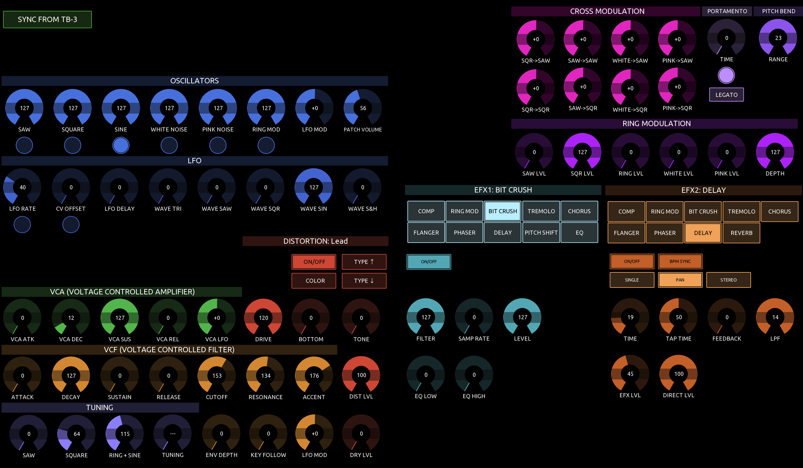

# TB-3 TouchOSC Controller

A full-featured TouchOSC layout for the Roland TB-3 synthesizer, providing complete parameter control via SysEx. Works standalone from a touchscreen, with optional Behringer BCR2000 hardware encoder support for hands-on knob control.

The BCR2000 integration is designed for **two units** (one for tone/distortion, one for effects), but works equally well with a **single BCR2000** — load both presets onto it and switch between them to access each half of the feature set.

---

## Requirements

- **[TouchOSC](https://hexler.net/touchosc)** (Windows, macOS, Linux, iOS, Android) — `TB3.tosc`
- **Roland TB-3** connected via USB MIDI
- **BCR2000** *(optional)* — one unit (switch presets) or two units (simultaneous access)

---

## MIDI Setup

### TouchOSC Connections

| Connection | Device | Notes |
|------------|--------|-------|
| **Connection 2** | BCR2000 (both units) | Both units share one port; differentiated by MIDI channel |
| **Connection 6** | TB-3 (USB MIDI) | Bidirectional — SysEx out and patch dump receive |

The TB-3 and BCR2000 units use separate connections so SysEx to the TB-3 never reaches the BCR2000.

| Device | MIDI Channel | Purpose |
|--------|-------------|---------|
| BCR2000 #1 | Ch 1 | Tone + Distortion |
| BCR2000 #2 | Ch 2 | EFX1 + EFX2 |

### BCR2000 Presets

Send **[`bcr2000/TB-3-TouchOSC-BCR2000.syx`](bcr2000/TB-3-TouchOSC-BCR2000.syx)** to your BCR2000 unit(s) using a SysEx librarian (e.g. MIDI-OX, SysEx Librarian, or similar). The file contains two presets:

| Preset | Channel | Covers |
|--------|---------|--------|
| 1 | Ch 1 | Tone + Distortion (Oscillators, LFO, VCA, VCF, Tuning) |
| 2 | Ch 2 | EFX1 + EFX2 |

**Two BCR2000 units:** load preset 1 into unit #1 and preset 2 into unit #2 for simultaneous access to everything.

**One BCR2000:** load both presets onto the same unit and switch between them as needed — you get full control of each half of the feature set, just not at the same time.

See [`bcr2000/bcr2000-1-tone-dist.md`](bcr2000/bcr2000-1-tone-dist.md) and [`bcr2000/bcr2000-2-efx.md`](bcr2000/bcr2000-2-efx.md) for the full CC maps.

---

## Syncing from the TB-3

Press **SYNC FROM TB-3** at the top-left to request a full patch dump. All parameters on screen (and BCR2000 encoder rings if connected) will update to match the current patch on the TB-3.

> Do this whenever you change a patch on the TB-3 itself, or at the start of a session.

---

## Layout Overview

The layout is divided into functional colour-coded sections:

| Colour | Section |
|--------|---------|
| Blue | Oscillators (VCO source levels + switches) |
| Teal | LFO |
| Green | VCA (Voltage Controlled Amplifier) |
| Amber | VCF (Voltage Controlled Filter) |
| Red | Distortion |
| Purple | Tuning |
| Magenta | Cross Modulation |
| Violet | Ring Modulation |
| Blue-indigo | Portamento + Pitch Bend |
| Teal / Coral | EFX1 / EFX2 (effects chains) |

---

## Oscillators

Eight encoders control source levels (SAW, SQUARE, SINE, WHITE NOISE, PINK NOISE, RING MOD, LFO MOD, PATCH VOLUME). Toggle buttons below each encoder switch the oscillator on/off.

---

## LFO

Controls LFO RATE, CV OFFSET, DELAY, and waveform mix levels (TRI, SAW, SQR, SIN, S&H). The LFO RATE encoder has a push-toggle for BPM SYNC; CV OFFSET has a RETRIGGER toggle.

---

## Cross Modulation & Ring Modulation

Eight encoders for cross-modulation routing between oscillators (SQR→SAW, SAW→SAW, WHITE→SAW, PINK→SAW, SQR→SQR, SAW→SQR, WHITE→SQR, PINK→SQR) plus Ring Modulation levels (SAW, SQR, RING, WHITE, PINK, DEPTH).

---

## Portamento & Pitch Bend

**Portamento:** TIME encoder with SW toggle. MODE button toggles LEGATO / ALWAYS.

**Pitch Bend:** RANGE encoder (0–17 semitones). TIME encoder sets the bend ramp time.

**LEGATO** button toggles LEGATO mode on/off.

---

## Distortion

The distortion section shows the current distortion **type name** in the header (e.g. *MILD OD*, *LEAD*). Controls:

- **ON/OFF** — bypass toggle
- **COLOR** — tone character toggle  
- **TYPE ↑ / TYPE ↓** — step through distortion types (24 types)
- **Encoders:** DRIVE, BOTTOM, TONE, EFFECT LEVEL, DRY LEVEL

---

## VCA, VCF, Tuning

- **VCA:** ATTACK, DECAY, SUSTAIN, RELEASE, LFO DEPTH
- **VCF:** ATTACK, DECAY, SUSTAIN, RELEASE, CUTOFF, RESONANCE, ACCENT, DIST LEVEL. CUTOFF and RESONANCE are 16-bit parameters (0–255 range).
- **Tuning:** SAW, SQUARE, RING+SINE individual tuning offsets, global TUNING, ENV DEPTH, KEY FOLLOW, LFO MOD, DRY LEVEL

---

## EFX Sections (EFX1 + EFX2)

There are two independent effects chains. **EFX1** (teal) and **EFX2** (coral) have the same control layout.

### Selecting an Effect Type

The two rows of buttons at the top of each EFX section are the **type selector**. Tap any effect to activate it:

| EFX1 | EFX2 |
|------|------|
| COMP, RING MOD, BIT CRUSH, TREMOLO, CHORUS | COMP, RING MOD, BIT CRUSH, TREMOLO, CHORUS |
| FLANGER, PHASER, DELAY, PITCH SHIFT, EQ | FLANGER, PHASER, DELAY, REVERB |

- **Tapping the active type again** returns to BYPASS (all controls hidden).
- The active type button is highlighted; others remain dimmed.

### Parameter Encoders

Once an effect type is selected, the relevant parameter encoders appear below the type selector. Unused slots for the current effect are hidden automatically.

### Action Buttons

Below the parameter encoders are up to 8 buttons (B1–B8):

| Button | Purpose |
|--------|---------|
| **B1 (ON/OFF)** | Effect bypass toggle — always present when an effect is active |
| **B2–B4** | Utility controls: BPM SYNC, STEP RATE (Phaser), POLARITY (Ring Mod) |
| **B5–B8** | Type-option presets: shown in a lighter shade — e.g. SINGLE/PAN/STEREO for Delay, 4STAGE/8STAGE/12STAGE/BI-PH for Phaser |

For **BPM SYNC** effects (Chorus, Flanger, Phaser, Delay, Tremolo): when BPM SYNC is on, the rate slot switches to a beat-division value.

Reverb (EFX2 only) uses all 7 action buttons (B2–B8) as reverb-type presets: AMBIENT, ROOM, HALL 1, HALL 2, PLATE, SPRING, MOD.

---

## BCR2000 Encoder Control

When BCR2000 units are connected, all encoder rings update automatically when a patch is received or when parameters change on screen.

**BCR2000 #1** covers the synthesis engine:
- Encoder groups 1 & 2: VCO source levels and LFO parameters
- Fixed rows: VCA envelope, distortion character, VCF envelope, tuning

**BCR2000 #2** covers the effects chains:
- Left 4 columns: EFX1 parameter slots S01–S12
- Right 4 columns: EFX2 parameter slots S01–S12
- Dedicated buttons: EFX1 and EFX2 SW, BPM SYNC, and type-option presets
- Top encoder (left): EFX1 type select
- Top encoder (right): EFX2 type select

See the `bcr2000/` folder for the full CC assignment tables.

---

## Files

| File | Description |
|------|-------------|
| `TB3.tosc` | TouchOSC layout — open this in TouchOSC |
| `lua/` | Lua source scripts (build-time injected) |
| `bcr2000/` | BCR2000 BC Manager preset documentation |
| `resources/` | TB-3 SysEx reference and Dope Robot panel files |
| `tools/` | Layout maintenance scripts |

---

## Credits & Attribution

The SysEx implementation and effects parameter data underpinning this controller
are based entirely on research and documentation by **Dope Robot**:

| Resource | Description |
|----------|-------------|
| [Unofficial TB-3 MIDI SysEx Implementation v1.4.1](https://doperobot.com/tb3) | The primary SysEx address reference used to map every parameter |
| Unofficial TB-3 FX Parameter Guide v1.07 | Detailed effects parameter reference (included in `resources/`) |
| TB-3 Editor & Patch Librarian v2.21 | BC Manager panel whose encoder layout informed the BCR2000 preset design |

All three files are included in the `resources/` folder for reference.

🌐 [doperobot.com](https://doperobot.com)

> The contents of the SysEx implementation have no relation with Roland Corporation.
> Please do not send any inquiries to Roland Corp regarding this controller.
