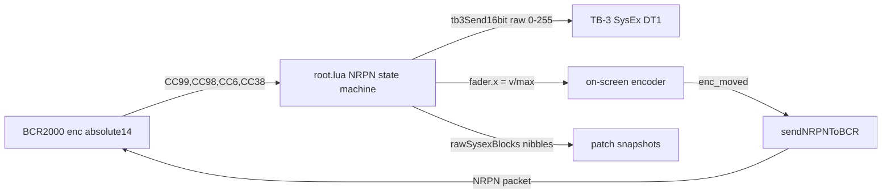

# BCR2000 NRPN for 16-bit TB-3 Parameters

## Why and what

Seven TB-3 parameters are 16-bit nibble-packed (raw 0–255). Four are currently on BCR2000 #1 as plain 7-bit CCs, so `sendFromEntry()` in [tb-3/lua/root.lua](tb-3/lua/root.lua) scales 0–127 up to 0–255 — every other raw value is unreachable. Switching those encoders to NRPN (absolute/14 mode) gives 1:1 raw-value control.

**Hard constraint:** NRPN uses CC 99/98 (param MSB/LSB) and CC 6/38 (data MSB/LSB). CC 98 and 99 are currently SQR TUNING and RING+SIN TUNING in `BCR1_MAP` — they must move to NRPN regardless. CC 6, 38, 98, 99 become permanently reserved on BCR1's channel 1.

## NRPN assignments (all seven 16-bit params)

NRPN MSB = 0 for all; LSB = number below. Min/Max = the raw SysEx range, so the BCR sends raw values directly and Lua does no scaling.

- NRPN 1 — SAW TUNING, addr `10 00 02 00`, Min 0 / Max 151 (BCR1 encoder, fixed row 3 pos 1, was CC 97)
- NRPN 2 — SQR TUNING, addr `10 00 02 02`, Min 0 / Max 151 (BCR1 row 3 pos 2, was CC 98)
- NRPN 3 — RING+SIN TUNING, addr `10 00 02 04`, Min 0 / Max 151 (BCR1 row 3 pos 3, was CC 99)
- NRPN 4 — VCF ENV DEPTH, addr `10 00 0A 04`, Min 0 / Max 255 (BCR1 row 3 pos 5, was CC 101)
- NRPN 5 — VCF CUTOFF, addr `10 00 0A 00`, Min 0 / Max 255 (no BCR encoder; future external controller)
- NRPN 6 — VCF RESONANCE, addr `10 00 0A 02`, Min 0 / Max 255 (no BCR encoder)
- NRPN 7 — ACCENT LEVEL, addr `10 00 14 0E`, Min 0 / Max 255 (no BCR encoder)

### Min/Max rationale

- **Tuning: 0–151, not 0–255.** The UI already caps at raw 151 (`enc_map.lua`: "no audible effect above raw 151; Ctrlr also caps at +24"), with center 127 = 0. Matching it keeps the BCR, on-screen faders, and hardware in exact agreement. Note the BCR can't display a negative/offset range — its readout will show 0–151 where 127 is center; that's cosmetic only.
- **Others: 0–255**, the full spec range. With absolute/14 mode the BCR transmits the literal value (data MSB = v ÷ 128, LSB = v mod 128) — one raw step per encoder detent, accelerated when turned fast.
- Do **not** use 0–16383: it would force scaling in Lua and make detents jump ~64 raw steps.

## BCR2000 programming (BC Manager / BCL)

Per encoder, channel 1, type NRPN, mode **absolute/14** (this makes the BCR send all four messages: CC99, CC98, CC6, CC38). Example BCL for the SAW TUNING encoder:

```
.easypar NRPN 1 1 0 151 absolute/14
.showvalue on
.resolution 96 192 384 768
```

(second `1` = NRPN number; repeat with param/max per the table above.)

In the same preset edit, retarget the ring-mod encoder (group 1, position 6): rotate CC 6 → CC 17, push CC 38 → CC 49 (both stay plain CC, channel 1, ranges unchanged: 0–127 rotate, toggle 0/127 push).

## Breakage inventory — everything the change touches on the BCR side

### A. CC numbers that change meaning on channel 1

- **CC 97 (was SAW TUNING)** — freed. Also happens to be MIDI-spec "Data Decrement"; leave unassigned so a future NRPN increment/decrement mode stays possible.
- **CC 98 (was SQR TUNING)** — becomes NRPN Param LSB. Can never again be a plain CC assignment on channel 1.
- **CC 99 (was RING+SIN TUNING)** — becomes NRPN Param MSB. Same restriction.
- **CC 101 (was VCF ENV DEPTH)** — freed. Note CC 101 is MIDI-spec RPN MSB; our parser only watches 98/99/6/38 so reusing it as plain CC would work, but avoid it to keep the channel spec-clean.
- **CC 6 / CC 38 (currently VCO RING LEVEL rotate / VCO RING SW push)** — become Data Entry MSB/LSB. These ARE mapped: encoder group 1 position 6 rotate + push. Both must be remapped to free CCs, in both directions:
  - Incoming: the NRPN parser consumes CC 6/38, so the ring encoder would corrupt NRPN data state instead of controlling ring mod.
  - Outgoing: `syncBCR1()` / `enc_moved` mirror send plain CC 6/38 to the BCR; with NRPN encoders programmed, the BCR's own receive parser would treat them as data entry and could move an NRPN encoder's value.
  - Remap: **CC 6 → CC 17** (rotate) and **CC 38 → CC 49** (push). These are the unused encoder-group-3 template slots and preserve the BCR's rotate/push pairing convention (push = rotate + 32). Physical encoder position is unchanged; only the transmitted CCs change in the BCR preset, and `BCR1_MAP[6]`/`[38]` move to `[17]`/`[49]` (`ADDR_TO_BCR1_CC` regenerates automatically). Neither 17 nor 49 collides with any `handleBCR1` special case.
- **CC 100 (GLOBAL TUNING)** — unchanged and still works. It is MIDI-spec RPN LSB, but since the BCR never sends RPN and our parser ignores CC 100/101 as status bytes, this stays a plain CC. Flag it in the `bcr_map.lua` header as "spec-dirty but intentional".
- **CC 96 (Data Increment)** — currently DIST TONE is CC 96! Check: `BCR1_MAP[96]` = DIST TONE. Our parser does not watch CC 96, so DIST TONE keeps working as plain CC. Document it as another "spec-dirty but intentional" entry; do not move it.

### B. Code paths that break and how each is remapped

1. **`handleBCR1` flat lookup** ([root.lua](tb-3/lua/root.lua) line 476, `BCR1_MAP[cc]`)
   - Old behaviour: CC 97/98/99/101 hit map entries → `sendFromEntry` (7-bit scaled) + `updateUIForAddr`.
   - Break: entries removed; without the NRPN intercept these CCs fall through to `return` silently.
   - Remap: NRPN state-machine intercept for 99/98/6/38 placed **before** the special-case ladder (CC 8 morph, CC 40, CC 88, CC 100), since CC 6/38 must never reach any other branch.

2. **`ADDR_TO_BCR1_CC` reverse table** ([bcr_map.lua](tb-3/lua/bcr_map.lua) line 159)
   - Break: loses the four address keys (`10000200`, `10000202`, `10000204`, `10000A04`) once the entries are deleted.
   - Affected consumer #1 — **`enc_moved` BCR mirror** (root.lua line 1151): moving the on-screen tuning/env-depth faders would silently stop updating the BCR LED rings.
   - Affected consumer #2 — none other; `ADDR_TO_BCR1_CC` is only read at line 1151 and 1189 (`sw_toggled` mirror — switches only, none of the four are switches, unaffected).
   - Remap: `enc_moved` mirror also checks `ADDR_TO_BCR1_NRPN` and sends the 4-message NRPN packet. Value scaling changes from `x * 127` to `round(x * entry.max)`.

3. **`syncBCR1()` patch-load ring sync** (root.lua line 302, iterates `BCR1_MAP`)
   - Break: the four params drop out of the loop → after a patch receive/recall/morph, those four BCR rings would freeze at stale positions.
   - Remap: add a second loop over `BCR1_NRPN_MAP` (entries 1–4 resolve via `ADDR_TO_ENC` exactly like the existing else-branch; entries 5–7 also resolve fine since cutoff/resonance/accent have on-screen faders in `panel_controls_group`). Send NRPN packets instead of plain CC.
   - Old scaling `fader.x * 127` → new `round(fader.x * entry.max)`.

4. **`updateUIForAddr()` after BCR input** (root.lua line 239)
   - Break: it computes `x = ccVal / 127`, wrong for NRPN values 0–151/0–255.
   - Remap: NRPN dispatch sets `fader.values.x = v / entry.max` directly. Setting the fader still fires `control_fader → enc_moved`, which re-derives the bipolar/center label from `ENC_SEND_MAP` (correct ±display for tunings) and echoes one redundant-but-harmless SysEx, same as the existing CC path. The `enc_moved` NRPN mirror will also echo the packet back to the BCR — the BCR just re-lights the same ring value; no feedback loop (the BCR does not retransmit on receive).

5. **Morph / `receivingPatch` interaction**
   - `applyMorph()` suppresses per-fader BCR mirroring via the `morphing` flag and calls `syncBCR1()` once at the end — the new NRPN loop in `syncBCR1()` covers this automatically.
   - During `receivingPatch`, `enc_moved` skips the SysEx send but still mirrors to the BCR; the NRPN mirror must sit in the same spot (after the `receivingPatch` guard) to preserve this.

### C. Explicitly NOT broken (verified)

- **BCR2000 #2 (channel 2)**: CC 98/99 there are EFX1 slots S10/S11 and CC 6/38 are unmapped. The NRPN parser lives inside `handleBCR1` (channel-1 branch of `onReceiveMIDI`), so channel 2 routing is untouched. Outgoing NRPN feedback packets are sent with status `0xB0` (channel 1) on the shared `BCR_CONNECTION`; BCR #2's channel-2 controls ignore them.
- **Push-encoder toggles / `pushToggleState`**: only `max == 1` entries (CC 33–42, 71, 79); none of the four converted CCs are toggles.
- **TB-3 hardware knob CC feedback** (CC 16/71/74 on connection 6, `handleTB3CC`): separate connection and handler; the channel-1 CC 71 reservation question doesn't arise because that path is keyed on the TB-3 connection, not the BCR one.
- **`parseBlock` / patch receive**: writes faders directly from SysEx; never used the BCR CC numbers.
- **DIST TYPE (CC 88), GLOBAL TUNING (CC 100), morph CC 8/40 special cases**: all keep their plain-CC handling; none collide with NRPN status bytes.

### D. Rollout ordering hazard — BCR preset and layout build must ship together

The BCR preset change and the `.tosc` rebuild are coupled. The two mismatch states are not symmetric, and one is destructive:

- **New Lua + old BCR preset** (forgot to load the new BCR preset): turning SQR TUNING (old CC 98) is interpreted as "NRPN param LSB select" — no sound change, but it corrupts the parser's selected-param state so the *next* real NRPN move can write to the wrong parameter. RING+SIN (CC 99) same. Turning RING LEVEL (old CC 6) / pushing RING SW (old CC 38) is interpreted as data entry — combined with a stale param select this can dispatch a bogus NRPN write. SAW (97) and ENV DEPTH (101) just go dead. Annoying but recoverable.
- **Old Lua + new BCR preset** (loaded BCR preset, forgot to rebuild/reload the layout): each NRPN packet arrives as four plain CCs. CC 99 and CC 98 hit the *old* map entries → every turn of **any** NRPN encoder slams RING+SIN TUNING and SQR TUNING with the param-select byte values, sending wrong SysEx to the TB-3 and dragging the on-screen tuning faders. **This is the destructive direction — rebuild and reload the TouchOSC layout before (or in the same sitting as) loading the new BCR preset.**

Mitigation: store the new BCR preset in a different preset slot on the unit so the old slot remains as a matched fallback for old layout builds.

## Code changes

### 1. [tb-3/lua/bcr_map.lua](tb-3/lua/bcr_map.lua)

- Remove `[97]`, `[98]`, `[99]`, `[101]` from `BCR1_MAP`.
- Move `[6]` (VCO RING LEVEL) → `[17]` and `[38]` (VCO RING SW) → `[49]` — CC 6/38 are now NRPN Data Entry (see breakage section A).
- Add `BCR1_NRPN_MAP` keyed by NRPN number with all seven entries (`addr`, `max`, plus `bipolar`/`center=127` for the three tunings so UI labels stay correct).
- Build reverse lookup `ADDR_TO_BCR1_NRPN` (addr-hex key → NRPN number + entry), parallel to the existing `ADDR_TO_BCR1_CC`.
- Update header comments: CC 6/38/98/99 reserved for NRPN on channel 1.

### 2. [tb-3/lua/root.lua](tb-3/lua/root.lua) — NRPN receive

In `handleBCR1()` (line 401), intercept CC 99/98/6/38 before the `BCR1_MAP` lookup with a small state machine (channel-1 only — BCR2's channel 2 keeps CC 98/99 as EFX slot CCs in `handleBCR2`):

```lua
-- nrpnParam selected by CC99 (MSB) + CC98 (LSB); CC6 stores data MSB;
-- CC38 completes the 14-bit value and dispatches.
local v = dataMSB * 128 + ccVal
local entry = BCR1_NRPN_MAP[nrpnParam]
v = math.min(v, entry.max)
tb3Send16bit(a[1], a[2], a[3], a[4], v)
```

On dispatch also:
- Update `rawSysexBlocks` MSB/LSB nibbles (same as `sendFromEntryFloat`, lines 220–224) — this actually *fixes* the known "BCR-only edits leave snapshots stale" gap for these params.
- Update the on-screen fader: set `fader.values.x = v / entry.max` directly (don't reuse `updateUIForAddr`, which assumes 0–127 input).

### 3. [tb-3/lua/root.lua](tb-3/lua/root.lua) — NRPN feedback to BCR

Add a `sendNRPNToBCR(nrpn, value)` helper that emits the 4-message packet (`CC99, CC98, CC6, CC38` on channel 1, `BCR_CONNECTION`) so the BCR LED rings track state. Wire it into:

- `syncBCR1()` (line 302): for addresses found in `ADDR_TO_BCR1_NRPN`, send NRPN with `value = round(fader.x * entry.max)` instead of the old plain CC.
- `enc_moved` BCR mirror (line 1148): check `ADDR_TO_BCR1_NRPN` alongside `ADDR_TO_BCR1_CC` and send the NRPN packet when matched. The BCR updates an encoder's ring when it receives NRPN matching its assignment, same as CC.

Mirroring NRPN 5–7 (cutoff/resonance/accent) is harmless — the BCR ignores unassigned NRPNs, and a future controller on the same connection gets feedback for free.

### 4. Docs + build

- Update the BCR table and bcr_map row in [tb-3/CLAUDE.md](tb-3/CLAUDE.md).
- `python3 tools/toscbuild.py build tb-3`.

## Data flow



## Notes / risks

- **200-local limit**: adds ~4 top-level locals (`BCR1_NRPN_MAP`, `ADDR_TO_BCR1_NRPN`, NRPN state vars). The root chunk is near the limit — consider packing NRPN state into one table.
- NRPN state machine dispatches only on CC 38; absolute/14 always sends the full packet, so no partial-update edge case.
- TB-3 hardware knob feedback (CC 74/71/16 for cutoff/resonance/accent) is a separate existing path and is unaffected.