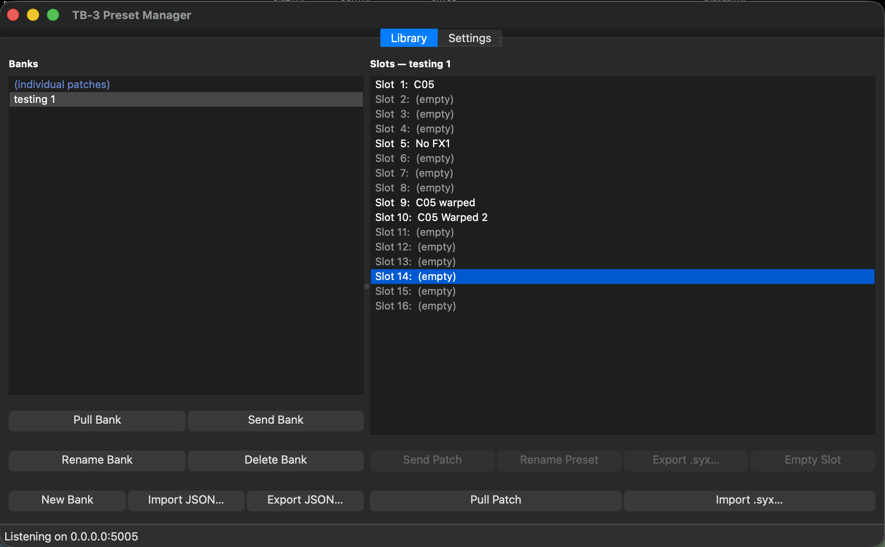

# TB-3 Preset Manager

Desktop companion app for the TB-3 TouchOSC layout. Saves full patch dumps
(`.syx`) from TouchOSC and restores them back through it to the TB-3 hardware.



> **Note:** the screenshot above reflects the current UI. Some button names and
> workflow descriptions in this README have not yet been updated to match — e.g.
> buttons are now **Pull Bank / Send Bank**, **Send Patch**, **Pull Patch**, etc.
> rather than the names written below. A full sync is pending.

## Setup (once)

```bash
cd tb-3/preset-manager
python3 -m pip install --user -r requirements.txt
./run-preset-manager.sh
```

`run-preset-manager.sh` uses **system `python3`** (it checks for a working
PyQt5 first). A project `.venv` is supported as a fallback — set
`TB3_PRESET_MANAGER_USE_VENV=1` to force it.

### macOS + Homebrew Python: "externally-managed-environment"

Homebrew's `python3` blocks plain `pip install --user`. If you hit that error,
install with:

```bash
python3 -m pip install --user --break-system-packages -r requirements.txt
```

`--break-system-packages` paired with `--user` only touches your user
site-packages — it does not modify the Homebrew Python install itself.

Recommended alias:

```bash
alias tb3-preset-manager='/Users/willellis/Documents/Development/Github/touchosc-controllers/tb-3/preset-manager/run-preset-manager.sh'
```

## Workflow

1. **First launch** opens with the **Settings** group on the right — confirm
   the listen/TouchOSC ports match your TouchOSC setup, and pick a patches
   folder (defaults to `~/tb3_patches/`).
2. The app listens continuously for `/tb3/backup`.
3. In TouchOSC: press **SAVE TO LIBRARY** → you'll be prompted for a name →
   saved as `<name>.syx` in the patches folder.
4. In TouchOSC: select a patch in the list → **Restore Patch** → the app
   splits the `.syx` into individual `F0…F7` SysEx messages and sends each to
   TouchOSC via `/tb3/restore`, which forwards them to the TB-3 hardware and
   updates its own UI (including BCR2000 LED ring sync).

| Utility | TouchOSC |
|---------|----------|
| Listen (`listen_ip`/`listen_port`) | Outgoing → same host:port |
| Send (`touchosc_ip`/`touchosc_port`) | Incoming ← same port |

Defaults: listen `0.0.0.0:9000`, send to TouchOSC at `127.0.0.1:9001`.

Settings auto-save to `~/.tb3_preset_manager/settings.json` (no Save button
beyond the Settings group's own save action).

## Banks

The **Banks** panel (right column) saves and restores the entire 16-slot patch grid
as a single named file.

| Button | Action |
|--------|--------|
| **Pull from TouchOSC** | Requests all 16 slots from the layout; prompts for a name; saves as `<name>.tb3bank.json` |
| **Push to TouchOSC** | Sends the selected bank back to the layout, restoring all slots |
| **Delete** | Removes the bank file from disk |
| **Rename** | Renames the bank file |
| **Import** | Copies a `.tb3bank.json` from anywhere on disk into the banks folder |
| **Export** | Saves a copy of the selected bank to a location you choose |

Banks are stored in a `banks/` subfolder of your patches folder.

### Bank file format

`.tb3bank.json` files are plain JSON:

```jsonc
{
  "version": 1,
  "name": "Live Set 1",
  "createdAt": "2026-01-01T12:00:00",
  "slots": {
    "1":  {"blocks": ["F041...F7", "F041...F7", ...]},
    "2":  null,
    ...
    "16": {"blocks": [...]}
  }
}
```

Each `"blocks"` array contains 11 hex-encoded Roland DT1 SysEx messages (the same
blocks as a `.syx` file). Empty slots are `null`.

## File format

`.syx` files are raw binary SysEx dumps — 11 contiguous `F0…F7` Roland DT1
messages, exactly as received from the TB-3 (via TouchOSC's `/tb3/backup`
JSON blob, decoded back to bytes).

## Troubleshooting

- **"PyQt5 not found" / "python-osc not found"** — re-run the setup step
  above; see the Homebrew note if `pip install --user` errors out.
- **"Python quit unexpectedly" on macOS** — use `./run-preset-manager.sh`
  (system `python3`); avoid a broken `.venv` unless you've fixed it (see the
  `TB3_PRESET_MANAGER_USE_VENV` override above).
